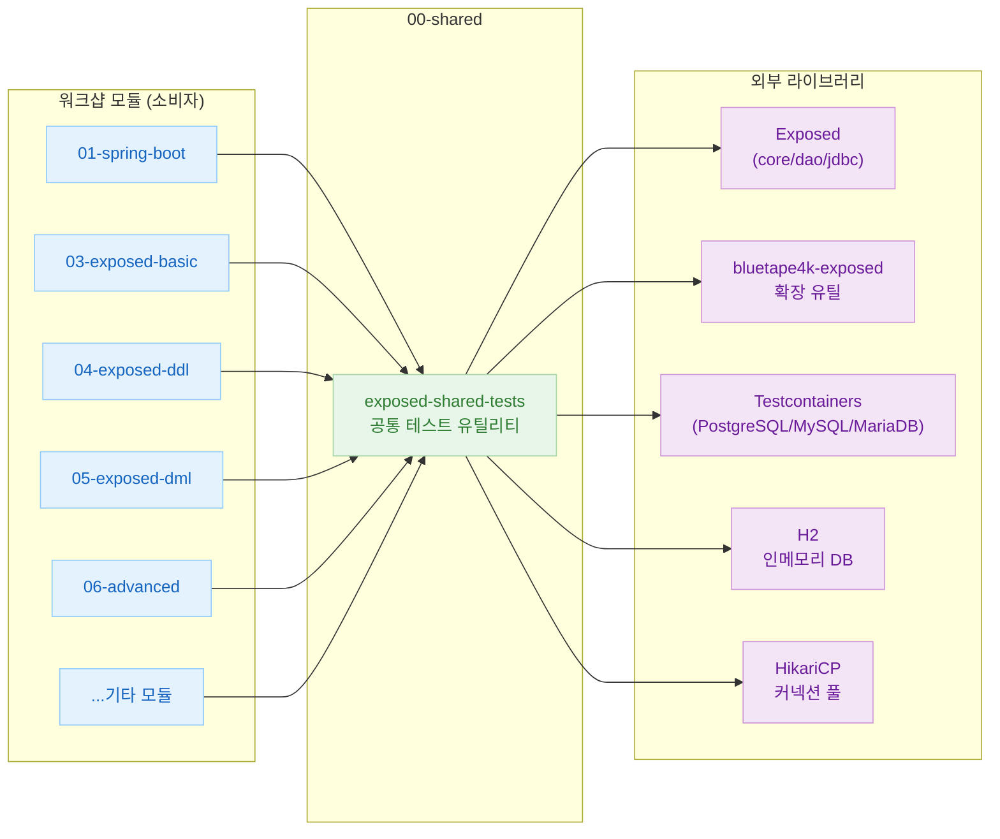

# 00-shared — 공유 테스트 유틸리티

[English](./README.md) | 한국어

모든 워크샵 모듈이 공통으로 의존하는 테스트 인프라 모듈입니다.
데이터베이스 연결, 테이블/스키마 생성·삭제, Faker 기반 테스트 데이터 생성 등을 제공합니다.

## 모듈 의존성 구조



## 포함 모듈

| 모듈 | 설명 |
|------|------|
| `exposed-shared-tests` | 공통 테스트 유틸리티 및 헬퍼 클래스 |

---

## 주요 클래스

### `AbstractExposedTest`

모든 Exposed 테스트 클래스의 베이스 클래스입니다.

```kotlin
abstract class AbstractExposedTest {
    companion object : KLogging() {
        val faker = Fakers.faker

        // JUnit 5 @MethodSource 에서 사용: 활성화된 DB 목록 반환
        fun enableDialects() = TestDB.enabledDialects()

        const val ENABLE_DIALECTS_METHOD = "enableDialects"
    }
}
```

테스트 클래스에서 다음과 같이 상속합니다.

```kotlin
@TestMethodOrder(MethodOrderer.MethodName::class)
class MyExposedTest : AbstractExposedTest() {

    @ParameterizedTest
    @MethodSource(ENABLE_DIALECTS_METHOD)
    fun `기본 CRUD 테스트`(testDB: TestDB) {
        withTables(testDB, Users) {
            // 테스트 본문
        }
    }
}
```

---

### `TestDB` enum

테스트 대상 데이터베이스를 열거합니다.

| 값 | 설명 |
|----|------|
| `H2` | H2 v2 인메모리 (기본) |
| `H2_V1` | H2 v1 인메모리 |
| `H2_MYSQL` | H2 MySQL 호환 모드 |
| `H2_MARIADB` | H2 MariaDB 호환 모드 |
| `H2_PSQL` | H2 PostgreSQL 호환 모드 |
| `MARIADB` | MariaDB (Testcontainers 또는 로컬) |
| `MYSQL_V8` | MySQL 8 (Testcontainers 또는 로컬) |
| `POSTGRESQL` | PostgreSQL (Testcontainers 또는 로컬) |
| `POSTGRESQLNG` | PostgreSQL NG 드라이버 |
| `COCKROACH` | CockroachDB (Testcontainers) |

기본 활성화 DB: `H2, POSTGRESQL, MYSQL_V8, MARIADB`

---

### `withDb` / `withDBSuspending`

지정한 `TestDB`에 연결하여 트랜잭션 블록을 실행합니다.

```kotlin
// JDBC (동기)
withDb(testDB) { db ->
    // transaction 블록 내부
}

// 코루틴 (비동기)
withDBSuspending(testDB) { db ->
    // suspendedTransaction 블록 내부
}
```

---

### `withTables` / `withTablesSuspending`

테스트 전 테이블을 생성하고, 테스트 후 자동으로 삭제합니다.

```kotlin
// JDBC
withTables(testDB, Users, Posts) { db ->
    // 테이블이 생성된 상태에서 실행
}

// 코루틴
withTablesSuspending(testDB, Users) { db ->
    // suspendedTransaction 내에서 실행
}
```

`dropTables = false` 옵션으로 삭제를 생략할 수 있습니다.

---

### `withSchemas` / `withSchemasSuspending`

스키마를 생성한 뒤 블록을 실행하고, 종료 시 스키마를 삭제합니다.

```kotlin
withSchemas(testDB, Schema("hr"), Schema("sales")) {
    // 스키마가 존재하는 상태에서 실행
}
```

---

## 환경 변수 / 시스템 프로퍼티

| 설정 | 기본값 | 설명 |
|------|--------|------|
| `USE_TESTCONTAINERS` (상수) | `true` | Testcontainers 사용 여부. `false`이면 로컬 DB 서버를 직접 연결 |
| `-PuseFastDB=true` (Gradle) | `false` | H2 인메모리 DB만 사용하여 빠르게 테스트 |

```bash
# H2만 사용해 빠르게 테스트
./gradlew :exposed-shared-tests:test -PuseFastDB=true
```

---

## 디렉토리 구조

```
00-shared/exposed-shared-tests/src/main/kotlin/exposed/shared/
├── tests/
│   ├── AbstractExposedTest.kt      # 테스트 베이스 클래스
│   ├── TestDB.kt                   # 지원 DB enum + 연결 설정
│   ├── TestSupport.kt              # 공통 유틸리티 함수
│   ├── WithDb.kt                   # JDBC DB 연결 헬퍼
│   ├── WithDBSuspending.kt         # 코루틴 DB 연결 헬퍼
│   ├── WithTables.kt               # JDBC 테이블 생성/삭제
│   ├── WithTablesSuspending.kt     # 코루틴 테이블 생성/삭제
│   ├── WithSchemas.kt              # JDBC 스키마 관리
│   ├── WithSchemasSuspending.kt    # 코루틴 스키마 관리
│   └── WithAutoCommitSuspending.kt # AutoCommit 코루틴 헬퍼
├── dml/
│   └── DMLTestData.kt              # DML 테스트용 공통 테이블·데이터
└── entities/
    └── BoardSchema.kt              # 엔티티 테스트용 스키마
```

---

## 실행 방법

```bash
# 공유 모듈만 테스트
./gradlew :exposed-shared-tests:test

# H2만 사용 (빠른 CI)
./gradlew :exposed-shared-tests:test -PuseFastDB=true
```
