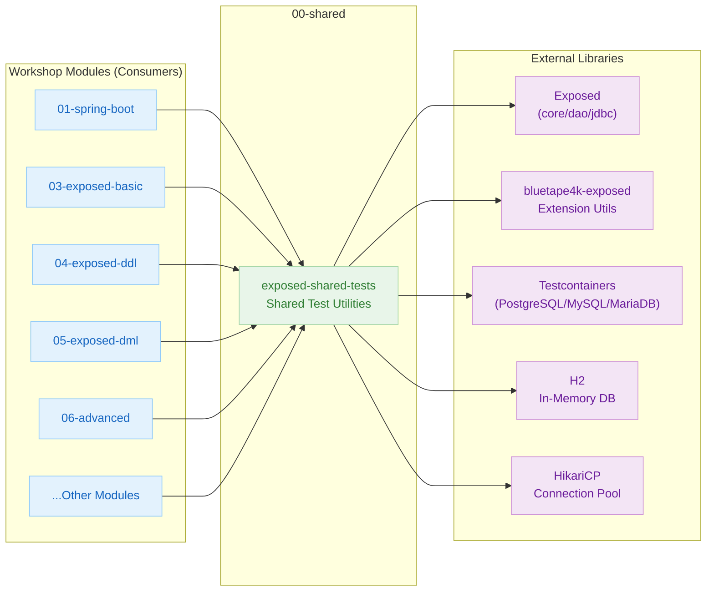

# 00-shared — Shared Test Utilities

English | [한국어](./README.ko.md)

A test infrastructure module that all workshop modules depend on.
Provides database connections, table/schema creation and deletion, and Faker-based test data generation.

## Module Dependency Structure



## Included Modules

| Module | Description |
|--------|-------------|
| `exposed-shared-tests` | Shared test utilities and helper classes |

---

## Key Classes

### `AbstractExposedTest`

The base class for all Exposed test classes.

```kotlin
abstract class AbstractExposedTest {
    companion object : KLogging() {
        val faker = Fakers.faker

        // Used with JUnit 5 @MethodSource: returns enabled DB list
        fun enableDialects() = TestDB.enabledDialects()

        const val ENABLE_DIALECTS_METHOD = "enableDialects"
    }
}
```

Test classes inherit from it as follows:

```kotlin
@TestMethodOrder(MethodOrderer.MethodName::class)
class MyExposedTest : AbstractExposedTest() {

    @ParameterizedTest
    @MethodSource(ENABLE_DIALECTS_METHOD)
    fun `basic CRUD test`(testDB: TestDB) {
        withTables(testDB, Users) {
            // test body
        }
    }
}
```

---

### `TestDB` Enum

Enumerates the target databases for testing.

| Value | Description |
|-------|-------------|
| `H2` | H2 v2 in-memory (default) |
| `H2_V1` | H2 v1 in-memory |
| `H2_MYSQL` | H2 MySQL compatibility mode |
| `H2_MARIADB` | H2 MariaDB compatibility mode |
| `H2_PSQL` | H2 PostgreSQL compatibility mode |
| `MARIADB` | MariaDB (Testcontainers or local) |
| `MYSQL_V8` | MySQL 8 (Testcontainers or local) |
| `POSTGRESQL` | PostgreSQL (Testcontainers or local) |
| `POSTGRESQLNG` | PostgreSQL NG driver |
| `COCKROACH` | CockroachDB (Testcontainers) |

Default enabled DBs: `H2, POSTGRESQL, MYSQL_V8, MARIADB`

---

### `withDb` / `withDBSuspending`

Connects to the specified `TestDB` and executes a transaction block.

```kotlin
// JDBC (synchronous)
withDb(testDB) { db ->
    // inside transaction block
}

// Coroutine (asynchronous)
withDBSuspending(testDB) { db ->
    // inside suspendedTransaction block
}
```

---

### `withTables` / `withTablesSuspending`

Creates tables before the test and automatically drops them after.

```kotlin
// JDBC
withTables(testDB, Users, Posts) { db ->
    // runs with tables created
}

// Coroutine
withTablesSuspending(testDB, Users) { db ->
    // runs inside suspendedTransaction
}
```

You can skip table deletion with `dropTables = false`.

---

### `withSchemas` / `withSchemasSuspending`

Creates schemas before executing the block, and drops them upon completion.

```kotlin
withSchemas(testDB, Schema("hr"), Schema("sales")) {
    // runs with schemas available
}
```

---

## Environment Variables / System Properties

| Setting | Default | Description |
|---------|---------|-------------|
| `USE_TESTCONTAINERS` (constant) | `true` | Whether to use Testcontainers. If `false`, connects to local DB servers directly |
| `-PuseFastDB=true` (Gradle) | `false` | Use only H2 in-memory DB for faster testing |

```bash
# Fast test with H2 only
./gradlew :exposed-shared-tests:test -PuseFastDB=true
```

---

## Directory Structure

```
00-shared/exposed-shared-tests/src/main/kotlin/exposed/shared/
├── tests/
│   ├── AbstractExposedTest.kt      # Test base class
│   ├── TestDB.kt                   # Supported DB enum + connection config
│   ├── TestSupport.kt              # Common utility functions
│   ├── WithDb.kt                   # JDBC DB connection helper
│   ├── WithDBSuspending.kt         # Coroutine DB connection helper
│   ├── WithTables.kt               # JDBC table create/drop
│   ├── WithTablesSuspending.kt     # Coroutine table create/drop
│   ├── WithSchemas.kt              # JDBC schema management
│   ├── WithSchemasSuspending.kt    # Coroutine schema management
│   └── WithAutoCommitSuspending.kt # AutoCommit coroutine helper
├── dml/
│   └── DMLTestData.kt              # Shared tables/data for DML tests
└── entities/
    └── BoardSchema.kt              # Schema for entity tests
```

---

## How to Run

```bash
# Test shared module only
./gradlew :exposed-shared-tests:test

# H2 only (fast CI)
./gradlew :exposed-shared-tests:test -PuseFastDB=true
```
