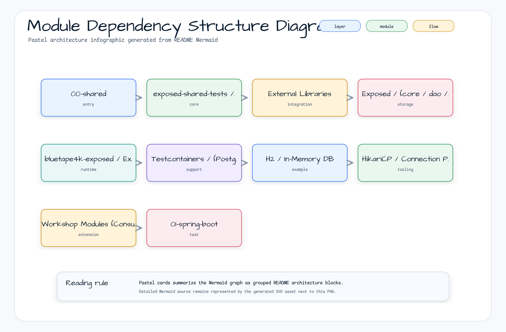
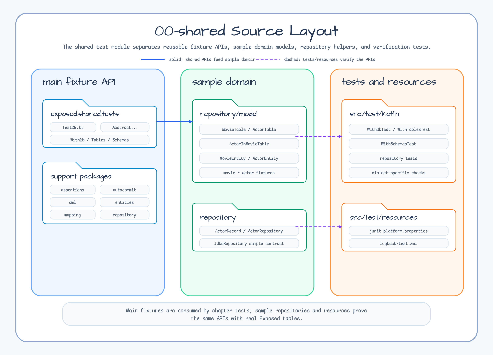

# 00-shared — Shared Test Infrastructure

English | [한국어](./README.ko.md)

`00-shared` contains the reusable test infrastructure used by the Exposed workshop chapters.
Instead of repeating database selection, transaction setup, schema/table cleanup, and sample data fixtures in every chapter, the workshop keeps those concerns in one shared module.

## What This Chapter Provides



- `TestDB` selects the database dialects used by parameterized tests.
- `AbstractExposedTest` provides the common JUnit entrypoint, UTC timezone setup, Faker, and dialect helpers.
- `withDb` and `withDbSuspending` open Exposed transactions for blocking and coroutine tests.
- `withTables` and `withSchemas` create and clean up test tables and schemas around each test block.
- Sample tables, DAO entities, records, and repositories provide realistic fixtures for downstream examples.

## Included Module

| Module | Purpose |
|--------|---------|
| `exposed-shared-tests` | Shared JUnit, Exposed, Testcontainers, and sample repository fixtures |

## Source Layout



The public fixture APIs live under `src/main/kotlin/exposed/shared/tests`.
Sample domain objects are grouped under `repository/model` and `repository/repository`, while `src/test` verifies the helpers against real Exposed tables and configured dialects.

## Core Types

### `AbstractExposedTest`

`AbstractExposedTest` is the base class for workshop tests. It exposes `ENABLE_DIALECTS_METHOD`, delegates dialect selection to `TestDB.enabledDialects()`, sets the default timezone to UTC, and keeps shared helper functions such as `prepareSchemaForTest()`.

```kotlin
@TestMethodOrder(MethodOrderer.MethodName::class)
class MyExposedTest : AbstractExposedTest() {

    @ParameterizedTest
    @MethodSource(ENABLE_DIALECTS_METHOD)
    fun `basic CRUD test`(testDB: TestDB) {
        withTables(testDB, Users) {
            // test body
        }
    }
}
```

### `TestDB`

`TestDB` enumerates the database targets supported by the shared tests.

| Value | Notes |
|-------|-------|
| `H2`, `H2_V1`, `H2_MYSQL`, `H2_MARIADB`, `H2_PSQL` | H2 in-memory modes for fast feedback and compatibility checks |
| `MARIADB`, `MYSQL_V5`, `MYSQL_V8` | MySQL-family targets through Testcontainers or local fallback |
| `POSTGRESQL`, `POSTGRESQLNG` | PostgreSQL targets |
| `COCKROACH` | CockroachDB target |
| `ORACLE`, `SQLSERVER` | Enterprise database targets when explicitly selected and available |

Default enabled dialects are `H2`, `POSTGRESQL`, and `MYSQL_V8`.

## Database Selection

| Gradle property | Effect |
|-----------------|--------|
| `-PuseDB=<name,...>` | Runs only the comma-separated `TestDB` values. This has the highest priority. |
| `-PuseFastDB=true` | Runs only `H2` for quick local feedback. |
| none | Runs the default matrix: `H2`, `POSTGRESQL`, `MYSQL_V8`. |

```bash
# Test shared module only
./gradlew :exposed-shared-tests:test

# H2 only
./gradlew :exposed-shared-tests:test -PuseFastDB=true

# Explicit dialect list
./gradlew :exposed-shared-tests:test -PuseDB=H2,POSTGRESQL
```

`USE_TESTCONTAINERS` is currently a source constant in `TestDB.kt` and defaults to `true`.
When enabled, container-backed databases are started by the shared test infrastructure.

## Next Step

Open [`exposed-shared-tests`](./exposed-shared-tests/README.md) for the detailed fixture API map and examples.
