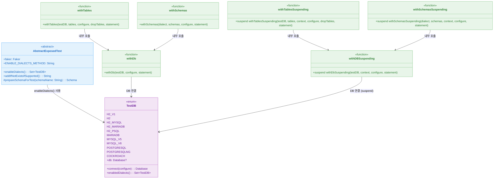

# 00 Shared: Exposed Shared Tests

[English](./README.md) | 한국어

공통 스키마, 유틸, 테스트 베이스 등을 모아 Exposed 예제 전반에서 공유하는 기반을 제공합니다.

## 챕터 목표

- 테스트 패턴과 DB 설정을 중앙화해 중복을 줄인다.
- 다양한 DB Dialect에서 통일된 스키마/데이터 생성 흐름을 확보한다.
- Testcontainers, 트랜잭션 헬퍼, SchemaUtils의 재사용 궤적을 마련한다.

## 선수 지식

- Kotlin/Java 기초 문법
- 관계형 데이터베이스와 JDBC 개념

## 포함 모듈

| 모듈                     | 설명                                                 |
|------------------------|----------------------------------------------------|
| `exposed-shared-tests` | 공통 테스트 베이스 클래스와 DB 설정, `WithTables` 헬퍼 및 ERD 문서 집합 |

## 권장 학습 순서

1. `exposed-shared-tests`

## 실행 방법

```bash
# 기본값으로 실행 (H2 + PostgreSQL + MySQL V8)
./gradlew :exposed-shared-tests:test

# H2 만 테스트 (빠른 로컬 개발용)
./gradlew :exposed-shared-tests:test -PuseFastDB=true

# 특정 DB 지정
./gradlew :exposed-shared-tests:test -PuseDB=H2,POSTGRESQL
```

### 테스트 대상 DB 선택 옵션

| Gradle 프로퍼티              | 설명                                              |
|----------------------------|--------------------------------------------------|
| `-PuseFastDB=true`         | H2 인메모리 DB 만 테스트 (빠른 피드백)              |
| `-PuseDB=<이름,...>`        | 쉼표로 구분하여 테스트할 DB를 직접 지정              |

`-PuseDB`에 사용 가능한 값:

| 값               | 설명                          |
|-----------------|------------------------------|
| `H2`            | H2 (인메모리, 기본 모드)         |
| `H2_MYSQL`      | H2 (MySQL 호환 모드)           |
| `H2_MARIADB`    | H2 (MariaDB 호환 모드)         |
| `H2_PSQL`       | H2 (PostgreSQL 호환 모드)      |
| `MARIADB`       | MariaDB (Testcontainers)     |
| `MYSQL_V5`      | MySQL 5.x (Testcontainers)   |
| `MYSQL_V8`      | MySQL 8.x (Testcontainers)   |
| `POSTGRESQL`    | PostgreSQL (Testcontainers)  |
| `POSTGRESQLNG`  | PostgreSQL NG 드라이버         |

> [!NOTE]
> 우선순위: `-PuseDB` > `-PuseFastDB` > 기본값 (H2, POSTGRESQL, MYSQL_V8)

## 테스트 포인트

- 각 Dialect에서 공통 스키마/데이터가 동일하게 생성되는지 확인한다.
- Testcontainers 기반 DB 격리 환경에서 연결/롤백이 안정적인지 검증한다.

## 성능·안정성 체크포인트

- Dialect별 스키마 생성/삭제가 테스트 간 독립적으로 작동하는지 점검한다.
- Testcontainers 환경에서 커넥션 재활용과 롤백이 일정하게 수행되는지 확인한다.

## 테스트 인프라 클래스 구조



## 핵심 사용 패턴

### WithTables / WithTablesSuspending 패턴

`withTables(testDB, vararg tables)` 헬퍼는 테스트 시작 전 지정한 테이블을 자동으로 생성하고,
테스트 블록 완료 후 자동으로 삭제(drop)한다. 이를 통해 테스트 간 DB 상태 독립성을 보장한다.

```kotlin
// JDBC 방식
withTables(testDB, ActorTable) {
    ActorTable.insert { it[name] = "test" }
    ActorTable.selectAll().count() // 검증
}

// Coroutine(suspend) 방식
withTablesSuspending(testDB, ActorTable) {
    ActorTable.insert { it[name] = "test" }
    ActorTable.selectAll().count() // 검증
}
```

관련 테스트: [`src/test/kotlin/exposed/shared/tests/WithTablesTest.kt`](src/test/kotlin/exposed/shared/tests/WithTablesTest.kt)

### TestDB enum 활용법

`TestDB` enum은 지원하는 DB Dialect 목록을 정의하며, `enableDialects()` 메서드로
테스트 대상 DB를 필터링한다. `@MethodSource(ENABLE_DIALECTS_METHOD)`와 함께 사용하면
활성화된 Dialect마다 파라미터화 테스트가 자동으로 실행된다.

```kotlin
class MyTest: AbstractExposedTest() {
    @ParameterizedTest
    @MethodSource(ENABLE_DIALECTS_METHOD)
    fun `my test`(testDB: TestDB) {
        withTables(testDB, MyTable) {
            // 각 Dialect에서 실행됨
        }
    }
}
```

### TestContainers 설정

`USE_TESTCONTAINERS=true`(기본값)이면 PostgreSQL, MySQL, MariaDB 등은 Testcontainers로
자동 기동된다. 로컬 개발 시 빠른 피드백이 필요한 경우 H2 인메모리 DB만 사용한다.

```bash
# H2 전용 실행 (빠른 피드백)
./gradlew :exposed-shared-tests:test -PuseFastDB=true

# 특정 DB 지정
./gradlew :exposed-shared-tests:test -PuseDB=H2,POSTGRESQL
```

### ActorRepository 공통 연산 검증

`withMovieAndActors(testDB)` 헬퍼로 영화·배우 샘플 데이터를 사전 구성한 뒤
Repository의 CRUD, 카운트, 존재 여부, 조건부 삭제 등을 검증한다.

관련 테스트: [`src/test/kotlin/exposed/shared/repository/ActorRepositoryTest.kt`](src/test/kotlin/exposed/shared/repository/ActorRepositoryTest.kt)

## 참고

- `AbstractExposedTest`, `WithTables` 등의 헬퍼 상속 구조를 참고해 실제 예제에서 재사용 가능하다.
- 다양한 ERD 문서와 Faker 기반 샘플 데이터가 포함되어 있다.

## 다음 챕터

- [01-spring-boot](../01-spring-boot/README.ko.md): Spring Boot 기반 MVC/WebFlux 예제에서 Exposed 사용 패턴을 학습합니다.
