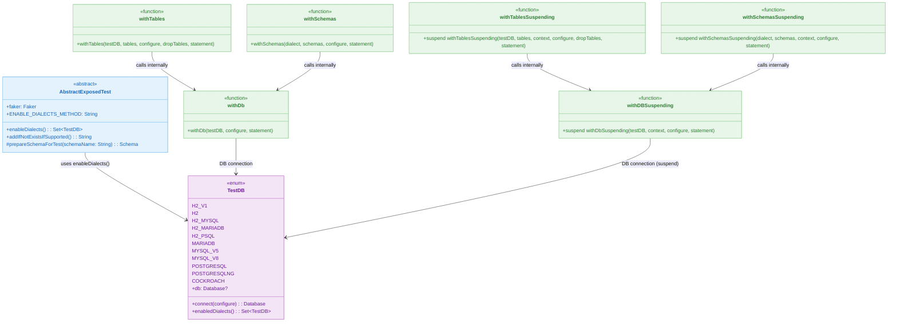

# 00 Shared: Exposed Shared Tests

English | [한국어](./README.ko.md)

Provides a shared foundation of common schemas, utilities, and test base classes used across all Exposed examples.

## Chapter Goals

- Centralize test patterns and DB configuration to reduce duplication.
- Ensure a unified schema/data creation flow across various DB dialects.
- Establish reusable patterns for Testcontainers, transaction helpers, and SchemaUtils.

## Prerequisites

- Basic Kotlin/Java syntax
- Relational database and JDBC concepts

## Included Modules

| Module                  | Description                                                              |
|-------------------------|--------------------------------------------------------------------------|
| `exposed-shared-tests`  | Shared test base classes with DB configuration, `WithTables` helpers, and ERD documentation |

## Recommended Learning Order

1. `exposed-shared-tests`

## How to Run

```bash
# Run with defaults (H2 + PostgreSQL + MySQL V8)
./gradlew :exposed-shared-tests:test

# Test with H2 only (fast local development)
./gradlew :exposed-shared-tests:test -PuseFastDB=true

# Specify target DBs
./gradlew :exposed-shared-tests:test -PuseDB=H2,POSTGRESQL
```

### DB Selection Options for Testing

| Gradle Property            | Description                                       |
|----------------------------|---------------------------------------------------|
| `-PuseFastDB=true`         | Test with H2 in-memory DB only (fast feedback)    |
| `-PuseDB=<name,...>`       | Specify DBs to test, comma-separated              |

Available values for `-PuseDB`:

| Value           | Description                    |
|-----------------|--------------------------------|
| `H2`            | H2 (in-memory, default mode)   |
| `H2_MYSQL`      | H2 (MySQL compatibility mode)  |
| `H2_MARIADB`    | H2 (MariaDB compatibility mode)|
| `H2_PSQL`       | H2 (PostgreSQL compatibility mode) |
| `MARIADB`       | MariaDB (Testcontainers)       |
| `MYSQL_V5`      | MySQL 5.x (Testcontainers)     |
| `MYSQL_V8`      | MySQL 8.x (Testcontainers)     |
| `POSTGRESQL`    | PostgreSQL (Testcontainers)    |
| `POSTGRESQLNG`  | PostgreSQL NG driver           |

> [!NOTE]
> Priority: `-PuseDB` > `-PuseFastDB` > default (H2, POSTGRESQL, MYSQL_V8)

## Test Points

- Verify that common schema/data is created identically across each dialect.
- Validate that connection/rollback is stable in Testcontainers-based DB isolation environments.

## Performance & Stability Checkpoints

- Verify that schema creation/deletion per dialect works independently between tests.
- Confirm that connection reuse and rollback are performed consistently in Testcontainers environments.

## Test Infrastructure Class Structure



## Core Usage Patterns

### WithTables / WithTablesSuspending Pattern

The `withTables(testDB, vararg tables)` helper automatically creates specified tables before the test starts
and drops them after the test block completes, ensuring DB state independence between tests.

```kotlin
// JDBC approach
withTables(testDB, ActorTable) {
    ActorTable.insert { it[name] = "test" }
    ActorTable.selectAll().count() // verify
}

// Coroutine (suspend) approach
withTablesSuspending(testDB, ActorTable) {
    ActorTable.insert { it[name] = "test" }
    ActorTable.selectAll().count() // verify
}
```

Related test: [`src/test/kotlin/exposed/shared/tests/WithTablesTest.kt`](src/test/kotlin/exposed/shared/tests/WithTablesTest.kt)

### TestDB Enum Usage

The `TestDB` enum defines the list of supported DB dialects, and the `enableDialects()` method
filters the target DBs for testing. When used with `@MethodSource(ENABLE_DIALECTS_METHOD)`,
parameterized tests are automatically executed for each enabled dialect.

```kotlin
class MyTest: AbstractExposedTest() {
    @ParameterizedTest
    @MethodSource(ENABLE_DIALECTS_METHOD)
    fun `my test`(testDB: TestDB) {
        withTables(testDB, MyTable) {
            // runs on each dialect
        }
    }
}
```

### TestContainers Configuration

When `USE_TESTCONTAINERS=true` (default), PostgreSQL, MySQL, MariaDB, etc. are automatically
started via Testcontainers. For fast feedback during local development, use H2 in-memory DB only.

```bash
# H2 only (fast feedback)
./gradlew :exposed-shared-tests:test -PuseFastDB=true

# Specify target DBs
./gradlew :exposed-shared-tests:test -PuseDB=H2,POSTGRESQL
```

### ActorRepository Common Operations Verification

Use the `withMovieAndActors(testDB)` helper to set up sample movie and actor data,
then verify the repository's CRUD, count, existence check, and conditional deletion operations.

Related test: [`src/test/kotlin/exposed/shared/repository/ActorRepositoryTest.kt`](src/test/kotlin/exposed/shared/repository/ActorRepositoryTest.kt)

## References

- The inheritance structure of helpers like `AbstractExposedTest` and `WithTables` can be referenced for reuse in actual examples.
- Various ERD documents and Faker-based sample data are included.

## Next Chapter

- [01-spring-boot](../01-spring-boot/README.md): Learn Exposed usage patterns in Spring Boot-based MVC/WebFlux examples.
