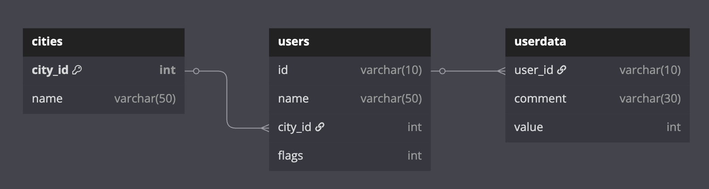
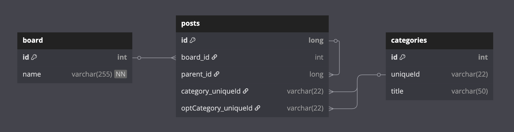
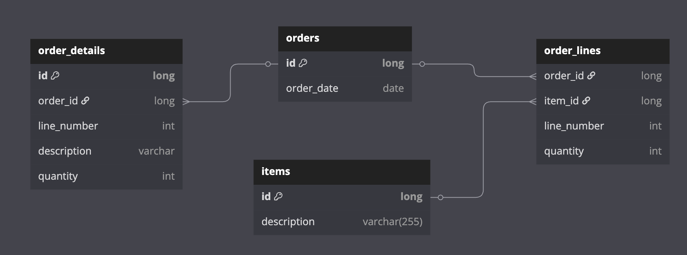
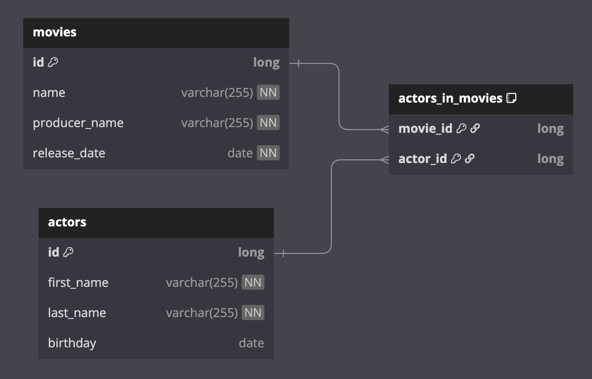
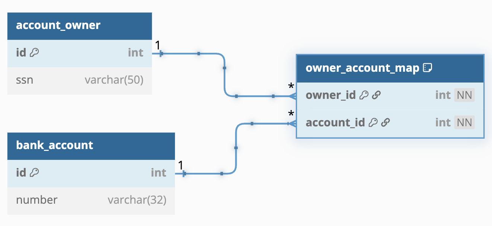

# 00 Shared: Exposed Shared Tests

이 모듈(`exposed-shared-tests`)은
`exposed-workshop` 프로젝트 전반에서 사용되는 공통 테스트 유틸리티와 리소스를 제공합니다. Exposed 기반 애플리케이션과 예제를 테스트하기 위해 특별히 설계된 포괄적인 테스트 인프라를 캡슐화합니다.

## 주요 구성 요소

### 1. Miscellaneous 테이블 정의 (`MiscTable.kt`)

다양한 컬럼 타입(`byte`, `short`, `integer`, `enumeration`, `varchar`, `decimal`, `float`, `double`, `char`)을 포함하는 다목적
`MiscTable` 스키마를 정의합니다. nullable과 non-nullable 변형을 모두 포함합니다.

데이터 검증을 위한 헬퍼 함수들도 제공합니다:

- `checkRow`: 결과 행 검증
- `checkInsert`: 삽입 데이터 검증

### 2. 공유 테스트 유틸리티 (`exposed.shared.tests` 패키지)

| 구성 요소          | 설명                                                                                       |
|----------------|------------------------------------------------------------------------------------------|
| **기본 테스트 클래스** | `AbstractExposedTest.kt`, `JdbcExposedTestBase.kt` - 테스트 설정, DB 연결, 트랜잭션 관리 표준화          |
| **데이터베이스 설정**  | `TestDB.kt` - PostgreSQL, H2, MySQL 등 다양한 RDBMS 설정                                       |
| **테스트 헬퍼**     | `TestUtils.kt`, `Assert.kt` - 일반 테스트 유틸리티와 커스텀 어서션                                       |
| **리소스 관리**     | `withAutoCommit.kt`, `WithDb.kt`, `WithSchemas.kt`, `WithTables.kt` - DB 세션, 스키마, 테이블 관리 |
| **컨테이너 통합**    | `Containers.kt` - Docker 컨테이너를 통한 격리된 DB 환경                                              |

### 3. DML 테스트 데이터 (`exposed.shared.dml` 패키지)

워크샵 전반에서 자주 사용되는 표준화된 테이블 스키마와 초기 데이터 세트를 정의합니다:

- `Cities`, `Users` - 도시-사용자 관계
- `Sales` - 판매 데이터
- `SomeAmounts` - 금액 데이터

**City Users ERD**



**Sales ERD**


### 4. 공유 Entity 스키마 (`exposed.shared.entities` 패키지)

여러 모듈에서 재사용할 수 있는 공통 엔티티 스키마를 정의합니다:

- `Boards`, `Posts`, `Categories` - 게시판 도메인

**Board ERD**



### 5. 공유 매핑 스키마 (`exposed.shared.mapping` 패키지)

**Order Schema ERD**



**Person Schema ERD**


### 6. 공유 리포지토리 스키마 (`exposed.shared.repository` 패키지)

**Movie Schema ERD**



### 7. 공유 샘플 스키마 (`exposed.shared.samples` 패키지)

**Bank Schema ERD**



**User & Cities Schema ERD**


## 활용 방법

이 모듈의 구성 요소들을 중앙화함으로써 `exposed-workshop` 프로젝트의 모든 예제와 테스트가 일관되고 강력하며 관리하기 쉬운 테스트 환경의 이점을 누릴 수 있습니다.

### 테스트 설정 예시

```kotlin
class MyTest: AbstractExposedTest() {

    @Test
    fun `테스트 예제`() = withTables(Cities, Users) {
        // 테이블이 자동으로 생성되고 트랜잭션으로 래핑됨

        val cityId = Cities.insertAndGetId {
            it[name] = "Seoul"
        }

        val userId = Users.insertAndGetId {
            it[name] = "Hong"
            it[cityId] = cityId
        }

        // 검증
        Users.selectAll().count() shouldBeEqualTo 1
    }
}
```

## 참고

- 모든 ERD 이미지는 다크 테마와 라이트 테마 버전이 있습니다.
- Testcontainers를 사용하면 Docker 환경에서 실제 DB로 테스트할 수 있습니다.
