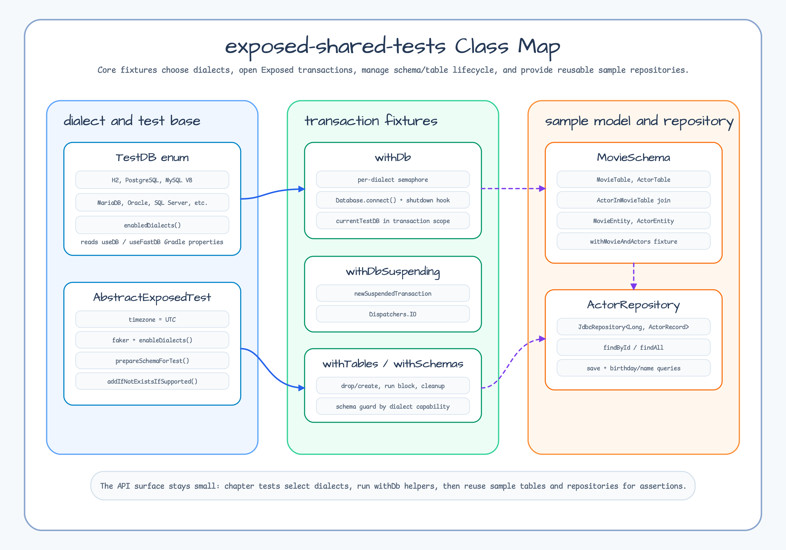

# exposed-shared-tests — Shared Exposed Test Fixtures

English | [한국어](./README.ko.md)

`exposed-shared-tests` is the fixture module used by the workshop examples.
It gives chapter tests one consistent way to choose database dialects, open Exposed transactions, create/drop tables and schemas, and load sample data for repository assertions.

## Goals

- Keep database selection and Testcontainers setup out of individual chapter tests.
- Provide the same blocking and suspending transaction patterns for every example.
- Make table, schema, DAO entity, and repository fixtures reusable across chapters.
- Verify the fixture helpers with real Exposed tables before downstream modules depend on them.

## Fixture Class Map



## How to Run

```bash
# Default matrix: H2 + PostgreSQL + MySQL V8
./gradlew :exposed-shared-tests:test

# Fast local feedback with H2 only
./gradlew :exposed-shared-tests:test -PuseFastDB=true

# Explicit dialect list
./gradlew :exposed-shared-tests:test -PuseDB=H2,POSTGRESQL
```

### Database Selection

| Gradle property | Description |
|-----------------|-------------|
| `-PuseDB=<name,...>` | Runs only the comma-separated `TestDB` values. |
| `-PuseFastDB=true` | Runs only `H2`. Ignored when `useDB` is present. |
| none | Runs `H2`, `POSTGRESQL`, and `MYSQL_V8`. |

Available `TestDB` values include:

| Value | Description |
|-------|-------------|
| `H2`, `H2_V1` | H2 in-memory targets |
| `H2_MYSQL`, `H2_MARIADB`, `H2_PSQL` | H2 compatibility modes |
| `MARIADB`, `MYSQL_V5`, `MYSQL_V8` | MySQL-family targets |
| `POSTGRESQL`, `POSTGRESQLNG` | PostgreSQL targets |
| `COCKROACH` | CockroachDB target |
| `ORACLE`, `SQLSERVER` | Enterprise DB targets when selected and available |

Priority is `-PuseDB` first, then `-PuseFastDB`, then the default matrix.

## Core Usage Patterns

### `withDb` and `withDbSuspending`

Use `withDb(testDB) { ... }` for blocking Exposed transactions and `withDbSuspending(testDB) { ... }` for coroutine tests.
Both helpers use a per-dialect semaphore, connect the selected database lazily, and expose `currentTestDB` inside the transaction scope.

```kotlin
withDb(testDB) {
    // blocking transaction
}

withDbSuspending(testDB) {
    // coroutine transaction through newSuspendedTransaction
}
```

### `withTables` and `withTablesSuspending`

`withTables(testDB, vararg tables)` drops and creates the requested tables before the block, runs the test, commits the work, and cleans up afterward.
The suspending variant follows the same lifecycle inside a coroutine transaction.

```kotlin
withTables(testDB, ActorTable) {
    ActorTable.insert { it[firstName] = "Ryu" }
    ActorTable.selectAll().count()
}
```

Related test: [`src/test/kotlin/exposed/shared/tests/WithTablesTest.kt`](src/test/kotlin/exposed/shared/tests/WithTablesTest.kt)

### `withSchemas` and `withSchemasSuspending`

Schema helpers create and drop schemas only when the active dialect reports schema support.
That keeps chapter tests portable across H2, PostgreSQL, MySQL-family databases, and selected container-backed targets.

Related test: [`src/test/kotlin/exposed/shared/tests/WithSchemasTest.kt`](src/test/kotlin/exposed/shared/tests/WithSchemasTest.kt)

### Sample Repository Fixtures

`MovieSchema` defines movie/actor tables, a many-to-many join table, DAO entities, and fixture helpers such as `withMovieAndActors`.
`ActorRepository` demonstrates a small `JdbcRepository<Long, ActorRecord>` implementation with lookup, save, count, and conditional query examples.

Related test: [`src/test/kotlin/exposed/shared/repository/ActorRepositoryTest.kt`](src/test/kotlin/exposed/shared/repository/ActorRepositoryTest.kt)

## Notes for Chapter Authors

- Extend `AbstractExposedTest` and use `@MethodSource(ENABLE_DIALECTS_METHOD)` for dialect-parameterized tests.
- Prefer the shared fixture helpers over ad hoc `Database.connect()` and `SchemaUtils` calls.
- Use `-PuseFastDB=true` while iterating locally, then run the default matrix before relying on behavior across dialects.

## Next Chapter

- [01-spring-boot](../../01-spring-boot/README.md): Exposed usage patterns in Spring Boot MVC and WebFlux examples.
