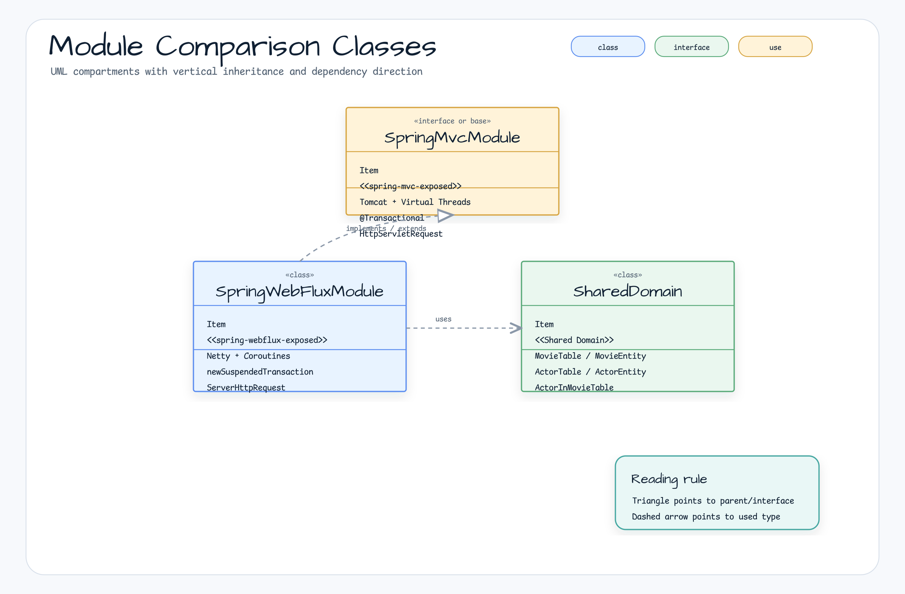
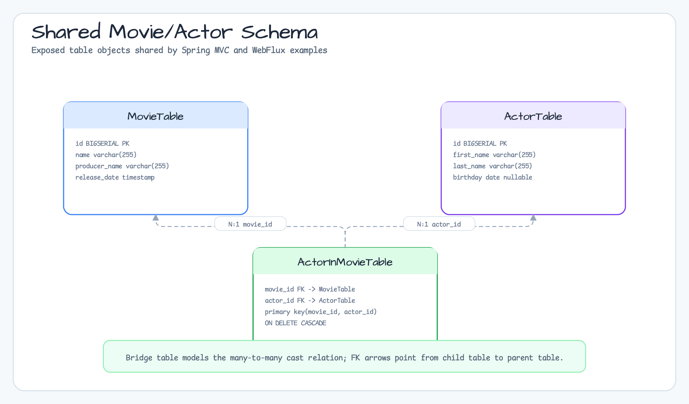

# 01 Spring Boot with Exposed

[English](./README.md) | 한국어

Spring Boot + Exposed로 REST API를 구현하는 챕터입니다. 동기 블로킹(Spring MVC + Virtual Threads)과 coroutine 기반 WebFlux 두 가지 웹 모델에서 동일한 영화/배우 도메인을 구현하며 Exposed 트랜잭션 경계의 차이를 비교합니다.

## 챕터 목표

- Spring MVC와 WebFlux에서 Exposed 기반 Repository 패턴을 비교하며 일관된 데이터 흐름을 확인한다.
- Spring이 관리하는 blocking 트랜잭션과 코드에서 직접 여는 suspended transaction의 차이를 파악한다.
- Swagger/OpenAPI를 통해 API를 자동 문서화하고 검증한다.

## 선수 지식

- Spring Boot 기본 개념 (컨트롤러, 서비스, 트랜잭션)
- [`00-shared/exposed-shared-tests`](../00-shared/exposed-shared-tests/README.ko.md): 공통 테스트 베이스 클래스와 DB 설정

---

## 포함 모듈

| 모듈                       | 서버     | 동시성 모델                             | 트랜잭션 관리                            |
|--------------------------|--------|------------------------------------|------------------------------------|
| `spring-mvc-exposed`     | Tomcat | Virtual Threads (블로킹 허용)           | `@Transactional` (Spring AOP)      |
| `spring-webflux-exposed` | Netty  | Kotlin Coroutines + suspend handler | `newSuspendedTransaction { }` (직접) |

### 모듈 비교



---

## 공통 도메인 구조

두 모듈은 동일한 스키마와 REST API 구조를 공유합니다.

### 데이터베이스 스키마



### REST API 구조

| 컨트롤러                    | 경로              | 주요 기능                      |
|-------------------------|-----------------|----------------------------|
| `ActorController`       | `/actors`       | 배우 CRUD (조회, 검색, 생성, 삭제)   |
| `MovieController`       | `/movies`       | 영화 CRUD (조회, 검색, 생성, 삭제)   |
| `MovieActorsController` | `/movie-actors` | 영화-배우 관계 조회, 카운트, 제작자 겸 배우 |

---

## 권장 학습 순서

1. **`spring-mvc-exposed`**: 익숙한 동기 모델에서 Exposed DSL/DAO 패턴을 먼저 익힌다.
2. **`spring-webflux-exposed`**: 동일 도메인을 suspend handler와 명시적인 `newSuspendedTransaction` 블록으로 구현하는 차이를 확인한다.

---

## 실행 방법

```bash
# Spring MVC 모듈 기동
./gradlew :spring-mvc-exposed:bootRun

# Spring WebFlux 모듈 기동
./gradlew :spring-webflux-exposed:bootRun

# 각 모듈 테스트
./gradlew :spring-mvc-exposed:test
./gradlew :spring-webflux-exposed:test

# Swagger UI (두 모듈 모두 동일 경로)
open http://localhost:8080/swagger-ui.html
```

---

## 테스트 포인트

- 동기/비동기 API에서 동일한 도메인 결과가 일관되게 반환되는지 검증한다.
- Swagger UI가 실행 시 `/swagger-ui.html`에서 자동으로 노출되는지 확인한다.
- 잘못된 파라미터(`birthday=invalid-date`)가 전달될 때 예외 없이 전체 목록이 반환되는지 확인한다.

## 성능·안정성 체크포인트

- **MVC**: Virtual Threads를 늘렸을 때 커넥션 풀/DB 부하가 급등하지 않는지 점검한다.
- **WebFlux**: Netty 요청 처리와 Exposed JDBC 트랜잭션 경계가 섞이지 않고, repository 작업이 `newSuspendedTransaction` 안에서 실행되는지 확인한다.
- 두 모듈 모두 `spring.profiles.active=postgres`로 전환하여 PostgreSQL에서 동작을 검증한다.

---

## 다음 챕터

- [02-alternatives-to-jpa](../02-alternatives-to-jpa/README.ko.md): R2DBC, Vert.x, Hibernate Reactive 등 JPA 대안 스택을 학습하는 챕터
