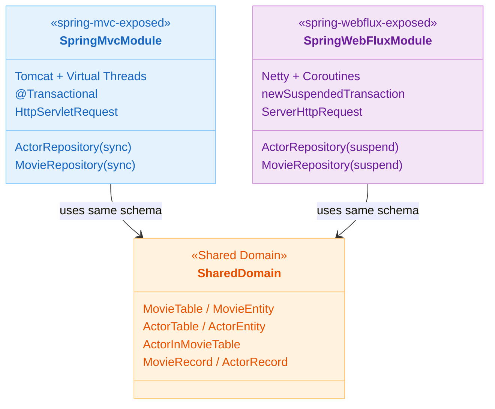
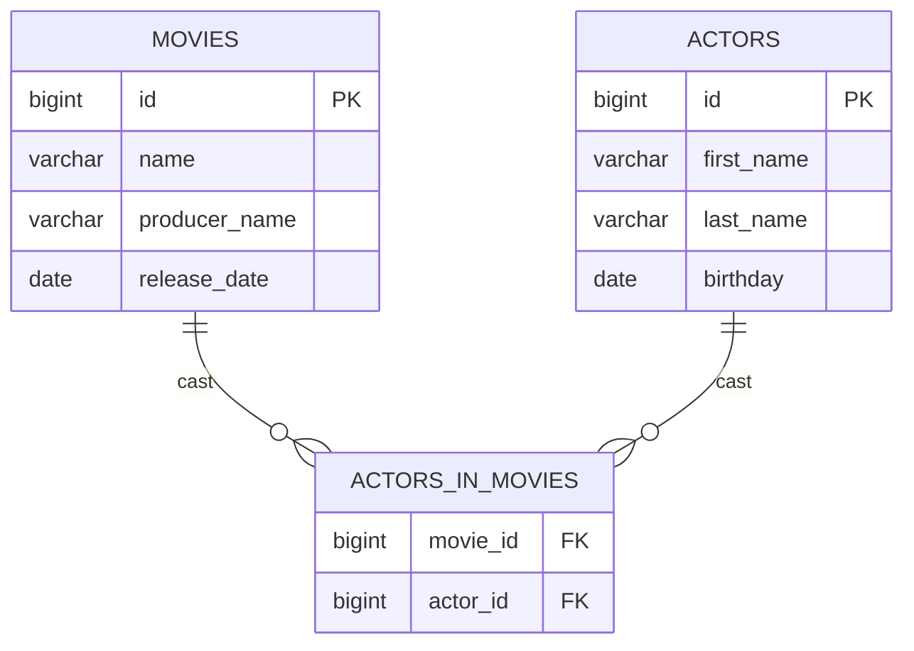

# 01 Spring Boot with Exposed

English | [한국어](./README.ko.md)

This chapter implements REST APIs with Spring Boot + Exposed. It compares two web models -- synchronous blocking (Spring MVC + Virtual Threads) and asynchronous non-blocking (Spring WebFlux + Kotlin Coroutines) -- implementing the same Movie/Actor domain to compare Exposed transaction handling approaches.

## Chapter Goals

- Compare Exposed-based Repository patterns in Spring MVC and WebFlux while verifying consistent data flow.
- Understand the differences in transaction/connection handling between Virtual Threads and Kotlin Coroutines.
- Auto-document and verify APIs through Swagger/OpenAPI.

## Prerequisites

- Basic Spring Boot concepts (controllers, services, transactions)
- [`00-shared/exposed-shared-tests`](../00-shared/exposed-shared-tests/README.md): Shared test base classes and DB configuration

---

## Included Modules

| Module                    | Server  | Concurrency Model                       | Transaction Management               |
|---------------------------|---------|----------------------------------------|--------------------------------------|
| `spring-mvc-exposed`      | Tomcat  | Virtual Threads (blocking allowed)      | `@Transactional` (Spring AOP)        |
| `spring-webflux-exposed`  | Netty   | Kotlin Coroutines + Dispatchers.IO      | `newSuspendedTransaction { }` (direct) |

### Module Comparison



---

## Shared Domain Structure

Both modules share the same schema and REST API structure.

### Database Schema



### REST API Structure

| Controller               | Path             | Key Features                                    |
|--------------------------|------------------|-------------------------------------------------|
| `ActorController`        | `/actors`        | Actor CRUD (read, search, create, delete)       |
| `MovieController`        | `/movies`        | Movie CRUD (read, search, create, delete)       |
| `MovieActorsController`  | `/movie-actors`  | Movie-actor relations, counts, producing actors |

---

## Recommended Learning Order

1. **`spring-mvc-exposed`**: Learn Exposed DSL/DAO patterns first in the familiar synchronous model.
2. **`spring-webflux-exposed`**: Compare how the same domain is implemented with suspend functions and `newSuspendedTransaction`.

---

## How to Run

```bash
# Start Spring MVC module
./gradlew :01-spring-boot:spring-mvc-exposed:bootRun

# Start Spring WebFlux module
./gradlew :01-spring-boot:spring-webflux-exposed:bootRun

# Test each module
./gradlew :01-spring-boot:spring-mvc-exposed:test
./gradlew :01-spring-boot:spring-webflux-exposed:test

# Swagger UI (same path for both modules)
open http://localhost:8080/swagger-ui.html
```

---

## Test Points

- Verify that sync/async APIs consistently return the same domain results.
- Confirm that Swagger UI is automatically exposed at `/swagger-ui.html` on startup.
- Verify that invalid parameters (`birthday=invalid-date`) return the full list without exceptions.

## Performance & Stability Checkpoints

- **MVC**: Check that connection pool/DB load does not spike when increasing Virtual Threads.
- **WebFlux**: Verify that the Netty EventLoop and Exposed JDBC transactions are properly separated via `Dispatchers.IO`.
- Switch both modules to `spring.profiles.active=postgres` and verify behavior on PostgreSQL.

---

## Next Chapter

- [02-alternatives-to-jpa](../02-alternatives-to-jpa/README.md): Learn alternative stacks to JPA including R2DBC, Vert.x, and Hibernate Reactive
