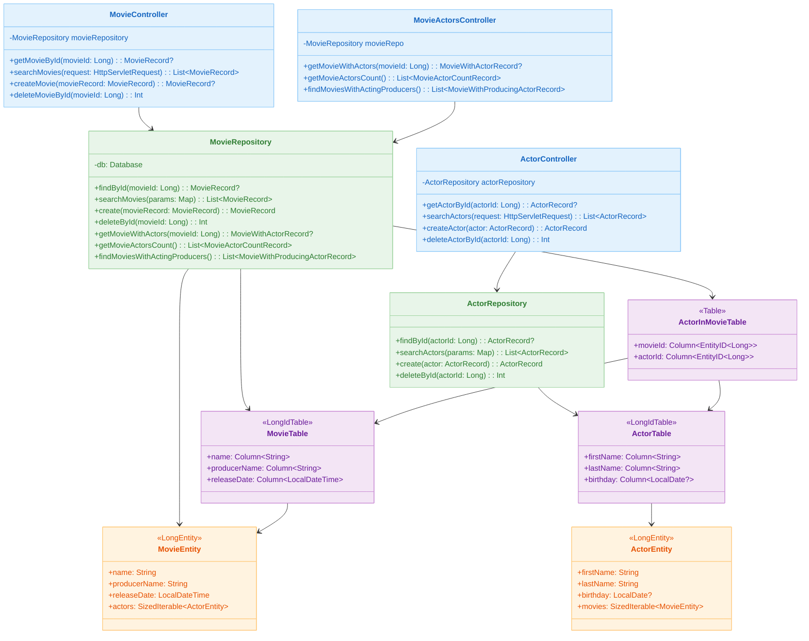
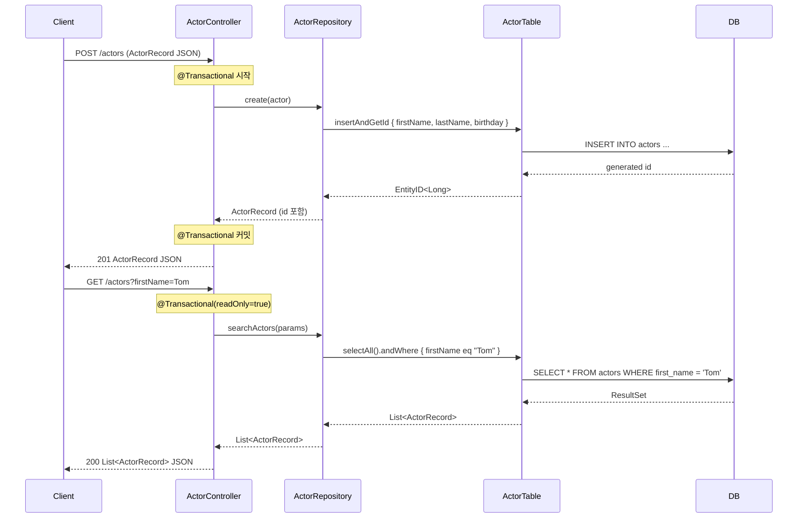
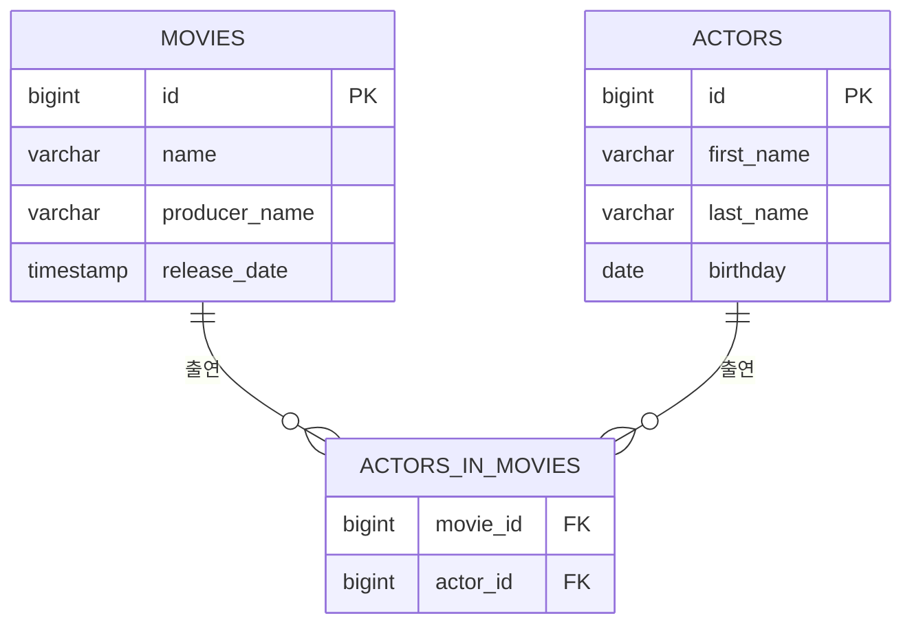

# Spring MVC with Exposed

[English](./README.md) | 한국어

Spring MVC + Virtual Threads 환경에서 Exposed DSL/DAO를 사용하는 REST API 모듈입니다. 영화(Movie)와 배우(Actor) 도메인을 통해 동기 블로킹 모델에서 Exposed 트랜잭션 처리 방법을 학습합니다.

## 학습 목표

- Spring MVC 컨트롤러에서 `@Transactional`과 Exposed Repository를 조합하는 방법을 익힌다.
- Tomcat Virtual Thread executor로 블로킹 I/O의 동시성을 높이는 설정을 이해한다.
- Exposed DSL(`selectAll`, `andWhere`, `insertAndGetId`, `deleteWhere`)과 DAO(`Entity.findById`, `load`) 두 가지 접근법을 비교한다.
- HikariCP + Spring Profile 조합으로 H2/MySQL/PostgreSQL을 전환하는 데이터베이스 설정을 이해한다.

## 선수 지식

- [`00-shared/exposed-shared-tests`](../../00-shared/exposed-shared-tests/README.ko.md): 공통 테스트 베이스 클래스와 DB 설정 참고
- Spring MVC, REST 컨트롤러, `@Transactional` 기본 개념

---

## 아키텍처



---

## API 목록

### Actor API (`/actors`)

| HTTP 메서드 | 경로             | 설명                        | 트랜잭션           |
|----------|----------------|---------------------------|----------------|
| `GET`    | `/actors/{id}` | ID로 배우 단건 조회              | readOnly=true  |
| `GET`    | `/actors`      | 쿼리 파라미터 기반 배우 검색 (없으면 전체) | readOnly=true  |
| `POST`   | `/actors`      | 새 배우 생성                   | readOnly=false |
| `DELETE` | `/actors/{id}` | ID로 배우 삭제                 | readOnly=false |

**검색 파라미터** (`GET /actors`):

| 파라미터        | 설명                  | 예시           |
|-------------|---------------------|--------------|
| `firstName` | 이름 일치 검색            | `Tom`        |
| `lastName`  | 성 일치 검색             | `Hanks`      |
| `birthday`  | 생년월일 (`yyyy-MM-dd`) | `1956-07-09` |
| `id`        | 배우 ID 일치 검색         | `1`          |

### Movie API (`/movies`)

| HTTP 메서드 | 경로             | 설명                        | 트랜잭션           |
|----------|----------------|---------------------------|----------------|
| `GET`    | `/movies/{id}` | ID로 영화 단건 조회              | readOnly=true  |
| `GET`    | `/movies`      | 쿼리 파라미터 기반 영화 검색 (없으면 전체) | readOnly=true  |
| `POST`   | `/movies`      | 새 영화 생성                   | readOnly=false |
| `DELETE` | `/movies/{id}` | ID로 영화 삭제                 | readOnly=false |

**검색 파라미터** (`GET /movies`):

| 파라미터           | 설명                           | 예시                    |
|----------------|------------------------------|-----------------------|
| `name`         | 영화 제목 일치 검색                  | `Forrest Gump`        |
| `producerName` | 제작자 이름 일치 검색                 | `Robert Zemeckis`     |
| `releaseDate`  | 개봉일시 (`yyyy-MM-ddTHH:mm:ss`) | `1994-07-06T00:00:00` |
| `id`           | 영화 ID 일치 검색                  | `1`                   |

### Movie-Actor Relation API (`/movie-actors`)

| HTTP 메서드 | 경로                               | 설명                    |
|----------|----------------------------------|-----------------------|
| `GET`    | `/movie-actors/{movieId}`        | 특정 영화와 출연 배우 목록 조회    |
| `GET`    | `/movie-actors/count`            | 각 영화별 출연 배우 수 집계      |
| `GET`    | `/movie-actors/acting-producers` | 제작자가 직접 배우로 출연한 영화 목록 |

---

## 요청 처리 흐름



---

## 핵심 구현

### Exposed DSL 쿼리 패턴

배우 검색 — 동적 조건 조합:

```kotlin
fun searchActors(params: Map<String, String?>): List<ActorRecord> {
    val query: Query = ActorTable.selectAll()

    params.forEach { (key, value) ->
        when (key) {
            ActorTable::id.name        -> value?.let { parseLongParam(key, it) }
                ?.let { query.andWhere { ActorTable.id eq it } }
            ActorTable::firstName.name -> value?.let { query.andWhere { ActorTable.firstName eq it } }
            ActorTable::lastName.name  -> value?.let { query.andWhere { ActorTable.lastName eq it } }
            ActorTable::birthday.name  -> value?.let { parseLocalDateParam(key, it) }
                ?.let { query.andWhere { ActorTable.birthday eq it } }
        }
    }

    return query.map { it.toActorRecord() }
}
```

영화-배우 관계 조회 — DAO Eager Loading:

```kotlin
fun getMovieWithActors(movieId: Long): MovieWithActorRecord? {
    // DAO 방식: actors 관계를 eager load
    return MovieEntity.findById(movieId)
        ?.load(MovieEntity::actors)
        ?.toMovieWithActorRecord()
}
```

영화-배우 수 집계 — DSL JOIN + GROUP BY:

```kotlin
fun getMovieActorsCount(): List<MovieActorCountRecord> {
    val join = MovieTable.innerJoin(ActorInMovieTable).innerJoin(ActorTable)

    return join
        .select(MovieTable.id, MovieTable.name, ActorTable.id.count())
        .groupBy(MovieTable.id)
        .map {
            MovieActorCountRecord(
                movieName = it[MovieTable.name],
                actorCount = it[ActorTable.id.count()].toInt()
            )
        }
}
```

### Virtual Thread 설정

`app.virtualthread.enabled=true`(기본값)일 때 Tomcat executor를 Virtual Thread 기반으로 전환합니다:

```kotlin
@Configuration
@ConditionalOnProperty("app.virtualthread.enabled", havingValue = "true", matchIfMissing = true)
class TomcatVirtualThreadConfig {
    @Bean
    fun protocolHandlerVirtualThreadExecutorCustomizer(): TomcatProtocolHandlerCustomizer<*> {
        return TomcatProtocolHandlerCustomizer<ProtocolHandler> { protocolHandler ->
            protocolHandler.executor = Executors.newVirtualThreadPerTaskExecutor()
        }
    }
}
```

### 데이터베이스 프로파일 설정

Spring Profile로 데이터베이스를 전환합니다:

| 프로파일       | 데이터베이스                            |
|------------|-----------------------------------|
| `h2`       | H2 인메모리 (기본값)                     |
| `mysql`    | MySQL 8 (TestContainers 자동 실행)    |
| `postgres` | PostgreSQL (TestContainers 자동 실행) |

```bash
# PostgreSQL 프로파일로 실행
./gradlew :01-spring-boot:spring-mvc-exposed:bootRun --args='--spring.profiles.active=postgres'
```

---

## 도메인 모델



| 클래스                             | 설명                                                      |
|---------------------------------|---------------------------------------------------------|
| `MovieRecord`                   | 영화 정보 DTO (`id`, `name`, `producerName`, `releaseDate`) |
| `ActorRecord`                   | 배우 정보 DTO (`id`, `firstName`, `lastName`, `birthday`)   |
| `MovieWithActorRecord`          | 영화 + 출연 배우 목록 복합 DTO                                    |
| `MovieActorCountRecord`         | 영화명 + 출연 배우 수 집계 DTO                                    |
| `MovieWithProducingActorRecord` | 제작자 겸 배우 정보 DTO                                         |
| `MovieTable`                    | Exposed `LongIdTable` — movies 테이블                      |
| `ActorTable`                    | Exposed `LongIdTable` — actors 테이블                      |
| `ActorInMovieTable`             | 영화-배우 N:M 관계 테이블                                        |
| `MovieEntity`                   | `LongEntity` DAO (actors 관계 포함)                         |
| `ActorEntity`                   | `LongEntity` DAO (movies 관계 포함)                         |

---

## 실행 방법

```bash
# 애플리케이션 기동 (기본: H2 프로파일)
./gradlew :01-spring-boot:spring-mvc-exposed:bootRun

# 테스트 실행
./gradlew :01-spring-boot:spring-mvc-exposed:test

# Swagger UI 접속
open http://localhost:8080/swagger-ui.html
```

---

## 실습 체크리스트

- `GET /actors`, `GET /movies` 응답을 Swagger UI 또는 curl로 확인한다.
- `POST /actors` → `DELETE /actors/{id}` 순서로 생성 후 삭제 흐름을 검증한다.
- `GET /movie-actors/{movieId}`에서 DAO eager loading SQL을 로그로 확인한다.
- `app.virtualthread.enabled=false`로 설정을 끄고 처리량 차이를 비교한다.
- `spring.profiles.active=postgres`로 전환하여 PostgreSQL에서 동일 API가 동작하는지 확인한다.

---

## 다음 모듈

- [spring-webflux-exposed](../spring-webflux-exposed/README.ko.md): 동일 도메인을 Kotlin Coroutines 기반 비동기 모델로 구현하는 방법 비교
