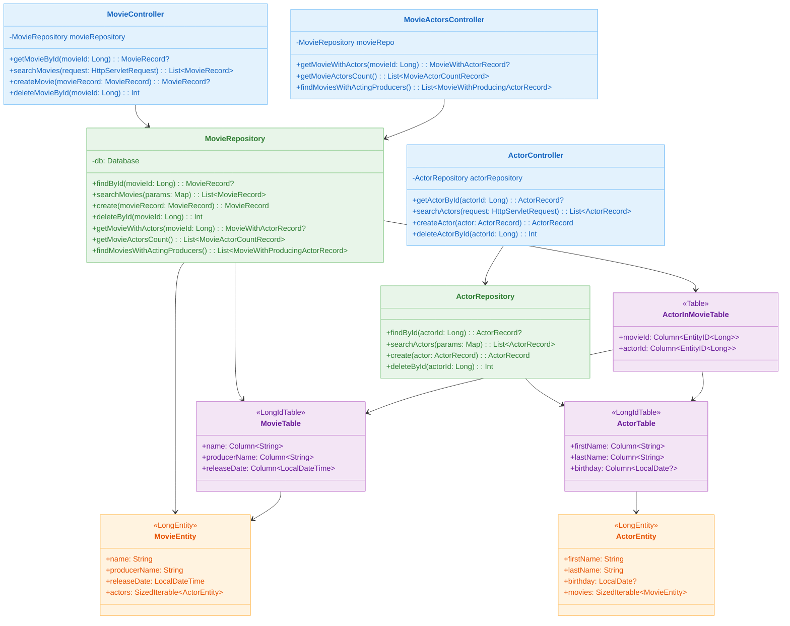
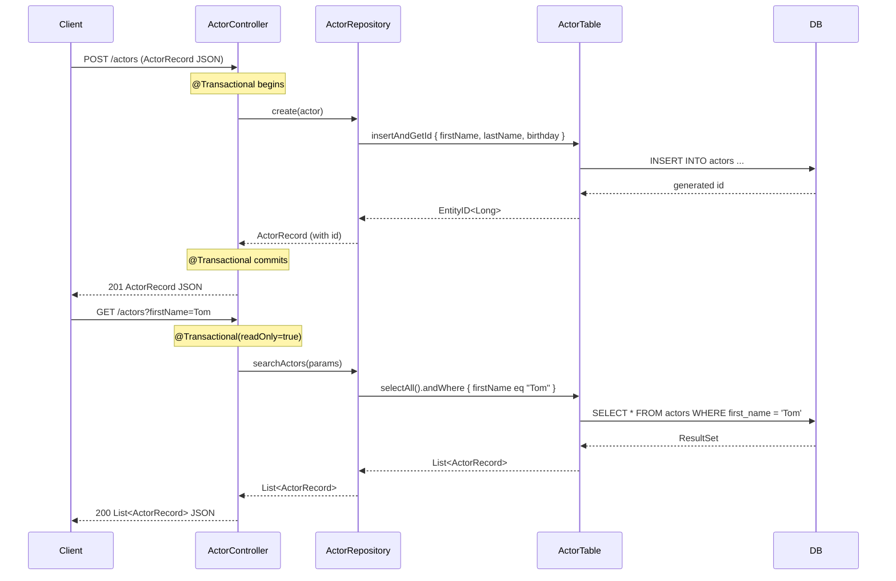
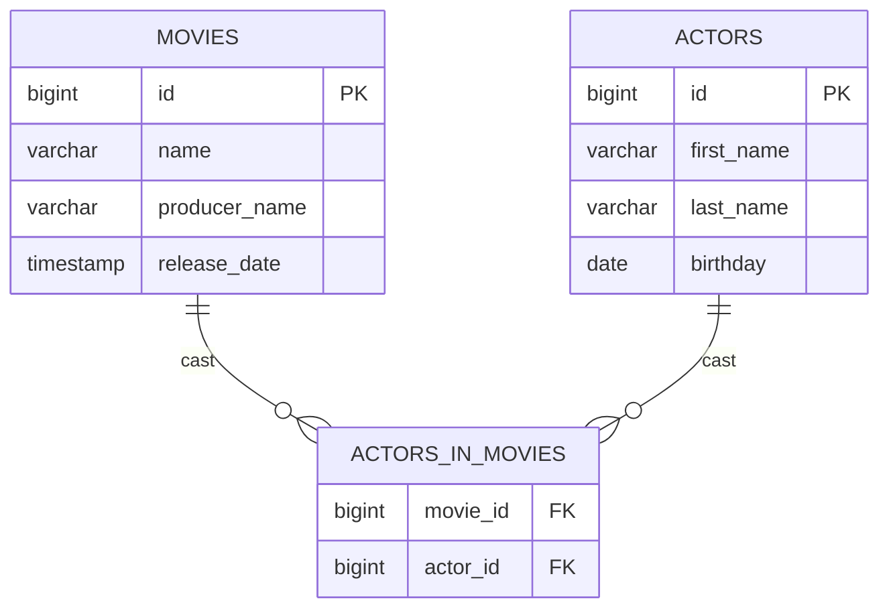

# Spring MVC with Exposed

English | [한국어](./README.ko.md)

A REST API module using Exposed DSL/DAO in a Spring MVC + Virtual Threads environment. Learn Exposed transaction handling in a synchronous blocking model through the Movie and Actor domain.

## Learning Goals

- Learn how to combine `@Transactional` with Exposed Repository in Spring MVC controllers.
- Understand the Tomcat Virtual Thread executor configuration for improving blocking I/O concurrency.
- Compare two approaches: Exposed DSL (`selectAll`, `andWhere`, `insertAndGetId`, `deleteWhere`) and DAO (`Entity.findById`, `load`).
- Understand database configuration for switching between H2/MySQL/PostgreSQL using HikariCP + Spring Profiles.

## Prerequisites

- [`00-shared/exposed-shared-tests`](../../00-shared/exposed-shared-tests/README.md): Shared test base classes and DB configuration reference
- Spring MVC, REST controllers, `@Transactional` basics

---

## Architecture



---

## API List

### Actor API (`/actors`)

| HTTP Method | Path            | Description                                  | Transaction    |
|-------------|-----------------|----------------------------------------------|----------------|
| `GET`       | `/actors/{id}`  | Get single actor by ID                       | readOnly=true  |
| `GET`       | `/actors`       | Search actors by query params (all if empty) | readOnly=true  |
| `POST`      | `/actors`       | Create new actor                             | readOnly=false |
| `DELETE`    | `/actors/{id}`  | Delete actor by ID                           | readOnly=false |

**Search Parameters** (`GET /actors`):

| Parameter   | Description                  | Example      |
|-------------|------------------------------|--------------|
| `firstName` | Match by first name          | `Tom`        |
| `lastName`  | Match by last name           | `Hanks`      |
| `birthday`  | Date of birth (`yyyy-MM-dd`) | `1956-07-09` |
| `id`        | Match by actor ID            | `1`          |

### Movie API (`/movies`)

| HTTP Method | Path            | Description                                  | Transaction    |
|-------------|-----------------|----------------------------------------------|----------------|
| `GET`       | `/movies/{id}`  | Get single movie by ID                       | readOnly=true  |
| `GET`       | `/movies`       | Search movies by query params (all if empty) | readOnly=true  |
| `POST`      | `/movies`       | Create new movie                             | readOnly=false |
| `DELETE`    | `/movies/{id}`  | Delete movie by ID                           | readOnly=false |

**Search Parameters** (`GET /movies`):

| Parameter      | Description                             | Example               |
|----------------|-----------------------------------------|-----------------------|
| `name`         | Match by movie title                    | `Forrest Gump`        |
| `producerName` | Match by producer name                  | `Robert Zemeckis`     |
| `releaseDate`  | Release datetime (`yyyy-MM-ddTHH:mm:ss`) | `1994-07-06T00:00:00` |
| `id`           | Match by movie ID                       | `1`                   |

### Movie-Actor Relation API (`/movie-actors`)

| HTTP Method | Path                              | Description                               |
|-------------|-----------------------------------|-------------------------------------------|
| `GET`       | `/movie-actors/{movieId}`         | Get movie with its cast list              |
| `GET`       | `/movie-actors/count`             | Count actors per movie                    |
| `GET`       | `/movie-actors/acting-producers`  | Movies where the producer also acts       |

---

## Request Processing Flow



---

## Key Implementation

### Exposed DSL Query Pattern

Actor search -- dynamic condition composition:

```kotlin
fun searchActors(params: Map<String, String?>): List<ActorRecord> {
    val query: Query = ActorTable.selectAll()

    params.forEach { (key, value) ->
        when (key) {
            ActorTable::id.name        -> value?.let { parseLongParam(key, it) }
                ?.let { query.andWhere { ActorTable.id eq it } }
            ActorTable::firstName.name -> value?.let { query.andWhere { ActorTable.firstName eq it } }
            ActorTable::lastName.name  -> value?.let { query.andWhere { ActorTable.lastName eq it } }
            ActorTable::birthday.name  -> value?.let { parseLocalDateParam(key, it) }
                ?.let { query.andWhere { ActorTable.birthday eq it } }
        }
    }

    return query.map { it.toActorRecord() }
}
```

Movie-actor relation query -- DAO Eager Loading:

```kotlin
fun getMovieWithActors(movieId: Long): MovieWithActorRecord? {
    // DAO approach: eager load the actors relation
    return MovieEntity.findById(movieId)
        ?.load(MovieEntity::actors)
        ?.toMovieWithActorRecord()
}
```

Movie-actor count aggregation -- DSL JOIN + GROUP BY:

```kotlin
fun getMovieActorsCount(): List<MovieActorCountRecord> {
    val join = MovieTable.innerJoin(ActorInMovieTable).innerJoin(ActorTable)

    return join
        .select(MovieTable.id, MovieTable.name, ActorTable.id.count())
        .groupBy(MovieTable.id)
        .map {
            MovieActorCountRecord(
                movieName = it[MovieTable.name],
                actorCount = it[ActorTable.id.count()].toInt()
            )
        }
}
```

### Virtual Thread Configuration

When `app.virtualthread.enabled=true` (default), the Tomcat executor switches to Virtual Thread-based:

```kotlin
@Configuration(proxyBeanMethods = false)
@ConditionalOnProperty("app.virtualthread.enabled", havingValue = "true", matchIfMissing = true)
class TomcatVirtualThreadConfig {
    @Bean
    fun protocolHandlerVirtualThreadExecutorCustomizer(): TomcatProtocolHandlerCustomizer<*> {
        return TomcatProtocolHandlerCustomizer<ProtocolHandler> { protocolHandler ->
            protocolHandler.executor = Executors.newVirtualThreadPerTaskExecutor()
        }
    }
}
```

### Database Profile Configuration

Switch databases using Spring Profiles:

| Profile    | Database                              |
|------------|---------------------------------------|
| `h2`       | H2 in-memory (default)               |
| `mysql`    | MySQL 8 (TestContainers auto-start)  |
| `postgres` | PostgreSQL (TestContainers auto-start)|

```bash
# Run with PostgreSQL profile
./gradlew :01-spring-boot:spring-mvc-exposed:bootRun --args='--spring.profiles.active=postgres'
```

---

## Domain Model



| Class                            | Description                                                     |
|----------------------------------|-----------------------------------------------------------------|
| `MovieRecord`                    | Movie info DTO (`id`, `name`, `producerName`, `releaseDate`)    |
| `ActorRecord`                    | Actor info DTO (`id`, `firstName`, `lastName`, `birthday`)      |
| `MovieWithActorRecord`           | Composite DTO with movie + cast list                            |
| `MovieActorCountRecord`          | Aggregation DTO with movie name + actor count                   |
| `MovieWithProducingActorRecord`  | DTO for producer who also acts                                  |
| `MovieTable`                     | Exposed `LongIdTable` -- movies table                           |
| `ActorTable`                     | Exposed `LongIdTable` -- actors table                           |
| `ActorInMovieTable`              | Movie-actor N:M relation table                                  |
| `MovieEntity`                    | `LongEntity` DAO (includes actors relation)                     |
| `ActorEntity`                    | `LongEntity` DAO (includes movies relation)                     |

---

## How to Run

```bash
# Start application (default: H2 profile)
./gradlew :01-spring-boot:spring-mvc-exposed:bootRun

# Run tests
./gradlew :01-spring-boot:spring-mvc-exposed:test

# Access Swagger UI
open http://localhost:8080/swagger-ui.html
```

---

## Practice Checklist

- Verify `GET /actors` and `GET /movies` responses via Swagger UI or curl.
- Validate the create-then-delete flow with `POST /actors` followed by `DELETE /actors/{id}`.
- Check DAO eager loading SQL in logs via `GET /movie-actors/{movieId}`.
- Disable `app.virtualthread.enabled=false` and compare throughput differences.
- Switch to `spring.profiles.active=postgres` and verify the same APIs work on PostgreSQL.

---

## Next Module

- [spring-webflux-exposed](../spring-webflux-exposed/README.md): Compare the same domain implemented with Kotlin Coroutines-based async model
