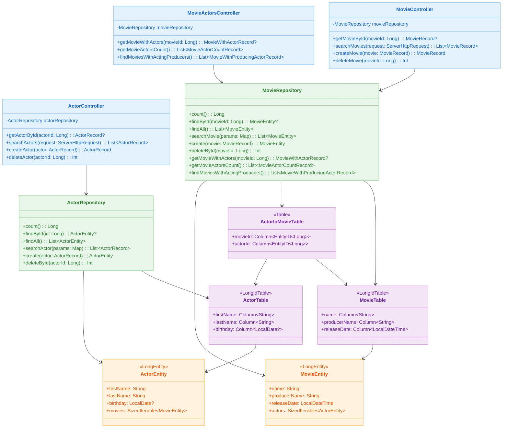
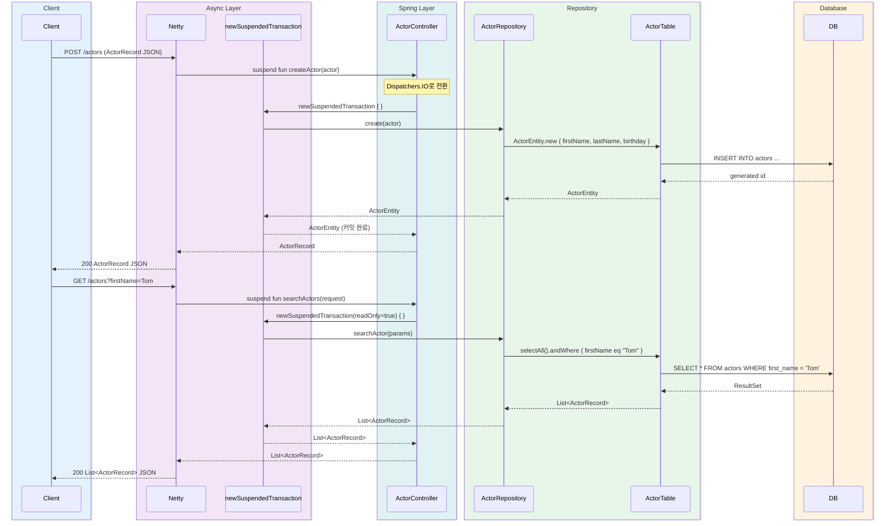
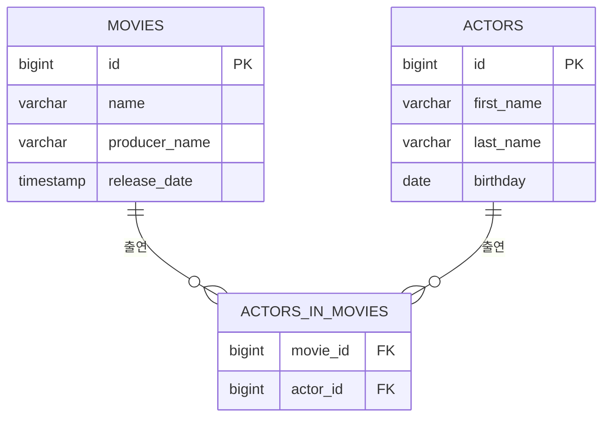

# Spring WebFlux with Exposed

[English](./README.md) | 한국어

Spring WebFlux + Kotlin Coroutines 환경에서 Exposed DSL/DAO를 논블로킹 방식으로 사용하는 REST API 모듈입니다. 영화(Movie)와 배우(Actor) 도메인을 통해
`newSuspendedTransaction` 기반 suspend 트랜잭션 처리 방법을 학습합니다.

## 학습 목표

- `newSuspendedTransaction`을 사용하여 WebFlux suspend 핸들러 안에서 Exposed 트랜잭션을 관리하는 방법을 익힌다.
- Netty 이벤트 루프와 Exposed JDBC 트랜잭션을 `Dispatchers.IO`로 분리하는 패턴을 이해한다.
- DAO 방식(`ActorEntity.new`, `MovieEntity.findById`)과 DSL 방식(`selectAll`, `andWhere`)을 suspend 컨텍스트에서 비교한다.
- Netty ConnectionProvider, LoopResources 튜닝을 통해 Reactive 서버 성능을 조정하는 방법을 확인한다.

## 선수 지식

- [`00-shared/exposed-shared-tests`](../../00-shared/exposed-shared-tests/README.ko.md): 공통 테스트 베이스 클래스와 DB 설정 참고
- Kotlin Coroutines(`suspend`, `CoroutineScope`, `Dispatchers.IO`) 기본 개념
- Spring WebFlux 기본 개념 (Reactor, `ServerHttpRequest`)

---

## Spring MVC vs Spring WebFlux 비교

| 항목               | spring-mvc-exposed              | spring-webflux-exposed                  |
|------------------|---------------------------------|-----------------------------------------|
| 서버               | Tomcat                          | Netty                                   |
| 동시성 모델           | Virtual Threads (블로킹 허용)        | Kotlin Coroutines + `Dispatchers.IO`    |
| 트랜잭션 관리          | `@Transactional` (Spring AOP)   | `newSuspendedTransaction { }` (직접 호출)   |
| 핸들러 함수 형태        | 일반 함수                           | `suspend fun`                           |
| 요청 객체            | `HttpServletRequest`            | `ServerHttpRequest`                     |
| Repository 반환 타입 | 동기 (`ActorRecord`, `List<...>`) | suspend 함수 (`ActorEntity`, `List<...>`) |
| 설정 클래스           | `TomcatVirtualThreadConfig`     | `NettyConfig`                           |

---

## 아키텍처



---

## API 목록

### Actor API (`/actors`)

| HTTP 메서드 | 경로             | 설명                           | 트랜잭션           |
|----------|----------------|------------------------------|----------------|
| `GET`    | `/actors/{id}` | ID로 배우 단건 조회                 | readOnly=true  |
| `GET`    | `/actors`      | 쿼리 파라미터 기반 배우 검색 (없으면 전체 반환) | readOnly=true  |
| `POST`   | `/actors`      | 새 배우 생성                      | readOnly=false |
| `DELETE` | `/actors/{id}` | ID로 배우 삭제                    | readOnly=false |

**검색 파라미터** (`GET /actors`):

| 파라미터        | 설명                  | 예시           |
|-------------|---------------------|--------------|
| `firstName` | 이름 일치 검색            | `Tom`        |
| `lastName`  | 성 일치 검색             | `Hanks`      |
| `birthday`  | 생년월일 (`yyyy-MM-dd`) | `1956-07-09` |
| `id`        | 배우 ID 일치 검색         | `1`          |

### Movie API (`/movies`)

| HTTP 메서드 | 경로             | 설명                           | 트랜잭션           |
|----------|----------------|------------------------------|----------------|
| `GET`    | `/movies/{id}` | ID로 영화 단건 조회                 | readOnly=true  |
| `GET`    | `/movies`      | 쿼리 파라미터 기반 영화 검색 (없으면 전체 반환) | readOnly=true  |
| `POST`   | `/movies`      | 새 영화 생성                      | readOnly=false |
| `DELETE` | `/movies/{id}` | ID로 영화 삭제                    | readOnly=false |

**검색 파라미터** (`GET /movies`):

| 파라미터           | 설명                           | 예시                    |
|----------------|------------------------------|-----------------------|
| `name`         | 영화 제목 일치 검색                  | `Forrest Gump`        |
| `producerName` | 제작자 이름 일치 검색                 | `Robert Zemeckis`     |
| `releaseDate`  | 개봉일시 (`yyyy-MM-ddTHH:mm:ss`) | `1994-07-06T00:00:00` |
| `id`           | 영화 ID 일치 검색                  | `1`                   |

### Movie-Actor Relation API (`/movie-actors`)

| HTTP 메서드 | 경로                               | 설명                    |
|----------|----------------------------------|-----------------------|
| `GET`    | `/movie-actors/{movieId}`        | 특정 영화와 출연 배우 목록 조회    |
| `GET`    | `/movie-actors/count`            | 각 영화별 출연 배우 수 집계      |
| `GET`    | `/movie-actors/acting-producers` | 제작자가 직접 배우로 출연한 영화 목록 |

---

## 요청 처리 흐름



---

## 핵심 구현

### suspend 트랜잭션 패턴

컨트롤러에서 `newSuspendedTransaction`으로 트랜잭션 경계를 직접 제어합니다:

```kotlin
@GetMapping("/{id}")
suspend fun getActorById(@PathVariable("id") actorId: Long): ActorRecord? {
    return newSuspendedTransaction(readOnly = true) {
        actorRepository.findById(actorId)?.toActorRecord()
    }
}

@PostMapping
suspend fun createActor(@RequestBody actor: ActorRecord): ActorRecord =
    newSuspendedTransaction {
        actorRepository.create(actor).toActorRecord()
    }
```

### DAO 방식 배우 생성

```kotlin
suspend fun create(actor: ActorRecord): ActorEntity {
    return ActorEntity.new {
        firstName = actor.firstName
        lastName = actor.lastName
        actor.birthday?.let { day ->
            birthday = runCatching { LocalDate.parse(day) }.getOrNull()
        }
    }
}
```

### 영화-배우 관계 — Eager Loading

```kotlin
suspend fun getMovieWithActors(movieId: Long): MovieWithActorRecord? {
    return MovieEntity
        .findById(movieId)
        ?.load(MovieEntity::actors)  // eager loading
        ?.toMovieWithActorRecord()
}
```

### 복잡한 JOIN 쿼리 — Lazy 초기화 패턴

```kotlin
private val MovieActorJoin by lazy {
    MovieTable
        .innerJoin(ActorInMovieTable)
        .innerJoin(ActorTable)
}

suspend fun getMovieActorsCount(): List<MovieActorCountRecord> {
    return MovieActorJoin
        .select(MovieTable.id, MovieTable.name, ActorTable.id.count())
        .groupBy(MovieTable.id)
        .map {
            MovieActorCountRecord(
                movieName = it[MovieTable.name],
                actorCount = it[ActorTable.id.count()].toInt()
            )
        }
}
```

### Netty 서버 튜닝

```kotlin
@Configuration
class NettyConfig {
    @Bean
    fun reactorResourceFactory(): ReactorResourceFactory {
        return ReactorResourceFactory().apply {
            isUseGlobalResources = false
            connectionProvider = ConnectionProvider.builder("http")
                .maxConnections(8_000)
                .maxIdleTime(30.seconds.toJavaDuration())
                .build()
            loopResources = LoopResources.create(
                "event-loop",
                4,
                maxOf(Runtimex.availableProcessors * 8, 64),
                true
            )
        }
    }
}
```

### 데이터베이스 프로파일 설정

Spring Profile로 데이터베이스를 전환합니다:

| 프로파일       | 데이터베이스                            |
|------------|-----------------------------------|
| `h2`       | H2 인메모리 (기본값)                     |
| `mysql`    | MySQL 8 (TestContainers 자동 실행)    |
| `postgres` | PostgreSQL (TestContainers 자동 실행) |

```bash
# PostgreSQL 프로파일로 실행
./gradlew :01-spring-boot:spring-webflux-exposed:bootRun --args='--spring.profiles.active=postgres'
```

---

## 도메인 모델



| 클래스                             | 설명                                                           |
|---------------------------------|--------------------------------------------------------------|
| `MovieRecord`                   | 영화 정보 DTO (`id`, `name`, `producerName`, `releaseDate`)      |
| `ActorRecord`                   | 배우 정보 DTO (`id`, `firstName`, `lastName`, `birthday`)        |
| `MovieWithActorRecord`          | 영화 + 출연 배우 목록 복합 DTO                                         |
| `MovieActorCountRecord`         | 영화명 + 출연 배우 수 집계 DTO                                         |
| `MovieWithProducingActorRecord` | 제작자 겸 배우 정보 DTO                                              |
| `MovieTable`                    | Exposed `LongIdTable` — movies 테이블 (name, producerName 인덱스)  |
| `ActorTable`                    | Exposed `LongIdTable` — actors 테이블 (firstName, lastName 인덱스) |
| `ActorInMovieTable`             | 영화-배우 N:M 관계 테이블 (복합 PK)                                     |
| `MovieEntity`                   | `LongEntity` DAO (actors 관계 포함)                              |
| `ActorEntity`                   | `LongEntity` DAO (movies 관계 포함)                              |

---

## 실행 방법

```bash
# 애플리케이션 기동 (기본: H2 프로파일)
./gradlew :01-spring-boot:spring-webflux-exposed:bootRun

# 테스트 실행
./gradlew :01-spring-boot:spring-webflux-exposed:test

# Swagger UI 접속
open http://localhost:8080/swagger-ui.html
```

---

## 실습 체크리스트

- `GET /actors`, `GET /movies` 응답을 Swagger UI 또는 curl로 확인한다.
- `POST /actors` → `GET /actors/{id}` → `DELETE /actors/{id}` 전체 CRUD 흐름을 검증한다.
- `GET /movie-actors/{movieId}`에서 DAO eager loading이 생성하는 SQL 2개를 로그로 확인한다.
- `GET /movie-actors/acting-producers`에서 조건부 JOIN SQL을 로그로 확인한다.
- `spring.profiles.active=postgres`로 전환하여 PostgreSQL에서 동일 API가 동작하는지 확인한다.

---

## 다음 챕터

- [02-alternatives-to-jpa](../../02-alternatives-to-jpa/README.ko.md): R2DBC, Vert.x, Hibernate Reactive 등 JPA 대안 스택 학습
