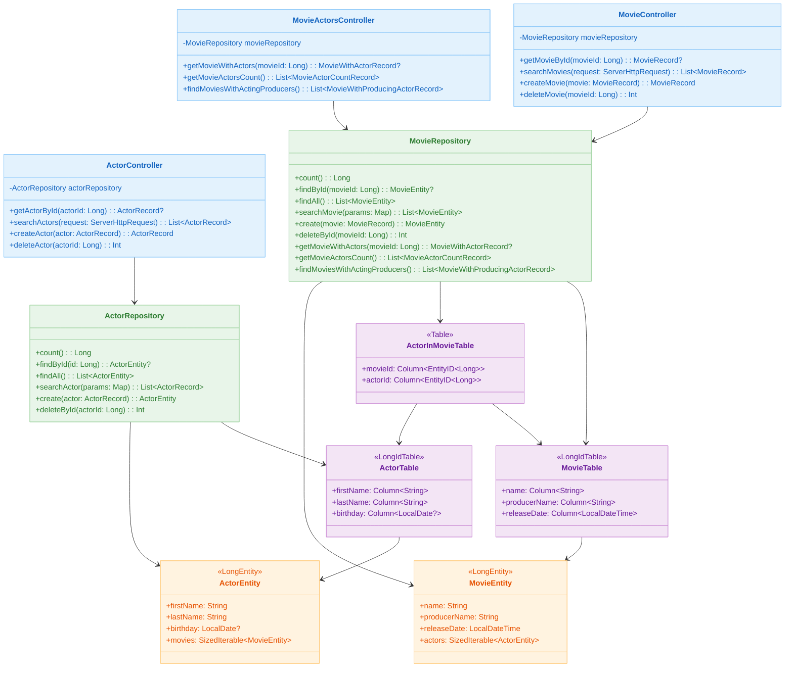
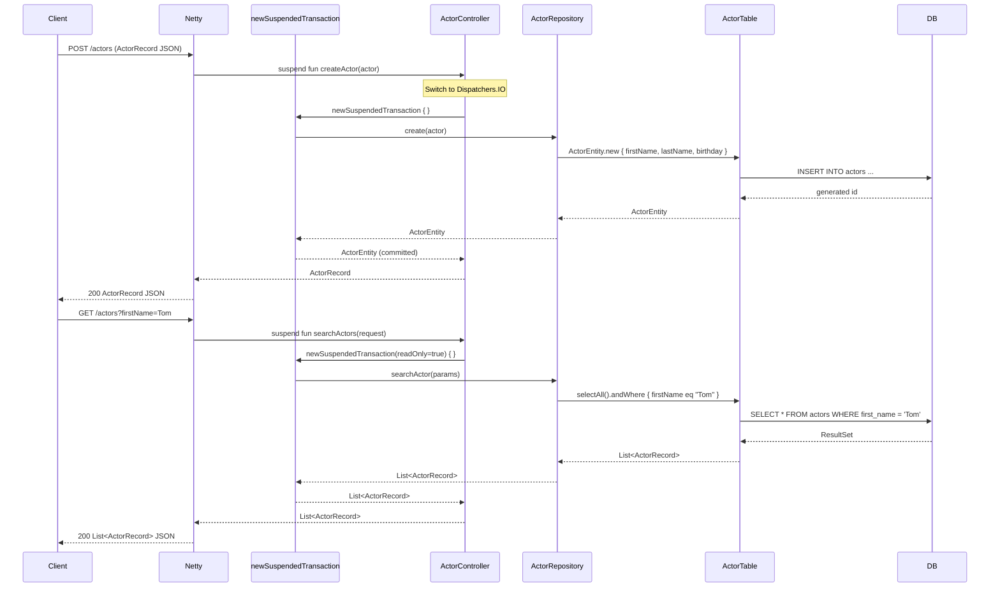
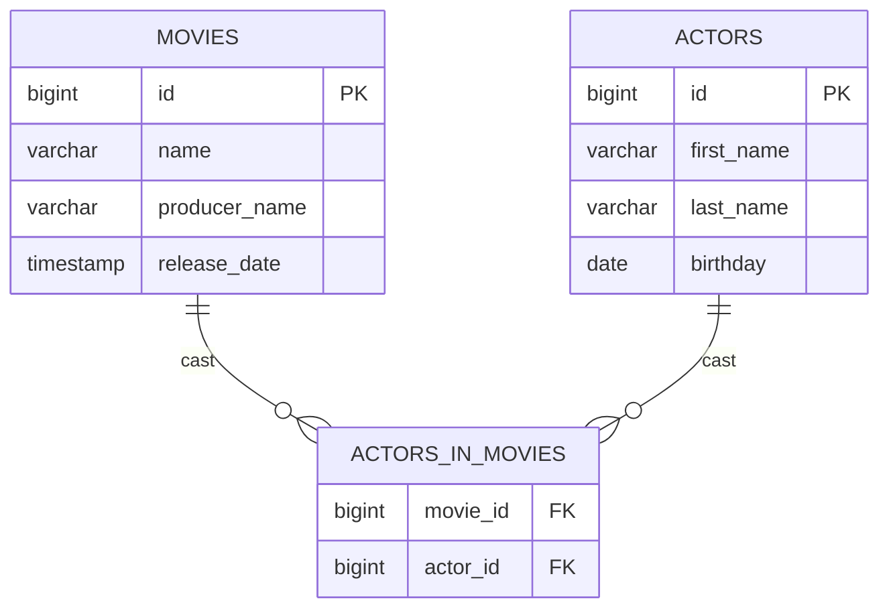

# Spring WebFlux with Exposed

English | [한국어](./README.ko.md)

A REST API module using Exposed DSL/DAO in a non-blocking fashion with Spring WebFlux + Kotlin Coroutines. Learn `newSuspendedTransaction`-based suspend transaction handling through the Movie and Actor domain.

## Learning Goals

- Learn how to manage Exposed transactions inside WebFlux suspend handlers using `newSuspendedTransaction`.
- Understand the pattern of separating Netty event loops and Exposed JDBC transactions via `Dispatchers.IO`.
- Compare DAO approach (`ActorEntity.new`, `MovieEntity.findById`) and DSL approach (`selectAll`, `andWhere`) in suspend context.
- Explore Reactive server performance tuning through Netty ConnectionProvider and LoopResources.

## Prerequisites

- [`00-shared/exposed-shared-tests`](../../00-shared/exposed-shared-tests/README.md): Shared test base classes and DB configuration reference
- Kotlin Coroutines basics (`suspend`, `CoroutineScope`, `Dispatchers.IO`)
- Spring WebFlux basics (Reactor, `ServerHttpRequest`)

---

## Spring MVC vs Spring WebFlux Comparison

| Aspect              | spring-mvc-exposed              | spring-webflux-exposed                  |
|---------------------|---------------------------------|-----------------------------------------|
| Server              | Tomcat                          | Netty                                   |
| Concurrency Model   | Virtual Threads (blocking OK)   | Kotlin Coroutines + `Dispatchers.IO`    |
| Transaction Mgmt    | `@Transactional` (Spring AOP)   | `newSuspendedTransaction { }` (direct)  |
| Handler Function    | Regular function                | `suspend fun`                           |
| Request Object      | `HttpServletRequest`            | `ServerHttpRequest`                     |
| Repository Return   | Sync (`ActorRecord`, `List<...>`) | Suspend (`ActorEntity`, `List<...>`)  |
| Config Class        | `TomcatVirtualThreadConfig`     | `NettyConfig`                           |

---

## Architecture



---

## API List

### Actor API (`/actors`)

| HTTP Method | Path            | Description                                    | Transaction    |
|-------------|-----------------|------------------------------------------------|----------------|
| `GET`       | `/actors/{id}`  | Get single actor by ID                         | readOnly=true  |
| `GET`       | `/actors`       | Search actors by query params (all if empty)   | readOnly=true  |
| `POST`      | `/actors`       | Create new actor                               | readOnly=false |
| `DELETE`    | `/actors/{id}`  | Delete actor by ID                             | readOnly=false |

**Search Parameters** (`GET /actors`):

| Parameter   | Description                  | Example      |
|-------------|------------------------------|--------------|
| `firstName` | Match by first name          | `Tom`        |
| `lastName`  | Match by last name           | `Hanks`      |
| `birthday`  | Date of birth (`yyyy-MM-dd`) | `1956-07-09` |
| `id`        | Match by actor ID            | `1`          |

### Movie API (`/movies`)

| HTTP Method | Path            | Description                                    | Transaction    |
|-------------|-----------------|------------------------------------------------|----------------|
| `GET`       | `/movies/{id}`  | Get single movie by ID                         | readOnly=true  |
| `GET`       | `/movies`       | Search movies by query params (all if empty)   | readOnly=true  |
| `POST`      | `/movies`       | Create new movie                               | readOnly=false |
| `DELETE`    | `/movies/{id}`  | Delete movie by ID                             | readOnly=false |

**Search Parameters** (`GET /movies`):

| Parameter      | Description                             | Example               |
|----------------|-----------------------------------------|-----------------------|
| `name`         | Match by movie title                    | `Forrest Gump`        |
| `producerName` | Match by producer name                  | `Robert Zemeckis`     |
| `releaseDate`  | Release datetime (`yyyy-MM-ddTHH:mm:ss`) | `1994-07-06T00:00:00` |
| `id`           | Match by movie ID                       | `1`                   |

### Movie-Actor Relation API (`/movie-actors`)

| HTTP Method | Path                              | Description                               |
|-------------|-----------------------------------|-------------------------------------------|
| `GET`       | `/movie-actors/{movieId}`         | Get movie with its cast list              |
| `GET`       | `/movie-actors/count`             | Count actors per movie                    |
| `GET`       | `/movie-actors/acting-producers`  | Movies where the producer also acts       |

---

## Request Processing Flow



---

## Key Implementation

### Suspend Transaction Pattern

Controllers directly control transaction boundaries with `newSuspendedTransaction`:

```kotlin
@GetMapping("/{id}")
suspend fun getActorById(@PathVariable("id") actorId: Long): ActorRecord? {
    return newSuspendedTransaction(readOnly = true) {
        actorRepository.findById(actorId)?.toActorRecord()
    }
}

@PostMapping
suspend fun createActor(@RequestBody actor: ActorRecord): ActorRecord =
    newSuspendedTransaction {
        actorRepository.create(actor).toActorRecord()
    }
```

### DAO-based Actor Creation

```kotlin
suspend fun create(actor: ActorRecord): ActorEntity {
    return ActorEntity.new {
        firstName = actor.firstName
        lastName = actor.lastName
        actor.birthday?.let { day ->
            birthday = runCatching { LocalDate.parse(day) }.getOrNull()
        }
    }
}
```

### Movie-Actor Relation -- Eager Loading

```kotlin
suspend fun getMovieWithActors(movieId: Long): MovieWithActorRecord? {
    return MovieEntity
        .findById(movieId)
        ?.load(MovieEntity::actors)  // eager loading
        ?.toMovieWithActorRecord()
}
```

### Complex JOIN Query -- Lazy Initialization Pattern

```kotlin
private val MovieActorJoin by lazy {
    MovieTable
        .innerJoin(ActorInMovieTable)
        .innerJoin(ActorTable)
}

suspend fun getMovieActorsCount(): List<MovieActorCountRecord> {
    return MovieActorJoin
        .select(MovieTable.id, MovieTable.name, ActorTable.id.count())
        .groupBy(MovieTable.id)
        .map {
            MovieActorCountRecord(
                movieName = it[MovieTable.name],
                actorCount = it[ActorTable.id.count()].toInt()
            )
        }
}
```

### Netty Server Tuning

```kotlin
@Configuration(proxyBeanMethods = false)
class NettyConfig {
    @Bean
    fun nettyReactiveWebServerFactory(): NettyReactiveWebServerFactory {
        return NettyReactiveWebServerFactory().apply {
            addServerCustomizers(EventLoopNettyCustomer())
        }
    }

    class EventLoopNettyCustomer : NettyServerCustomizer {
        override fun apply(httpServer: HttpServer): HttpServer {
            return httpServer
                .option(ChannelOption.SO_KEEPALIVE, true)
                .option(ChannelOption.SO_BACKLOG, 8_000)
                .doOnConnection { conn ->
                    conn.addHandlerLast(ReadTimeoutHandler(10))
                    conn.addHandlerLast(WriteTimeoutHandler(10))
                }
        }
    }

    @Bean
    fun reactorResourceFactory(): ReactorResourceFactory {
        return ReactorResourceFactory().apply {
            isUseGlobalResources = false
            connectionProvider = ConnectionProvider.builder("http")
                .maxConnections(8_000)
                .maxIdleTime(30.seconds.toJavaDuration())
                .build()
            loopResources = LoopResources.create(
                "event-loop",
                4,
                maxOf(Runtimex.availableProcessors * 8, 64),
                true
            )
        }
    }
}
```

### Database Profile Configuration

Switch databases using Spring Profiles:

| Profile    | Database                              |
|------------|---------------------------------------|
| `h2`       | H2 in-memory (default)               |
| `mysql`    | MySQL 8 (TestContainers auto-start)  |
| `postgres` | PostgreSQL (TestContainers auto-start)|

```bash
# Run with PostgreSQL profile
./gradlew :01-spring-boot:spring-webflux-exposed:bootRun --args='--spring.profiles.active=postgres'
```

---

## Domain Model



| Class                            | Description                                                            |
|----------------------------------|------------------------------------------------------------------------|
| `MovieRecord`                    | Movie info DTO (`id`, `name`, `producerName`, `releaseDate`)           |
| `ActorRecord`                    | Actor info DTO (`id`, `firstName`, `lastName`, `birthday`)             |
| `MovieWithActorRecord`           | Composite DTO with movie + cast list                                   |
| `MovieActorCountRecord`          | Aggregation DTO with movie name + actor count                          |
| `MovieWithProducingActorRecord`  | DTO for producer who also acts                                         |
| `MovieTable`                     | Exposed `LongIdTable` -- movies table (name, producerName indexed)     |
| `ActorTable`                     | Exposed `LongIdTable` -- actors table (firstName, lastName indexed)    |
| `ActorInMovieTable`              | Movie-actor N:M relation table (composite PK)                         |
| `MovieEntity`                    | `LongEntity` DAO (includes actors relation)                            |
| `ActorEntity`                    | `LongEntity` DAO (includes movies relation)                            |

---

## How to Run

```bash
# Start application (default: H2 profile)
./gradlew :01-spring-boot:spring-webflux-exposed:bootRun

# Run tests
./gradlew :01-spring-boot:spring-webflux-exposed:test

# Access Swagger UI
open http://localhost:8080/swagger-ui.html
```

---

## Practice Checklist

- Verify `GET /actors` and `GET /movies` responses via Swagger UI or curl.
- Validate the full CRUD flow: `POST /actors` -> `GET /actors/{id}` -> `DELETE /actors/{id}`.
- Check the 2 SQL queries generated by DAO eager loading in logs via `GET /movie-actors/{movieId}`.
- Check the conditional JOIN SQL in logs via `GET /movie-actors/acting-producers`.
- Switch to `spring.profiles.active=postgres` and verify the same APIs work on PostgreSQL.

---

## Next Chapter

- [02-alternatives-to-jpa](../../02-alternatives-to-jpa/README.md): Learn alternative stacks to JPA including R2DBC, Vert.x, and Hibernate Reactive
