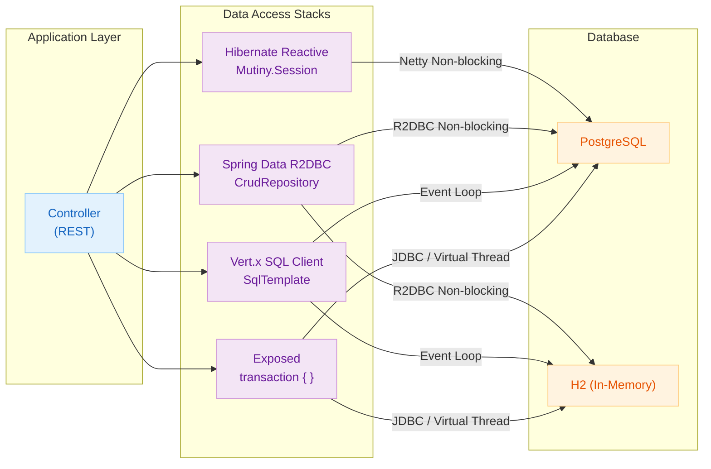

# 02 Alternatives to JPA

English | [한국어](./README.ko.md)

A chapter for comparing and practising JPA alternative technologies in Spring-based applications, validating various ORM and Reactive clients.

## Overview

Hands-on exploration of database access technologies beyond JPA, so you can understand the design philosophy and trade-offs of each. Reactive stacks (Hibernate Reactive, R2DBC, Vert.x SQL Client) and Exposed are placed side-by-side, helping you derive the criteria for migrating legacy JPA projects.

## Learning Goals

- Understand the declarative patterns of Hibernate Reactive, R2DBC, and Vert.x SQL Client.
- Compare transaction models and ID strategy differences across each stack through hands-on practice.
- Summarise the considerations when migrating from a legacy JPA project to Exposed.

## Included Modules

| Module                         | Description                                                    |
|-------------------------------|----------------------------------------------------------------|
| `hibernate-reactive-example`  | Example based on Hibernate Reactive + Mutiny + PostgreSQL      |
| `r2dbc-example`               | Asynchronous data access example using Spring Data R2DBC       |
| `vertx-sqlclient-example`     | Event-driven example based on Vert.x SQL Client                |

## Technology Comparison

| Item                    | Exposed (JDBC)                                    | Hibernate Reactive                          | Spring Data R2DBC                            | Vert.x SQL Client                        |
|------------------------|---------------------------------------------------|---------------------------------------------|----------------------------------------------|------------------------------------------|
| Connection model       | JDBC (blocking, leverages Virtual Threads)        | Netty-based Non-blocking                    | R2DBC (fully async Non-blocking)             | Netty event loop                         |
| Query style            | Type-safe DSL / DAO Entity                        | JPA EntityManager / Criteria API            | Repository interface / `DatabaseClient`      | `SqlClient` / `SqlTemplate`              |
| Transactions           | `transaction { }` / `newSuspendedTransaction { }` | `Mutiny.Session` / `withTransaction`        | `@Transactional` / `TransactionalOperator`   | `withSuspendTransaction` block           |
| Result types           | Synchronous result / `Deferred`                   | `Uni<T>` / `Multi<T>` (SmallRye Mutiny)     | `suspend` function / `Flow<T>`               | `suspend` function / `RowSet`            |
| Entity mapping         | `object Table` / `IntEntity`                      | `@Entity`, `@OneToMany` JPA annotations     | `@Table`, `@Id` Spring annotations           | None (manual RowMapper)                  |
| N+1 prevention         | `.with()` eager loading                           | `fetch()` / `JOIN FETCH`                    | Manual join query required                   | Manual join query required               |
| Learning curve         | Kotlin DSL friendly, low                          | Requires JPA knowledge, moderate            | Spring ecosystem friendly, low               | Direct SQL control, high                 |
| WHERE type safety      | Compile-time check                                | Criteria API (verbose)                      | String-based `@Query`                        | String SQL                               |
| DB support             | H2, PostgreSQL, MySQL, MariaDB, Oracle, MSSQL     | PostgreSQL, MySQL, MariaDB (Reactive driver)| R2DBC-supported DBs (PostgreSQL, MySQL, H2, MSSQL, etc.) | PostgreSQL, MySQL, MariaDB, MSSQL, DB2, etc. |
| Spring Boot integration| `exposed-spring-boot-starter`                     | Separate SessionFactory bean registration   | `spring-boot-starter-data-r2dbc`             | Manual Vert.x configuration              |

## Architecture Flow



## Recommended Study Order

1. `hibernate-reactive-example` — The closest starting point to JPA
2. `r2dbc-example` — The most widely used Reactive approach in the Spring ecosystem
3. `vertx-sqlclient-example` — The lowest-level control, direct event loop experience

## Prerequisites

- Spring Boot basics: DI and transaction concepts
- Exposed DSL/DAO flow (`03-exposed-basic`, `05-exposed-dml`)

## Running Tests

```bash
# Full chapter tests
./gradlew :02-alternatives-to-jpa:hibernate-reactive-example:test
./gradlew :02-alternatives-to-jpa:r2dbc-example:test
./gradlew :02-alternatives-to-jpa:vertx-sqlclient-example:test

# Run app server (Hibernate Reactive)
./gradlew :02-alternatives-to-jpa:hibernate-reactive-example:bootRun

# Run app server (R2DBC)
./gradlew :02-alternatives-to-jpa:r2dbc-example:bootRun
```

## Test Points

- Verify that the same domain results are consistent across each client.
- Check exception/timeout/rollback behaviour in Reactive/Async paths.
- Measure the thread/connection model differences quantitatively.

## Next Chapter

- [03-exposed-basic](../03-exposed-basic/README.md): Continues with Exposed DSL/DAO learning.
