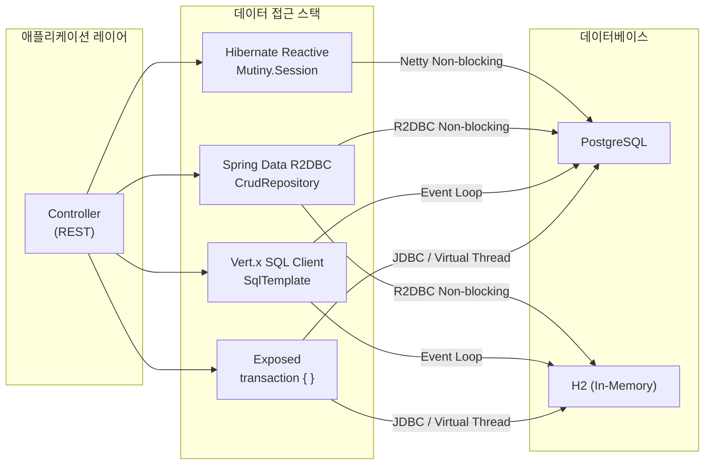

# 02 Alternatives to JPA

Spring 기반 애플리케이션에서 JPA 대안 기술들을 비교/실습하며, 다양한 ORM/Reactive 클라이언트를 검증하는 챕터입니다.

## 개요

JPA 외의 데이터베이스 접근 기술을 직접 실습하여 각각의 설계 철학과 트레이드오프를 이해합니다. Reactive 스택(Hibernate Reactive, R2DBC, Vert.x SQL Client)과 Exposed를 나란히 비교하여, 레거시 JPA 프로젝트를 전환할 때의 기준을 도출합니다.

## 학습 목표

- Hibernate Reactive, R2DBC, Vert.x SQL Client의 선언적 패턴을 이해한다.
- 각 스택의 트랜잭션 모델과 ID 전략 차이를 실습으로 비교한다.
- 레거시 JPA 프로젝트에서 Exposed로 전환할 때 고려해야 할 기준을 정리한다.

## 포함 모듈

| 모듈                           | 설명                                             |
|------------------------------|------------------------------------------------|
| `hibernate-reactive-example` | Hibernate Reactive + Mutiny + PostgreSQL 기반 예제 |
| `r2dbc-example`              | Spring Data R2DBC를 사용한 비동기 데이터 접근 예제           |
| `vertx-sqlclient-example`    | Vert.x SQL Client 기반 이벤트 드리븐 예제                |

## 기술 비교표

| 항목             | Exposed (JDBC)                                    | Hibernate Reactive                         | Spring Data R2DBC                            | Vert.x SQL Client                        |
|----------------|---------------------------------------------------|--------------------------------------------|----------------------------------------------|------------------------------------------|
| 연결 모델          | JDBC (블로킹, Virtual Thread 활용)                     | Netty 기반 Non-blocking                      | R2DBC (완전 비동기 Non-blocking)                  | Netty 이벤트 루프                             |
| 쿼리 스타일         | 타입 안전 DSL / DAO Entity                            | JPA EntityManager / Criteria API           | Repository 인터페이스 / `DatabaseClient`          | `SqlClient` / `SqlTemplate`              |
| 트랜잭션           | `transaction { }` / `newSuspendedTransaction { }` | `Mutiny.Session` / `withTransaction`       | `@Transactional` / `TransactionalOperator`   | `withSuspendTransaction` 블록              |
| 결과 타입          | 동기 결과 / `Deferred`                                | `Uni<T>` / `Multi<T>` (SmallRye Mutiny)    | `suspend` 함수 / `Flow<T>`                     | `suspend` 함수 / `RowSet`                  |
| 엔티티 매핑         | `object Table` / `IntEntity`                      | `@Entity`, `@OneToMany` JPA 어노테이션          | `@Table`, `@Id` Spring 어노테이션                 | 없음 (직접 RowMapper 작성)                     |
| N+1 방지         | `.with()` eager loading                           | `fetch()` / `JOIN FETCH`                   | 수동 join 쿼리 필요                                | 수동 join 쿼리 필요                            |
| 학습 곡선          | Kotlin DSL 친화적, 낮음                                | JPA 지식 필요, 중간                              | Spring 생태계 친화적, 낮음                           | SQL 직접 제어, 높음                            |
| WHERE 절 타입 안전성 | 컴파일 타임 체크                                         | Criteria API (장황함)                         | 문자열 기반 `@Query`                              | 문자열 SQL                                  |
| DB 지원          | H2, PostgreSQL, MySQL, MariaDB, Oracle, MSSQL     | PostgreSQL, MySQL, MariaDB (Reactive 드라이버) | R2DBC 지원 DB (PostgreSQL, MySQL, H2, MSSQL 등) | PostgreSQL, MySQL, MariaDB, MSSQL, DB2 등 |
| Spring Boot 통합 | `exposed-spring-boot-starter`                     | 별도 SessionFactory 빈 등록                     | `spring-boot-starter-data-r2dbc`             | 수동 Vert.x 설정                             |

## 아키텍처 흐름



## 권장 학습 순서

1. `hibernate-reactive-example` — JPA와 가장 유사한 출발점
2. `r2dbc-example` — Spring 생태계에서 가장 널리 사용되는 Reactive 접근
3. `vertx-sqlclient-example` — 가장 저수준 제어, 이벤트 루프 직접 경험

## 선수 지식

- Spring Boot 및 DI/트랜잭션 기본 개념
- Exposed DSL/DAO 흐름 (`03-exposed-basic`, `05-exposed-dml`)

## 테스트 실행 방법

```bash
# 전체 챕터 테스트
./gradlew :02-alternatives-to-jpa:hibernate-reactive-example:test
./gradlew :02-alternatives-to-jpa:r2dbc-example:test
./gradlew :02-alternatives-to-jpa:vertx-sqlclient-example:test

# 앱 서버 실행 (Hibernate Reactive)
./gradlew :02-alternatives-to-jpa:hibernate-reactive-example:bootRun

# 앱 서버 실행 (R2DBC)
./gradlew :02-alternatives-to-jpa:r2dbc-example:bootRun
```

## 테스트 포인트

- 각 클라이언트에서 동일 도메인 결과가 일관된지 확인한다.
- Reactive/Async 경로에서 예외/타임아웃/롤백 동작을 점검한다.
- Thread/Connection 모델 차이를 계량적으로 측정한다.

## 다음 챕터

- [03-exposed-basic](../03-exposed-basic/README.md): Exposed DSL/DAO 학습으로 이어집니다.
