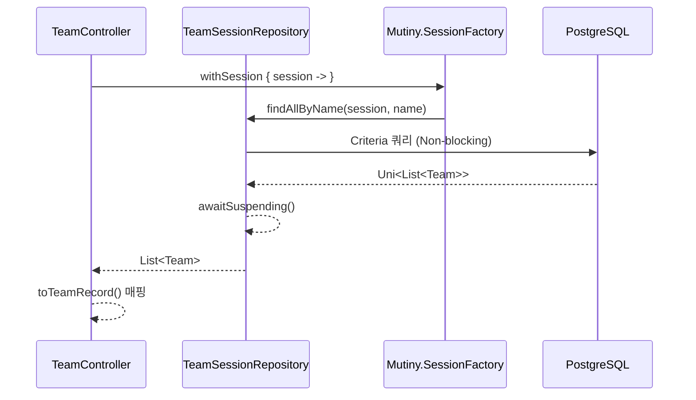
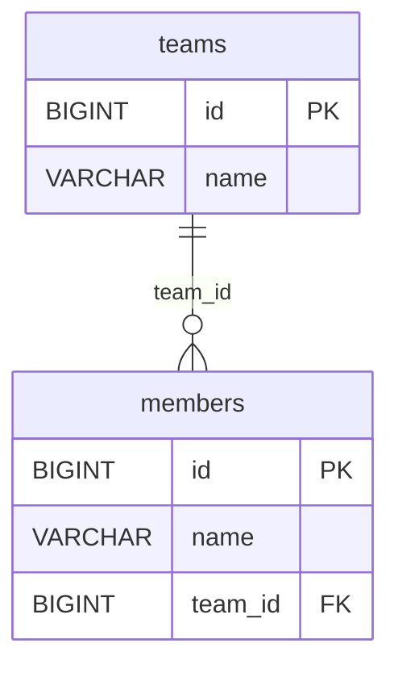
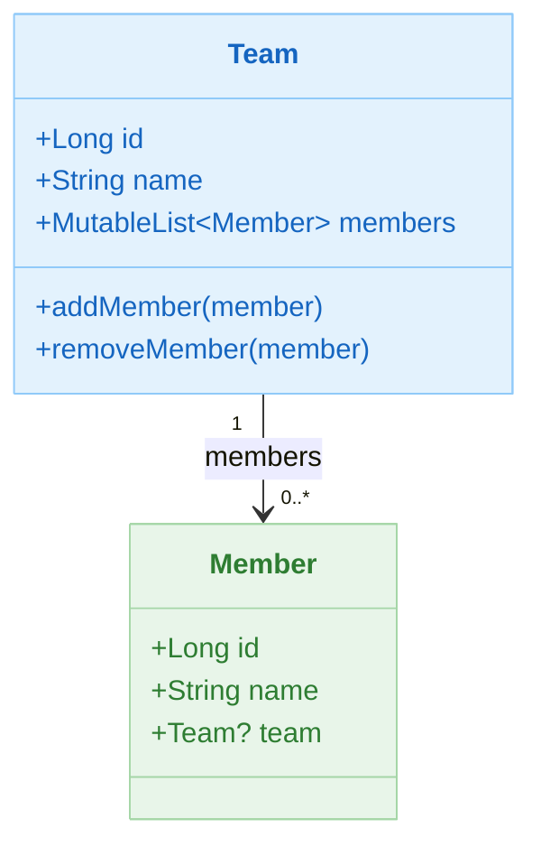

# 02 Alternatives: Hibernate Reactive Example

Hibernate Reactive + Mutiny + PostgreSQL 환경에서 선언적/Reactive 트랜잭션을 실습하는 모듈입니다. JPA에서 Reactive로 전환할 때의 API 대응과 차이를 직접 비교할 수 있습니다.

## 개요

Hibernate Reactive는 기존 JPA 어노테이션(`@Entity`,
`@OneToMany` 등)을 그대로 사용하면서 Netty 기반 Non-blocking I/O로 DB와 통신합니다. SmallRye Mutiny의 `Uni`/`Multi` 타입을 Kotlin 코루틴
`suspend` 함수로 감싸서 사용합니다.

## 학습 목표

- Hibernate Reactive의 `Mutiny.Session` 기반 비동기 CRUD를 이해한다.
- `Uni<T>` / `Multi<T>` 결과를 `awaitSuspending()`으로 코루틴에서 소비하는 방법을 익힌다.
- JPA `@Entity` 어노테이션과 Exposed `Table`/`Entity` 패턴을 비교한다.
- PostgreSQL에서 Reactive 흐름을 유지하며 이벤트를 처리한다.

## 아키텍처 흐름



## ERD



## 도메인 모델



### JPA 엔티티 선언

```kotlin
@Entity
@Access(AccessType.FIELD)
@DynamicInsert
@DynamicUpdate
class Team: AbstractValueObject() {

    @Id
    @GeneratedValue(strategy = GenerationType.IDENTITY)
    var id: Long = 0L
        protected set

    var name: String = ""

    @OneToMany(mappedBy = "team", orphanRemoval = false)
    val members: MutableList<Member> = mutableListOf()
}
```

### Repository — Mutiny.Session 기반 CRUD

```kotlin
@Repository
class TeamSessionRepository(sf: SessionFactory): AbstractMutinySessionRepository<Team, Long>(sf) {

    // 이름 기반 검색 (Criteria API + awaitSuspending)
    suspend fun findAllByName(session: Session, name: String): List<Team> {
        val cb = sf.criteriaBuilder
        val criteria = cb.createQuery(Team::class.java)
        val root = criteria.from(Team::class.java)
        criteria.select(root).where(cb.equal(root.get(Team_.name), name))
        return session.createQuery(criteria).resultList.awaitSuspending()
    }

    // 멤버 이름으로 팀 조회 후 members 즉시 로딩
    suspend fun findAllByMemberName(session: Session, name: String): List<Team> {
        // ... Criteria + session.fetch() 패턴
        return session.createQuery(criteria).resultList.awaitSuspending().apply {
            asFlow().flatMapMerge { team ->
                session.fetch(team.members).awaitSuspending().asFlow()
            }.collect()
        }
    }
}
```

## 핵심 구성 파일

| 파일                                             | 설명                                      |
|------------------------------------------------|-----------------------------------------|
| `domain/model/Team.kt`                         | `@Entity` 팀 JPA 엔티티                     |
| `domain/model/Member.kt`                       | `@Entity` 멤버 JPA 엔티티                    |
| `domain/repository/TeamSessionRepository.kt`   | `Mutiny.Session` 기반 Team CRUD           |
| `domain/repository/MemberSessionRepository.kt` | Member 조회/저장                            |
| `config/HibernateReactiveConfig.kt`            | `Mutiny.SessionFactory` + PostgreSQL 설정 |
| `controller/TeamController.kt`                 | Team REST API (`/teams`, `/teams/{id}`) |
| `controller/MemberController.kt`               | Member REST API                         |

## 테스트 파일 구성

| 파일                                               | 설명                       |
|--------------------------------------------------|--------------------------|
| `config/HibernateReactiveConfigTest.kt`          | `SessionFactory` 빈 로딩 검증 |
| `domain/repository/TeamSessionRepositoryTest.kt` | Team CRUD suspend 테스트    |
| `domain/repository/MemerRepositoryTest.kt`       | Member 조회/저장 테스트         |
| `controller/TeamControllerTest.kt`               | Team REST API 통합 테스트     |
| `controller/MemberControllerTest.kt`             | Member REST API 통합 테스트   |

## Hibernate Reactive vs Exposed 비교

| 항목      | Hibernate Reactive                              | Exposed                                           |
|---------|-------------------------------------------------|---------------------------------------------------|
| 스키마 정의  | `@Entity`, `@Table` JPA 어노테이션                   | `object MyTable : IntIdTable("my_table")`         |
| CRUD    | `session.persist(entity).awaitSuspending()`     | `MyTable.insert { it[col] = value }`              |
| 조회      | Criteria API + `awaitSuspending()`              | `MyTable.selectAll().where { col eq value }`      |
| 관계 로딩   | `session.fetch(team.members).awaitSuspending()` | `.with(Team::members)` eager loading              |
| 트랜잭션    | `sf.withSession { s -> s.withTransaction { } }` | `transaction { }` / `newSuspendedTransaction { }` |
| 결과 타입   | `Uni<T>` → `awaitSuspending()`                  | 동기 결과 / `Deferred<T>`                             |
| JPA 호환성 | 완전 호환 (마이그레이션 용이)                               | 독자적 DSL (재작성 필요)                                  |

## 테스트 실행 방법

```bash
# 테스트 실행
./gradlew :02-alternatives-to-jpa:hibernate-reactive-example:test

# 앱 서버 실행 (PostgreSQL 필요)
./gradlew :02-alternatives-to-jpa:hibernate-reactive-example:bootRun

# 특정 테스트 클래스만 실행
./gradlew :02-alternatives-to-jpa:hibernate-reactive-example:test \
    --tests "alternative.hibernate.reactive.example.domain.repository.TeamSessionRepositoryTest"
```

## 복잡한 시나리오

- **이름 기반 조회 + 재검증**: `TeamSessionRepositoryTest` — `findAllByName` 후 `findById`로 동일 엔티티 재조회 일치 검증
- **삭제 후 null 확인**: `delete team by id` 테스트 — 저장 → 삭제 → 조회(null) 시나리오
- **멤버 이름으로 팀 조회**: `findAllByMemberName` — JOIN 후 `session.fetch()`로 members 즉시 로딩

## 알려진 제약 사항

- PostgreSQL 전용 Reactive 드라이버를 사용하므로, H2/MySQL에서는 실행되지 않습니다.
- Reactive 흐름 내에서 블로킹 호출(`Thread.sleep`, JDBC 직접 호출)은 이벤트 루프를 차단하므로 금지됩니다.

## 다음 모듈

- [r2dbc-example](../r2dbc-example/README.md)
