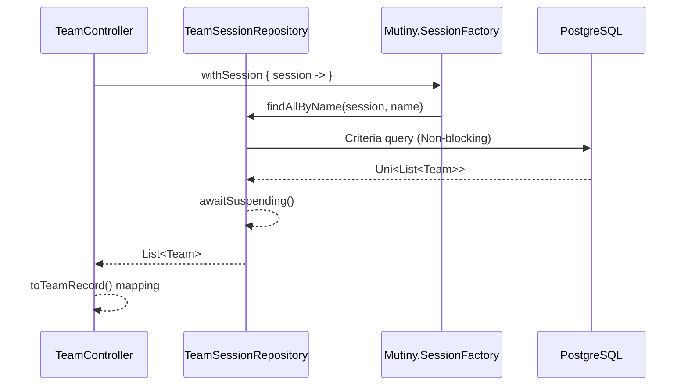
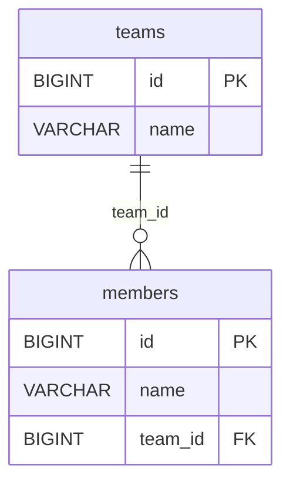
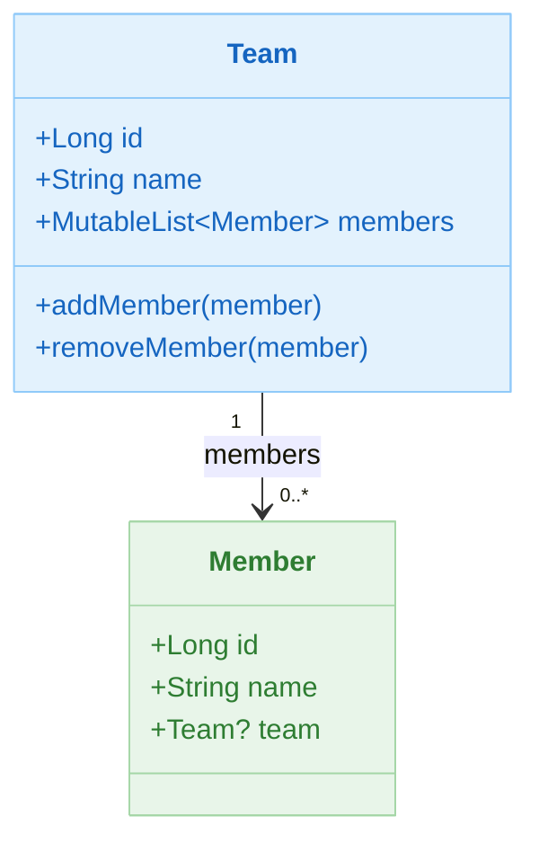

# 02 Alternatives: Hibernate Reactive Example

English | [한국어](./README.ko.md)

A module for practising declarative/Reactive transactions in a Hibernate Reactive + Mutiny + PostgreSQL environment. You can directly compare API mappings and differences when migrating from JPA to Reactive.

## Overview

Hibernate Reactive retains the existing JPA annotations (`@Entity`, `@OneToMany`, etc.) while communicating with the database via Netty-based Non-blocking I/O. SmallRye Mutiny `Uni`/`Multi` types are wrapped with Kotlin coroutine `suspend` functions.

## Learning Goals

- Understand async CRUD based on Hibernate Reactive's `Mutiny.Session`.
- Learn how to consume `Uni<T>` / `Multi<T>` results in coroutines via `awaitSuspending()`.
- Compare JPA `@Entity` annotations with Exposed `Table`/`Entity` patterns.
- Handle events in PostgreSQL while maintaining the Reactive flow.

## Architecture Flow



## ERD



## Domain Model



### JPA Entity Declaration

```kotlin
@Entity
@Access(AccessType.FIELD)
@DynamicInsert
@DynamicUpdate
class Team: AbstractValueObject() {

    @Id
    @GeneratedValue(strategy = GenerationType.IDENTITY)
    var id: Long = 0L
        protected set

    var name: String = ""

    @OneToMany(mappedBy = "team", orphanRemoval = false)
    val members: MutableList<Member> = mutableListOf()
}
```

### Repository — Mutiny.Session-based CRUD

```kotlin
@Repository
class TeamSessionRepository(sf: SessionFactory): AbstractMutinySessionRepository<Team, Long>(sf) {

    // Name-based search (Criteria API + awaitSuspending)
    suspend fun findAllByName(session: Session, name: String): List<Team> {
        val cb = sf.criteriaBuilder
        val criteria = cb.createQuery(Team::class.java)
        val root = criteria.from(Team::class.java)
        criteria.select(root).where(cb.equal(root.get(Team_.name), name))
        return session.createQuery(criteria).resultList.awaitSuspending()
    }

    // Find teams by member name, then eagerly load members
    suspend fun findAllByMemberName(session: Session, name: String): List<Team> {
        // ... Criteria + session.fetch() pattern
        return session.createQuery(criteria).resultList.awaitSuspending().apply {
            asFlow().flatMapMerge { team ->
                session.fetch(team.members).awaitSuspending().asFlow()
            }.collect()
        }
    }
}
```

## Key Files

| File                                             | Description                                     |
|------------------------------------------------|-------------------------------------------------|
| `domain/model/Team.kt`                         | `@Entity` Team JPA entity                       |
| `domain/model/Member.kt`                       | `@Entity` Member JPA entity                     |
| `domain/repository/TeamSessionRepository.kt`   | `Mutiny.Session`-based Team CRUD                |
| `domain/repository/MemberSessionRepository.kt` | Member query/save                               |
| `config/HibernateReactiveConfig.kt`            | `Mutiny.SessionFactory` + PostgreSQL config     |
| `controller/TeamController.kt`                 | Team REST API (`/teams`, `/teams/{id}`)         |
| `controller/MemberController.kt`               | Member REST API                                 |

## Test Files

| File                                               | Description                               |
|--------------------------------------------------|-------------------------------------------|
| `config/HibernateReactiveConfigTest.kt`          | Verifies `SessionFactory` bean loading    |
| `domain/repository/TeamSessionRepositoryTest.kt` | Team CRUD suspend tests                   |
| `domain/repository/MemerRepositoryTest.kt`       | Member query/save tests                   |
| `controller/TeamControllerTest.kt`               | Team REST API integration tests           |
| `controller/MemberControllerTest.kt`             | Member REST API integration tests         |

## Hibernate Reactive vs Exposed Comparison

| Item           | Hibernate Reactive                              | Exposed                                           |
|---------------|-------------------------------------------------|---------------------------------------------------|
| Schema definition | `@Entity`, `@Table` JPA annotations         | `object MyTable : IntIdTable("my_table")`         |
| CRUD          | `session.persist(entity).awaitSuspending()`     | `MyTable.insert { it[col] = value }`              |
| Query         | Criteria API + `awaitSuspending()`              | `MyTable.selectAll().where { col eq value }`      |
| Relation loading | `session.fetch(team.members).awaitSuspending()` | `.with(Team::members)` eager loading           |
| Transactions  | `sf.withSession { s -> s.withTransaction { } }` | `transaction { }` / `newSuspendedTransaction { }` |
| Result types  | `Uni<T>` → `awaitSuspending()`                  | Synchronous result / `Deferred<T>`                |
| JPA compatibility | Fully compatible (easy migration)           | Proprietary DSL (requires rewrite)                |

## Running Tests

```bash
# Run tests
./gradlew :02-alternatives-to-jpa:hibernate-reactive-example:test

# Run app server (requires PostgreSQL)
./gradlew :02-alternatives-to-jpa:hibernate-reactive-example:bootRun

# Run a specific test class
./gradlew :02-alternatives-to-jpa:hibernate-reactive-example:test \
    --tests "alternative.hibernate.reactive.example.domain.repository.TeamSessionRepositoryTest"
```

## Advanced Scenarios

- **Name-based query + re-verification**: `TeamSessionRepositoryTest` — verifies that the same entity retrieved via `findAllByName` matches a subsequent `findById` lookup
- **Null check after delete**: `delete team by id` test — save → delete → query(null) scenario
- **Find team by member name**: `findAllByMemberName` — JOIN followed by `session.fetch()` for eager member loading

## Known Limitations

- Uses a PostgreSQL-specific Reactive driver, so it does not run on H2/MySQL.
- Blocking calls inside the Reactive flow (`Thread.sleep`, direct JDBC calls) block the event loop and are prohibited.

## Next Module

- [r2dbc-example](../r2dbc-example/README.md)
