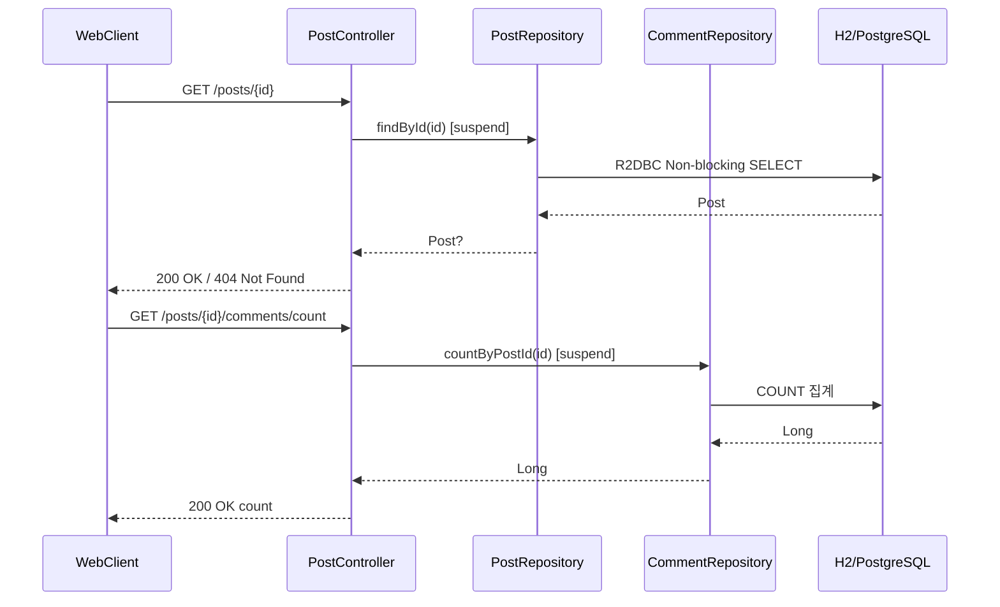
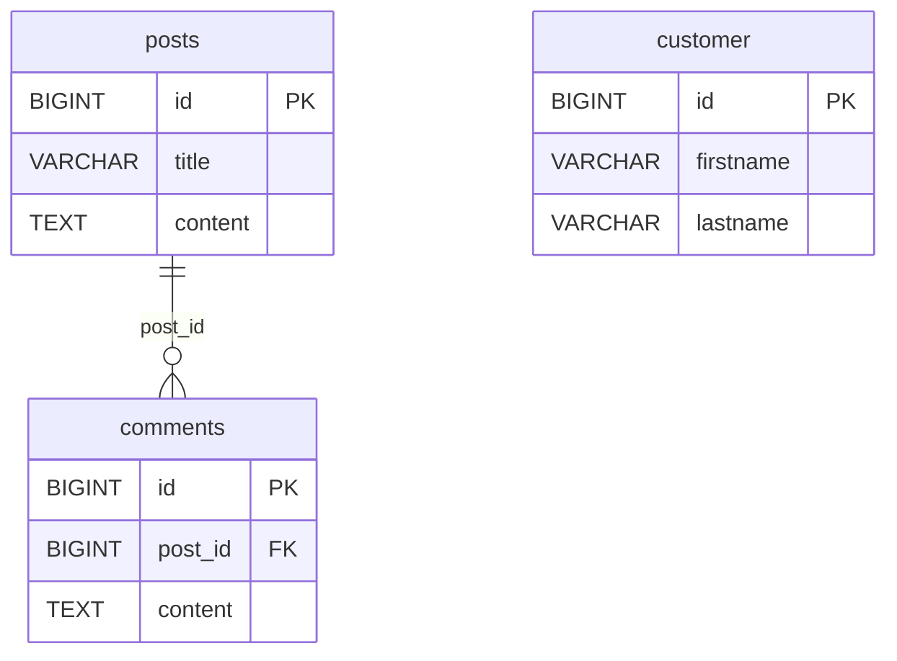
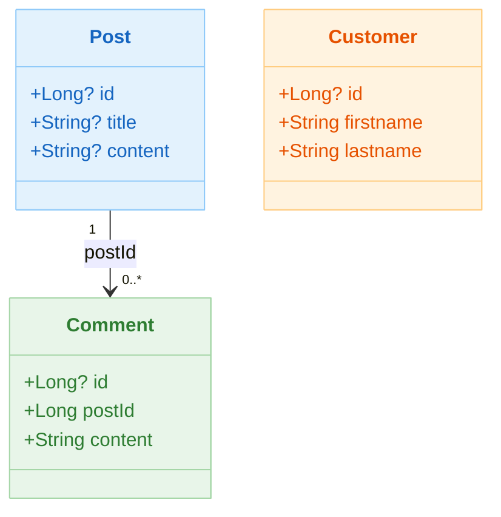

# 02 Alternatives: R2DBC Example

[English](./README.md) | 한국어

Spring Data R2DBC + Kotlin Coroutines를 이용해 비동기 데이터베이스 액세스를 구현하는 모듈입니다. `CrudRepository` 인터페이스와
`DatabaseClient` 직접 활용 두 가지 방식을 모두 다룹니다.

## 개요

Spring Data R2DBC는 완전 Non-blocking R2DBC 드라이버 위에서 Spring Data 방식의 Repository 추상화를 제공합니다. Kotlin 코루틴의
`suspend` 함수와 자연스럽게 통합되어, `Mono`/`Flux`를 직접 다루지 않고도 Reactive 데이터 접근이 가능합니다.

## 학습 목표

- R2DBC `CrudRepository` 기반 suspend CRUD를 이해한다.
- `DatabaseClient`로 커스텀 쿼리와 동적 테이블 생성을 구현한다.
- `@Query` 어노테이션으로 네임드 파라미터 쿼리를 정의한다.
- Exposed와의 Latency/연결 모델 차이를 비교한다.

## 아키텍처 흐름



## ERD



## 도메인 모델



### R2DBC 엔티티 선언

```kotlin
// Post 엔티티 — Spring Data R2DBC 어노테이션 사용
@Table("posts")
data class Post(
    @Column("title") val title: String? = null,
    @Column("content") val content: String? = null,
    @Id val id: Long? = null,
)

// Comment 엔티티
@Table("comments")
data class Comment(
    @Column("post_id") val postId: Long,
    @Column("content") val content: String,
    @Id val id: Long? = null,
)
```

### Repository 선언

```kotlin
// CrudRepository 기반 — 기본 CRUD 자동 제공
interface PostRepository: CoroutineCrudRepository<Post, Long>

// 커스텀 @Query 사용
interface CommentRepository: CoroutineCrudRepository<Comment, Long> {
    suspend fun countByPostId(postId: Long): Long

    @Query("SELECT * FROM comments WHERE post_id = :postId")
    fun findByPostId(postId: Long): Flow<Comment>
}

// DatabaseClient 직접 활용
@Repository
class CustomerRepository(private val client: DatabaseClient) {
    suspend fun findByFirstname(firstname: String): List<Customer> =
        client.sql("SELECT * FROM customer WHERE firstname = :name")
            .bind("name", firstname)
            .map { row, _ -> Customer(row["id"] as Long, row["firstname"] as String, row["lastname"] as String) }
            .flow()
            .toList()
}
```

## 핵심 구성 파일

| 파일                                        | 설명                                     |
|-------------------------------------------|----------------------------------------|
| `domain/model/Post.kt`                    | Post R2DBC 엔티티                         |
| `domain/model/Comment.kt`                 | Comment R2DBC 엔티티                      |
| `domain/model/Customer.kt`                | Customer R2DBC 엔티티                     |
| `domain/repository/PostRepository.kt`     | `CoroutineCrudRepository` 기반 Post CRUD |
| `domain/repository/CommentRepository.kt`  | 집계·Flow 조회 Repository                  |
| `domain/repository/CustomerRepository.kt` | `DatabaseClient` 직접 활용                 |
| `controller/PostController.kt`            | REST API (`/posts`, `/posts/{id}`)     |
| `config/R2dbcConfig.kt`                   | `ConnectionFactory` 설정                 |
| `utils/DatabaseInitializer.kt`            | 스키마 초기화 (R2DBC DDL)                    |

## 테스트 파일 구성

| 파일                                            | 설명                                 |
|-----------------------------------------------|------------------------------------|
| `config/R2dbcConfigTest.kt`                   | `ConnectionFactory` 빈 로딩 검증        |
| `domain/repository/PostRepositoryTest.kt`     | Post CRUD 코루틴 테스트                  |
| `domain/repository/CommentRespositoryTest.kt` | 댓글 조회·집계·삽입 테스트                    |
| `domain/repository/CustomerRepositoryTest.kt` | `DatabaseClient` + 커스텀 쿼리 테스트      |
| `controller/PostControllerTest.kt`            | `WebTestClient` 기반 REST API 통합 테스트 |

## Exposed vs Spring Data R2DBC 비교

| 항목     | Exposed                                           | Spring Data R2DBC                          |
|--------|---------------------------------------------------|--------------------------------------------|
| 쿼리 스타일 | 타입 안전 DSL / DAO Entity                            | Repository 인터페이스 / `DatabaseClient`        |
| 트랜잭션   | `transaction { }` / `newSuspendedTransaction { }` | `@Transactional` / `TransactionalOperator` |
| 연결 모델  | JDBC (블로킹, Virtual Thread 활용)                     | R2DBC (완전 비동기 Non-blocking)                |
| 스키마 정의 | `object Table : IntIdTable()`                     | `@Table`, `@Id` 어노테이션 + 별도 DDL 스크립트        |
| 타입 안전성 | 컴파일 타임 컬럼 타입 체크                                   | 문자열 기반 `@Query`, 런타임 오류 가능                 |
| N+1 방지 | `.with()` eager loading                           | 수동 join 쿼리 필요                              |
| 학습 곡선  | Kotlin DSL 친화적                                    | Spring 생태계 친화적                             |
| 페이징    | `.limit(n).offset(m)`                             | `Pageable` / `PageRequest`                 |

## 테스트 실행 방법

```bash
# 전체 모듈 테스트
./gradlew :02-alternatives-to-jpa:r2dbc-example:test

# 앱 서버 실행 (H2 기본)
./gradlew :02-alternatives-to-jpa:r2dbc-example:bootRun

# 특정 테스트 클래스만 실행
./gradlew :02-alternatives-to-jpa:r2dbc-example:test \
    --tests "alternative.r2dbc.example.domain.repository.PostRepositoryTest"
```

## 복잡한 시나리오

- **커스텀 쿼리**: `CustomerRepositoryTest` — `DatabaseClient`로 테이블 직접 생성 후 `findByFirstname` / `@Query` 어노테이션 검증
- **REST API 통합**: `PostControllerTest` — `WebTestClient`로 HTTP 200/404 응답 및 댓글 수 집계 검증
- **트랜잭션 속성 변경**: `readOnly = true`, `timeout` 값을 조정하여 DB 반응 확인

## 다음 모듈

- [vertx-sqlclient-example](../vertx-sqlclient-example/README.md)
