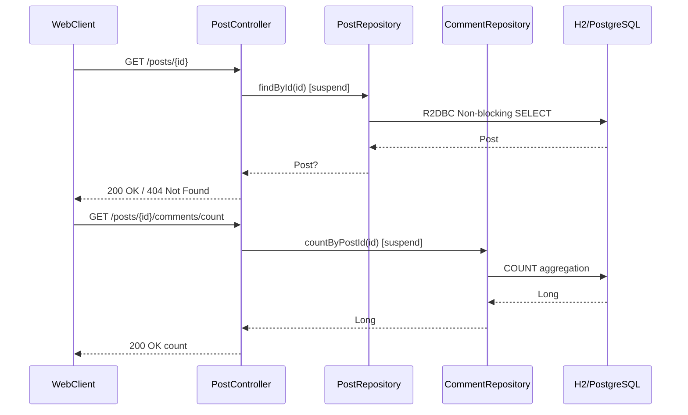
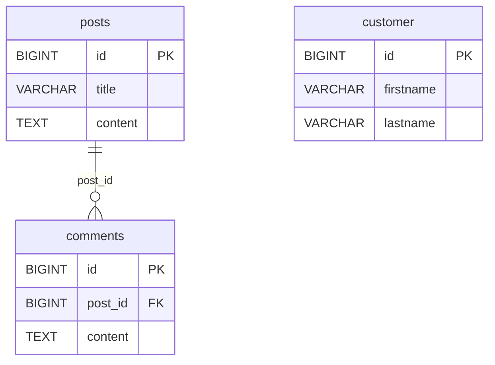
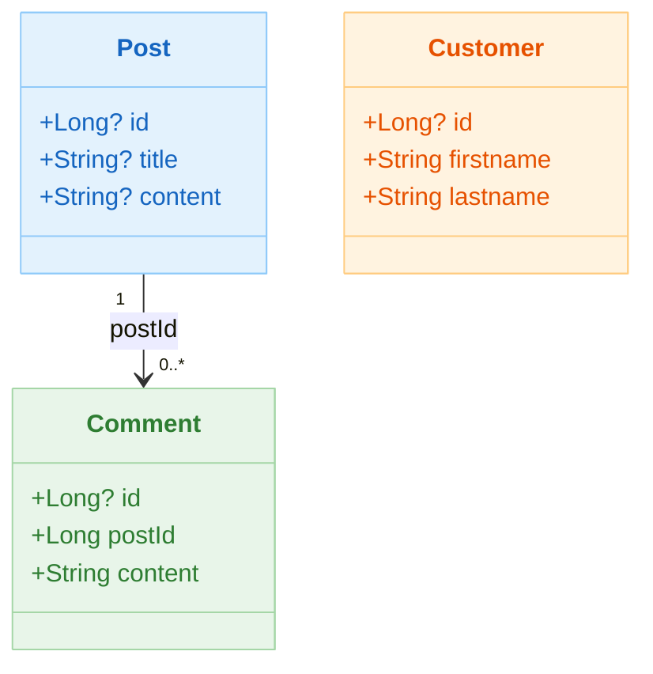

# 02 Alternatives: R2DBC Example

English | [한국어](./README.ko.md)

A module implementing asynchronous database access using Spring Data R2DBC + Kotlin Coroutines. Covers both the `CrudRepository` interface and direct use of `DatabaseClient`.

## Overview

Spring Data R2DBC provides a Spring Data-style Repository abstraction on top of a fully Non-blocking R2DBC driver. It integrates naturally with Kotlin coroutine `suspend` functions, enabling Reactive data access without handling `Mono`/`Flux` directly.

## Learning Goals

- Understand suspend CRUD based on the R2DBC `CrudRepository`.
- Implement custom queries and dynamic table creation with `DatabaseClient`.
- Define named-parameter queries using the `@Query` annotation.
- Compare latency and connection model differences with Exposed.

## Architecture Flow



## ERD



## Domain Model



### R2DBC Entity Declaration

```kotlin
// Post entity — uses Spring Data R2DBC annotations
@Table("posts")
data class Post(
    @Column("title") val title: String? = null,
    @Column("content") val content: String? = null,
    @Id val id: Long? = null,
)

// Comment entity
@Table("comments")
data class Comment(
    @Column("post_id") val postId: Long,
    @Column("content") val content: String,
    @Id val id: Long? = null,
)
```

### Repository Declaration

```kotlin
// R2dbcEntityOperations-based — direct entity operations
@Repository
@Transactional(readOnly = true)
class PostRepository(
    private val client: DatabaseClient,
    private val operations: R2dbcEntityOperations,
) {
    suspend fun count(): Long = operations.countAllSuspending<Post>()
    fun findAll(): Flow<Post> = operations.selectAllSuspending<Post>()
    suspend fun findById(id: Long): Post = operations.findOneByIdSuspending(id)

    @Transactional
    suspend fun save(post: Post): Post = operations.insertSuspending(post)
}

// Custom query with Criteria API
@Repository
@Transactional(readOnly = true)
class CommentRepository(
    private val client: DatabaseClient,
    private val operations: R2dbcEntityOperations,
) {
    suspend fun countByPostId(postId: Long): Long {
        val query = Query.query(Criteria.where(Comment::postId.name).isEqual(postId))
        return operations.countSuspending<Comment>(query)
    }

    fun findAllByPostId(postId: Long): Flow<Comment> {
        val query = Query.query(Criteria.where(Comment::postId.name).isEqual(postId))
        return operations.selectSuspending<Comment>(query)
    }
}

// CoroutineCrudRepository-based — Spring Data auto-implementations
interface CustomerRepository: CoroutineCrudRepository<Customer, Long> {
    fun findByFirstname(firstname: String): Flow<Customer>

    @Query("select id, firstname, lastname from customer c where c.lastname = :lastname")
    fun findByLastname(lastname: String): Flow<Customer>
}
```

## Key Files

| File                                      | Description                                              |
|-------------------------------------------|----------------------------------------------------------|
| `domain/model/Post.kt`                    | Post R2DBC entity                                        |
| `domain/model/Comment.kt`                 | Comment R2DBC entity                                     |
| `domain/model/Customer.kt`                | Customer R2DBC entity                                    |
| `domain/repository/PostRepository.kt`     | Post CRUD based on `R2dbcEntityOperations`               |
| `domain/repository/CommentRepository.kt`  | Criteria API-based aggregation and Flow query repository |
| `domain/repository/CustomerRepository.kt` | `CoroutineCrudRepository`-based auto-implementation      |
| `controller/PostController.kt`            | REST API (`/posts`, `/posts/{id}`)                       |
| `config/R2dbcConfig.kt`                   | `ConnectionFactory` configuration                        |
| `utils/DatabaseInitializer.kt`            | Schema initialisation (R2DBC DDL)                        |

## Test Files

| File                                            | Description                                      |
|-----------------------------------------------|--------------------------------------------------|
| `config/R2dbcConfigTest.kt`                   | Verifies `ConnectionFactory` bean loading        |
| `domain/repository/PostRepositoryTest.kt`     | Post CRUD coroutine tests                        |
| `domain/repository/CommentRespositoryTest.kt` | Comment query, aggregation, and insert tests     |
| `domain/repository/CustomerRepositoryTest.kt` | `DatabaseClient` + custom query tests            |
| `controller/PostControllerTest.kt`            | REST API integration tests with `WebTestClient`  |

## Exposed vs Spring Data R2DBC Comparison

| Item             | Exposed                                           | Spring Data R2DBC                          |
|-----------------|---------------------------------------------------|--------------------------------------------|
| Query style     | Type-safe DSL / DAO Entity                        | Repository interface / `DatabaseClient`    |
| Transactions    | `transaction { }` / `newSuspendedTransaction { }` | `@Transactional` / `TransactionalOperator` |
| Connection model| JDBC (blocking, leverages Virtual Threads)        | R2DBC (fully async Non-blocking)           |
| Schema definition | `object Table : IntIdTable()`                   | `@Table`, `@Id` annotations + separate DDL script |
| Type safety     | Compile-time column type check                    | String-based `@Query`, runtime errors possible |
| N+1 prevention  | `.with()` eager loading                           | Manual join query required                 |
| Learning curve  | Kotlin DSL friendly                               | Spring ecosystem friendly                  |
| Pagination      | `.limit(n).offset(m)`                             | `Pageable` / `PageRequest`                 |

## Running Tests

```bash
# Full module tests
./gradlew :02-alternatives-to-jpa:r2dbc-example:test

# Run app server (H2 by default)
./gradlew :02-alternatives-to-jpa:r2dbc-example:bootRun

# Run a specific test class
./gradlew :02-alternatives-to-jpa:r2dbc-example:test \
    --tests "alternative.r2dbc.example.domain.repository.PostRepositoryTest"
```

## Advanced Scenarios

- **Custom query**: `CustomerRepositoryTest` — creates a table directly via `DatabaseClient`, then verifies `findByFirstname` and `@Query` annotations
- **REST API integration**: `PostControllerTest` — verifies HTTP 200/404 responses and comment count aggregation with `WebTestClient`
- **Transaction attribute changes**: Adjust `readOnly = true` and `timeout` values to observe DB behaviour

## Next Module

- [vertx-sqlclient-example](../vertx-sqlclient-example/README.md)
