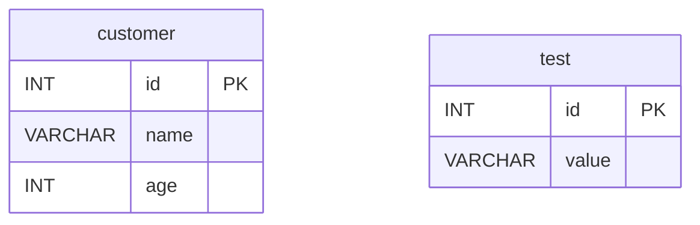

# 02 Alternatives: Vert.x SQL Client Example

[English](./README.md) | 한국어

Vert.x SQL Client + Kotlin Coroutines를 활용해 이벤트 기반/논블로킹 데이터베이스 작업을 구현한 모듈입니다. 가장 저수준에 가까운 SQL 직접 제어를 통해 Reactive 스택의 동작 원리를 경험합니다.

## 개요

Vert.x SQL Client는 ORM 없이 SQL을 직접 작성하고 이벤트 루프에서 실행하는 방식입니다. `SqlTemplate`으로 명명된 파라미터를 사용하거나, `RowMapper`/
`TupleMapper`로 도메인 객체 변환을 정의합니다. `suspend` 함수로 코루틴에서 자연스럽게 사용할 수 있습니다.

## 학습 목표

- Vert.x SQL Client의 `SqlClient`/`SqlConnection`을 `suspend`로 감싼 패턴을 익힌다.
- `SqlTemplate`의 명명된 파라미터(`#{param}`) 바인딩과 다양한 `RowMapper` 전략을 이해한다.
- 트랜잭션 경계를 Vert.x에서 직접 제어하는 `withSuspendTransaction` 패턴을 이해한다.
- 이벤트 루프 기반 API와 Exposed의 블로킹/Non-blocking 경로를 비교한다.

## 아키텍처 흐름

```mermaid
flowchart LR
    subgraph Test["테스트 코드"]
        JE["JDBCPoolExamples\n(H2 JDBC Pool)"]
        TE["SqlClientTemplatePostgresExamples\n(PostgreSQL SqlTemplate)"]
    end

    subgraph Vertx["Vert.x 레이어"]
        Pool["JDBCPool / PgPool"]
        Conn["SqlConnection"]
        Tmpl["SqlTemplate"]
    end

    subgraph DB["데이터베이스"]
        H2["H2 In-Memory"]
        PG["PostgreSQL"]
    end

    JE -->|getH2Pool ()|Pool
TE -->|getPgPool ()|Pool
Pool -->|withSuspendTransaction|Conn
Conn --> Tmpl
Pool --> H2
Tmpl --> PG

    classDef blue fill:#E3F2FD,stroke:#90CAF9,color:#1565C0
    classDef green fill:#E8F5E9,stroke:#A5D6A7,color:#2E7D32
    classDef orange fill:#FFF3E0,stroke:#FFCC80,color:#E65100

    class JE,TE blue
    class Pool,Conn,Tmpl green
    class H2,PG orange
```

## ERD



## 도메인 모델

```kotlin
// Vert.x SQL Client에는 ORM 어노테이션이 없으며, 직접 data class를 정의합니다.
data class Customer(
    val id: Int,
    val name: String,
    val age: Int,
)
```

## 핵심 API 패턴

### JDBC Pool 기반 단순 조회 (H2)

```kotlin
val pool = vertx.getH2Pool()

// suspend 트랜잭션 블록
pool.withSuspendTransaction { conn ->
    val rows = conn.query("SELECT * FROM test").execute().coAwait()
    val records = rows.map { it.toJson() }
}
```

### SqlTemplate 명명된 파라미터 바인딩 (PostgreSQL)

```kotlin
val pool = vertx.getPgPool()

// #{param} 명명된 파라미터로 조회
val rows = SqlTemplate
    .forQuery(pool, "SELECT * FROM customer WHERE name = #{name}")
    .execute(mapOf("name" to "Alice"))
    .coAwait()
```

### RowMapper로 도메인 객체 변환

```kotlin
// CustomerRowMapper: Row → Customer 변환 직접 정의
val customers = SqlTemplate
    .forQuery(pool, "SELECT * FROM customer WHERE age > #{age}")
    .mapTo(CustomerRowMapper.INSTANCE)
    .execute(mapOf("age" to 20))
    .coAwait()
    .map { it }  // List<Customer>
```

### TupleMapper로 도메인 객체 → INSERT 파라미터 매핑

```kotlin
// tupleMapperOfRecord<Customer>()로 Customer 필드를 자동으로 Tuple에 바인딩
val insertCount = SqlTemplate
    .forUpdate(pool, "INSERT INTO customer (id, name, age) VALUES (#{id}, #{name}, #{age})")
    .mapFrom(tupleMapperOfRecord<Customer>())
    .executeBatch(customers)
    .coAwait()
```

### 명시적 트랜잭션 (count 집계 검증)

```kotlin
pool.withSuspendTransaction { conn ->
    val countRow = conn.query("SELECT COUNT(*) FROM test").execute().coAwait()
    val count = countRow.first().getInteger(0)
    count shouldBeEqualTo 2
}
```

## 핵심 구성 파일

| 파일                                               | 설명                                   |
|--------------------------------------------------|--------------------------------------|
| `AbstractSqlClientTest.kt`                       | H2/MySQL/PostgreSQL 커넥션 풀 생성 헬퍼      |
| `JDBCPoolExamples.kt`                            | H2 JDBC Pool 기반 SELECT/파라미터 바인딩/트랜잭션 |
| `templates/SqlClientTemplatePostgresExamples.kt` | PostgreSQL `SqlTemplate` 다양한 바인딩 전략  |
| `model/Customer.kt`                              | 테스트 도메인 모델                           |

## Vert.x SQL Client vs Exposed 비교

| 항목     | Vert.x SQL Client                    | Exposed                                           |
|--------|--------------------------------------|---------------------------------------------------|
| 쿼리 방식  | 문자열 SQL + 명명된 파라미터                   | 타입 안전 DSL                                         |
| 스키마 정의 | 없음 (DDL 직접 실행)                       | `object Table : IntIdTable()`                     |
| 결과 매핑  | `RowMapper` 직접 구현                    | 자동 컬럼 매핑                                          |
| 트랜잭션   | `withSuspendTransaction { conn -> }` | `transaction { }` / `newSuspendedTransaction { }` |
| 타입 안전성 | 없음 (런타임 오류 가능)                       | 컴파일 타임 체크                                         |
| 학습 곡선  | 높음 (SQL 직접 제어)                       | 낮음 (Kotlin DSL)                                   |
| 연결 모델  | Netty 이벤트 루프                         | JDBC / Virtual Thread                             |

## 테스트 실행 방법

```bash
# 전체 모듈 테스트 (H2 기반 — PostgreSQL 불필요)
./gradlew :02-alternatives-to-jpa:vertx-sqlclient-example:test

# 특정 테스트 클래스만 실행
./gradlew :02-alternatives-to-jpa:vertx-sqlclient-example:test \
    --tests "alternative.vertx.sqlclient.example.JDBCPoolExamples"
```

## 복잡한 시나리오

- **다양한 바인딩 전략**: `SqlClientTemplatePostgresExamples`
  - `#{param}` 명명된 파라미터로 조회
  - `CustomerRowMapper`로 Row → 도메인 객체 변환
  - `Row::toJson`으로 anemic JSON 바인딩
  - `tupleMapperOfRecord<Customer>()`로 도메인 객체 → Tuple 자동 바인딩
  - Jackson databind(`mapFrom(Customer::class.java)`) 활용 INSERT
- **명시적 트랜잭션**: `JDBCPoolExamples` — `withSuspendTransaction` 블록 내 COUNT 집계 검증

## 주의 사항

- 이벤트 루프 스레드에서 블로킹 호출(`Thread.sleep`, JDBC 직접 사용)을 하면 전체 이벤트 루프가 멈춥니다.
- PostgreSQL 예제(`SqlClientTemplatePostgresExamples`)는 실행 중인 PostgreSQL이 필요합니다. Testcontainers로 자동 시작됩니다.

## 다음 챕터

- [03-exposed-basic](../../03-exposed-basic/README.md)
