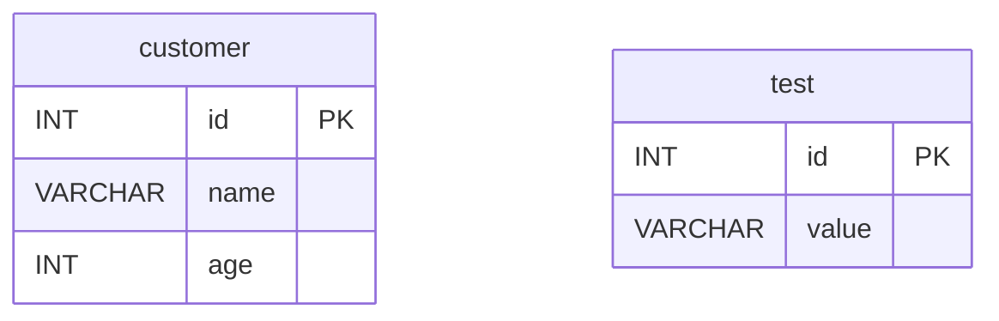

# 02 Alternatives: Vert.x SQL Client Example

English | [한국어](./README.ko.md)

A module implementing event-driven/non-blocking database operations using Vert.x SQL Client + Kotlin Coroutines. Experience the inner workings of the Reactive stack through the lowest-level direct SQL control.

## Overview

Vert.x SQL Client writes SQL directly without an ORM and executes it on the event loop. You can use named parameters with `SqlTemplate`, or define domain object transformations with `RowMapper`/`TupleMapper`. It can be used naturally in coroutines via `suspend` functions.

## Learning Goals

- Learn the pattern of wrapping Vert.x SQL Client's `SqlClient`/`SqlConnection` with `suspend`.
- Understand `SqlTemplate` named parameter (`#{param}`) binding and various `RowMapper` strategies.
- Understand the `withSuspendTransaction` pattern for direct transaction boundary control in Vert.x.
- Compare event-loop-based API with Exposed's blocking/Non-blocking paths.

## Architecture Flow

```mermaid
%%{init: {'theme': 'base', 'themeVariables': {'background': '#FAFAFA', 'fontFamily': '"Comic Mono", "goorm sans code", "JetBrains Mono", "goorm sans"'}}}%%
flowchart LR
    subgraph Test["Test Code"]
        JE["JDBCPoolExamples\n(H2 JDBC Pool)"]
        TE["SqlClientTemplatePostgresExamples\n(PostgreSQL SqlTemplate)"]
    end

    subgraph Vertx["Vert.x Layer"]
        Pool["JDBCPool / PgPool"]
        Conn["SqlConnection"]
        Tmpl["SqlTemplate"]
    end

    subgraph DB["Database"]
        H2["H2 In-Memory"]
        PG["PostgreSQL"]
    end

    JE -->|getH2Pool ()|Pool
TE -->|getPgPool ()|Pool
Pool -->|withSuspendTransaction|Conn
Conn --> Tmpl
Pool --> H2
Tmpl --> PG

    classDef blue fill:#E3F2FD,stroke:#90CAF9,color:#1565C0
    classDef green fill:#E8F5E9,stroke:#A5D6A7,color:#2E7D32
    classDef orange fill:#FFF3E0,stroke:#FFCC80,color:#E65100

    class JE,TE blue
    class Pool,Conn,Tmpl green
    class H2,PG orange
```

## ERD



## Domain Model

```kotlin
// Vert.x SQL Client has no ORM annotations; define a data class directly.
data class Customer(
    val id: Int,
    val name: String,
    val age: Int,
)
```

## Core API Patterns

### Simple Query with JDBC Pool (H2)

```kotlin
val pool = vertx.getH2Pool()

// suspend transaction block
pool.withSuspendTransaction { conn ->
    val rows = conn.query("SELECT * FROM test").execute().coAwait()
    val records = rows.map { it.toJson() }
}
```

### SqlTemplate Named Parameter Binding (PostgreSQL)

```kotlin
val pool = vertx.getPgPool()

// Query with #{param} named parameters
val rows = SqlTemplate
    .forQuery(pool, "SELECT * FROM customer WHERE name = #{name}")
    .execute(mapOf("name" to "Alice"))
    .coAwait()
```

### Domain Object Mapping with RowMapper

```kotlin
// CustomerRowMapper: defines Row → Customer transformation directly
val customers = SqlTemplate
    .forQuery(pool, "SELECT * FROM customer WHERE age > #{age}")
    .mapTo(CustomerRowMapper.INSTANCE)
    .execute(mapOf("age" to 20))
    .coAwait()
    .map { it }  // List<Customer>
```

### Domain Object → INSERT Parameter Mapping with TupleMapper

```kotlin
// tupleMapperOfRecord<Customer>() automatically binds Customer fields to a Tuple
val insertCount = SqlTemplate
    .forUpdate(pool, "INSERT INTO customer (id, name, age) VALUES (#{id}, #{name}, #{age})")
    .mapFrom(tupleMapperOfRecord<Customer>())
    .executeBatch(customers)
    .coAwait()
```

### Explicit Transaction (count aggregation verification)

```kotlin
pool.withSuspendTransaction { conn ->
    val countRow = conn.query("SELECT COUNT(*) FROM test").execute().coAwait()
    val count = countRow.first().getInteger(0)
    count shouldBeEqualTo 2
}
```

## Key Files

| File                                               | Description                                           |
|--------------------------------------------------|-------------------------------------------------------|
| `AbstractSqlClientTest.kt`                       | H2/MySQL/PostgreSQL connection pool creation helper   |
| `JDBCPoolExamples.kt`                            | H2 JDBC Pool-based SELECT/parameter binding/transactions |
| `templates/SqlClientTemplatePostgresExamples.kt` | Various binding strategies with PostgreSQL `SqlTemplate` |
| `model/Customer.kt`                              | Test domain model                                     |

## Vert.x SQL Client vs Exposed Comparison

| Item             | Vert.x SQL Client                    | Exposed                                           |
|-----------------|--------------------------------------|---------------------------------------------------|
| Query approach  | String SQL + named parameters        | Type-safe DSL                                     |
| Schema definition | None (DDL executed directly)       | `object Table : IntIdTable()`                     |
| Result mapping  | Direct `RowMapper` implementation    | Automatic column mapping                          |
| Transactions    | `withSuspendTransaction { conn -> }` | `transaction { }` / `newSuspendedTransaction { }` |
| Type safety     | None (runtime errors possible)       | Compile-time check                                |
| Learning curve  | High (direct SQL control)            | Low (Kotlin DSL)                                  |
| Connection model| Netty event loop                     | JDBC / Virtual Thread                             |

## Running Tests

```bash
# Full module tests (H2-based — no PostgreSQL required)
./gradlew :02-alternatives-to-jpa:vertx-sqlclient-example:test

# Run a specific test class
./gradlew :02-alternatives-to-jpa:vertx-sqlclient-example:test \
    --tests "alternative.vertx.sqlclient.example.JDBCPoolExamples"
```

## Advanced Scenarios

- **Various binding strategies**: `SqlClientTemplatePostgresExamples`
  - Query with `#{param}` named parameters
  - Row → domain object transformation with `CustomerRowMapper`
  - Anemic JSON binding with `Row::toJson`
  - Automatic domain object → Tuple binding with `tupleMapperOfRecord<Customer>()`
  - INSERT using Jackson databind (`mapFrom(Customer::class.java)`)
- **Explicit transactions**: `JDBCPoolExamples` — COUNT aggregation verification within a `withSuspendTransaction` block

## Notes

- Blocking calls (`Thread.sleep`, direct JDBC usage) on the event loop thread will halt the entire event loop.
- The PostgreSQL example (`SqlClientTemplatePostgresExamples`) requires a running PostgreSQL instance. Testcontainers starts it automatically.

## Next Chapter

- [03-exposed-basic](../../03-exposed-basic/README.md)
