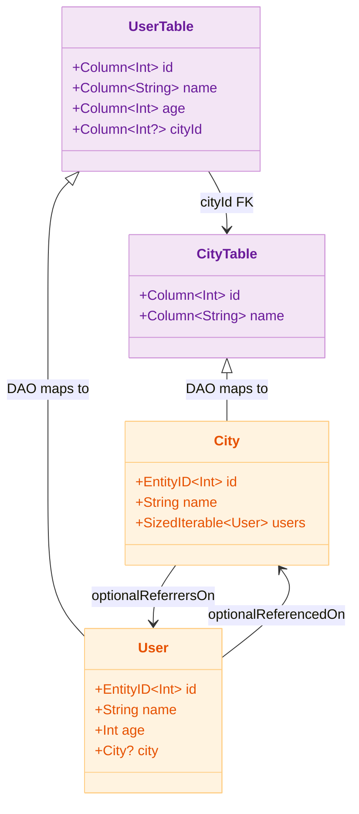

# 03 Exposed Basic

[English](./README.md) | 한국어

Exposed를 처음 만나보는 학습 적응 장치로, DSL과 DAO를 나란히 비교하며 공통 조회/저장 흐름을 테스트 기반으로 익히는 챕터입니다.

## 개요

Exposed는 두 가지 데이터 접근 패턴을 제공합니다. **DSL(SQL DSL)** 패턴은 SQL을 Kotlin 타입 안전 함수 체인으로 표현하며, **DAO** 패턴은 `Entity`/
`EntityClass`를 통해 ORM 스타일로 동작합니다. 두 패턴을 동일한 도메인(`City`/`User`)으로 나란히 실습하여 차이를 직접 확인합니다.

## 학습 목표

- DSL과 DAO의 역할 차이를 명확히 이해한 후, 공통 CRUD 시나리오를 재현한다.
- 테스트 코드로 조건/정렬/페이징 결과를 검증해 안정적인 쿼리 작성 경험을 확보한다.
- 이후 `04-exposed-ddl`, `05-exposed-dml`에서 재사용할 구조(스키마/유틸 클래스)를 정리한다.

## 포함 모듈

| 모듈                    | 설명                                                      |
|-----------------------|---------------------------------------------------------|
| `exposed-sql-example` | DSL 중심으로 SELECT/INSERT/UPDATE/DELETE 기본 흐름을 확인하는 테스트 예제 |
| `exposed-dao-example` | DAO(Entity) 모델링, 관계 매핑, 코루틴 트랜잭션 사례를 담은 예제              |

## DSL vs DAO 패턴 비교

| 항목     | DSL (SQL DSL)                                        | DAO (Entity/EntityClass)                           |
|--------|------------------------------------------------------|----------------------------------------------------|
| 스키마 정의 | `object CityTable : Table("cities")`                 | `object CityTable : IntIdTable("cities")`          |
| 레코드 삽입 | `CityTable.insert { it[name] = "Seoul" }`            | `City.new { name = "Seoul" }`                      |
| 레코드 조회 | `CityTable.selectAll().where { id eq 1 }`            | `City.findById(1)` / `City.all()`                  |
| 레코드 수정 | `CityTable.update({ id eq 1 }) { it[name] = "..." }` | `city.name = "..."` (트랜잭션 내 자동 반영)                 |
| 레코드 삭제 | `CityTable.deleteWhere { id eq 1 }`                  | `city.delete()`                                    |
| 관계 조회  | `CityTable.innerJoin(UserTable).selectAll()`         | `city.users` (Lazy) / `.with(City::users)` (Eager) |
| 결과 타입  | `ResultRow` (Map-like)                               | `Entity` 인스턴스 (객체 모델)                              |
| 집계/조인  | DSL 체이닝으로 자유롭게 표현 가능                                 | 복잡한 집계는 DSL 혼용 권장                                  |
| 코루틴 지원 | `newSuspendedTransaction { }`                        | `newSuspendedTransaction { }` 내 Entity 접근          |
| N+1 위험 | 없음 (명시적 JOIN)                                        | Lazy Loading 시 주의 필요                               |

## 도메인 모델 (classDiagram)



## DSL 방식 스키마 정의

```kotlin
// DSL — 일반 Table 사용, PrimaryKey 명시
object CityTable : Table("cities") {
    val id = integer("id").autoIncrement()
    val name = varchar("name", length = 50)
    override val primaryKey = PrimaryKey(id, name = "PK_Cities_ID")
}

object UserTable : Table("users") {
    val id = varchar("id", length = 10)
    val name = varchar("name", length = 50)
    val cityId = optReference("city_id", CityTable.id)
    override val primaryKey = PrimaryKey(id, name = "PK_User_ID")
}
```

## DAO 방식 스키마 정의

```kotlin
// DAO — IntIdTable 상속, Entity 클래스와 쌍을 이룸
object CityTable : IntIdTable("cities") {
    val name = varchar("name", 50)
}

object UserTable : IntIdTable("users") {
    val name = varchar("name", 50)
    val age = integer("age")
    val cityId = optReference("city_id", CityTable)
}

class City(id: EntityID<Int>) : IntEntity(id) {
    companion object : IntEntityClass<City>(CityTable)
    var name: String by CityTable.name
    val users: SizedIterable<User> by User optionalReferrersOn UserTable.cityId
}

class User(id: EntityID<Int>) : IntEntity(id) {
    companion object : IntEntityClass<User>(UserTable)
    var name: String by UserTable.name
    var age: Int by UserTable.age
    var city: City? by City optionalReferencedOn UserTable.cityId
}
```

## 권장 학습 순서

1. `exposed-sql-example` — DSL의 기본 SELECT/INSERT/UPDATE/DELETE
2. `exposed-dao-example` — Entity CRUD, 관계 매핑, Eager Loading

## 선수 지식

- Kotlin 기본 문법과 함수형 관용구
- 관계형 데이터베이스 기본 개념 (테이블, PK/FK)

## 테스트 실행 방법

```bash
# DSL 예제 테스트
./gradlew :exposed-sql-example:test

# DAO 예제 테스트
./gradlew :exposed-dao-example:test

# H2만 대상으로 빠른 테스트
./gradlew :exposed-sql-example:test -PuseFastDB=true
./gradlew :exposed-dao-example:test -PuseFastDB=true
```

## 테스트 포인트

- DSL/DAO 각각에서 동일 비즈니스 시나리오를 재현할 수 있는지 검증
- 조회 조건, 정렬, 페이징 결과가 기대값과 일치하는지 확인
- N+1 가능성이 있는 조회 패턴을 조기에 식별
- 트랜잭션 경계 밖에서 Entity 지연 접근이 발생하지 않도록 테스트로 고정

## 다음 챕터

- [04-exposed-ddl](../04-exposed-ddl/README.md): DB 연결과 스키마 정의 실습으로 확장합니다.
