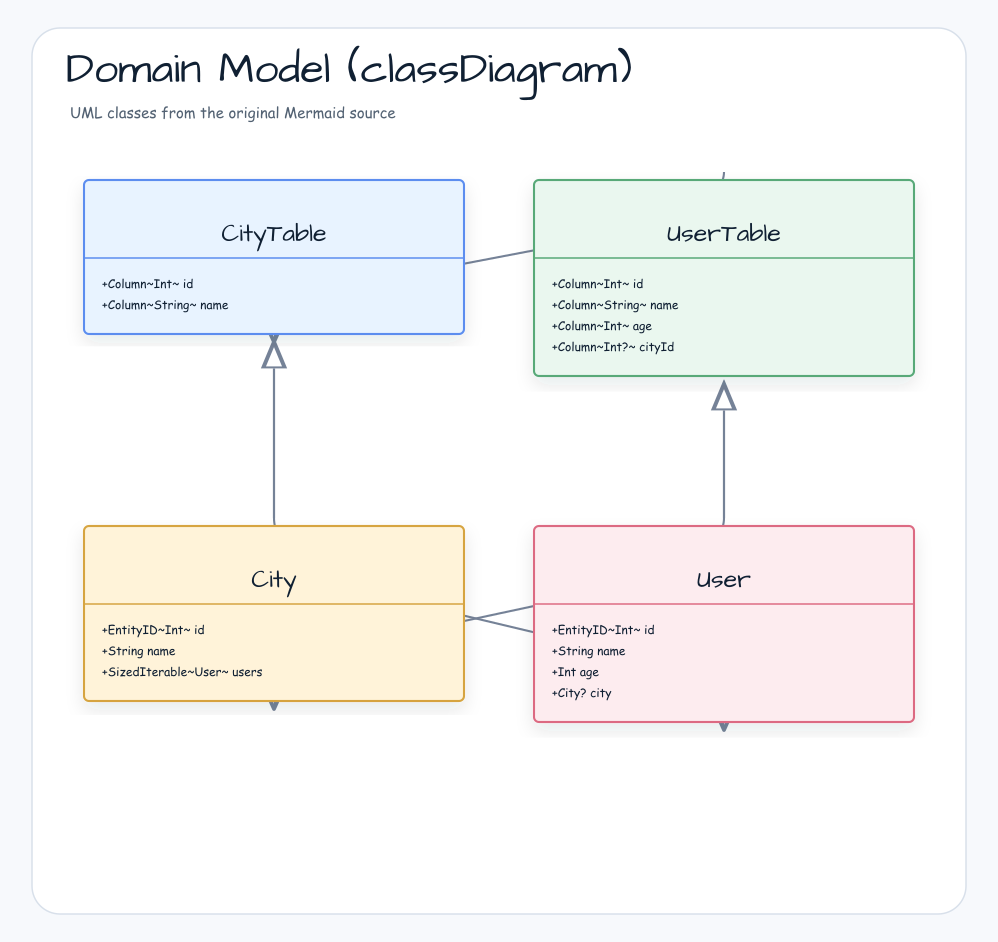

# 03 Exposed Basic

[English](./README.md) | 한국어

Exposed를 처음 배우는 독자를 위한 입문 챕터입니다. SQL DSL과 DAO를 같은 `City`/`User` 도메인 위에서 비교하고, 모든 개념을 실행 가능한 테스트로 확인합니다.

## 개요

Exposed는 두 가지 데이터 접근 패턴을 제공합니다. **DSL(SQL DSL)** 패턴은 `Table` 객체 위에서 SQL을 Kotlin 타입 안전 쿼리 체인으로 표현하고, **DAO** 패턴은 `IntIdTable`의 행을 `IntEntity` 객체로 매핑합니다. 이 챕터는 두 모듈 모두 같은 `City`/`User` 형태를 사용해 스키마 정의, 트랜잭션 경계, 관계 처리, 결과 타입의 차이를 쉽게 비교할 수 있게 구성했습니다.

## 학습 목표

- SQL DSL 쿼리 체인과 DAO 엔티티 객체를 각각 언제 쓰는지 이해한다.
- update, delete, join, group-by, 관계 로딩, 코루틴 트랜잭션 동작을 테스트로 확인한다.
- 이후 DDL/DML 챕터로 확장되는 스키마/헬퍼/테스트 구조를 익힌다.

## 포함 모듈

| 모듈                    | 설명                                                      |
|-----------------------|---------------------------------------------------------|
| `exposed-sql-example` | SQL DSL의 update, delete, join, aggregation, 코루틴 트랜잭션을 확인하는 테스트 예제 |
| `exposed-dao-example` | DAO 엔티티 조회, optional 관계, eager loading, update/delete, 코루틴 트랜잭션을 확인하는 테스트 예제 |

## DSL vs DAO 패턴 비교

| 항목     | DSL (SQL DSL)                                        | DAO (Entity/EntityClass)                           |
|--------|------------------------------------------------------|----------------------------------------------------|
| 스키마 정의 | `object CityTable : Table("cities")`                 | `object CityTable : IntIdTable("cities")`          |
| 레코드 삽입 | `CityTable.insert { it[name] = "Seoul" }`            | `City.new { name = "Seoul" }`                      |
| 레코드 조회 | `CityTable.selectAll().where { id eq 1 }`            | `City.findById(1)` / `City.all()`                  |
| 레코드 수정 | `CityTable.update({ id eq 1 }) { it[name] = "..." }` | `city.name = "..."` (트랜잭션 내 자동 반영)                 |
| 레코드 삭제 | `CityTable.deleteWhere { id eq 1 }`                  | `city.delete()`                                    |
| 관계 조회  | `CityTable.innerJoin(UserTable).selectAll()`         | `city.users` (Lazy) / `.with(City::users)` (Eager) |
| 결과 타입  | `ResultRow` (Map-like)                               | `Entity` 인스턴스 (객체 모델)                              |
| 집계/조인  | DSL 체이닝으로 자유롭게 표현 가능                                 | 복잡한 집계는 DSL 혼용 권장                                  |
| 코루틴 지원 | `newSuspendedTransaction { }`                        | `newSuspendedTransaction { }` 내 Entity 접근          |
| N+1 위험 | 없음 (명시적 JOIN)                                        | Lazy Loading 시 주의 필요                               |

## 도메인 모델



## DSL 방식 스키마 정의

```kotlin
// DSL — 일반 Table 사용, PrimaryKey 명시
object CityTable : Table("cities") {
    val id = integer("id").autoIncrement()
    val name = varchar("name", length = 50)
    override val primaryKey = PrimaryKey(id, name = "PK_Cities_ID")
}

object UserTable : Table("users") {
    val id = varchar("id", length = 10)
    val name = varchar("name", length = 50)
    val cityId = optReference("city_id", CityTable.id)
    override val primaryKey = PrimaryKey(id, name = "PK_User_ID")
}
```

## DAO 방식 스키마 정의

```kotlin
// DAO — IntIdTable 상속, Entity 클래스와 쌍을 이룸
object CityTable : IntIdTable("cities") {
    val name = varchar("name", 50)
}

object UserTable : IntIdTable("users") {
    val name = varchar("name", 50)
    val age = integer("age")
    val cityId = optReference("city_id", CityTable)
}

class City(id: EntityID<Int>) : IntEntity(id) {
    companion object : IntEntityClass<City>(CityTable)
    var name: String by CityTable.name
    val users: SizedIterable<User> by User optionalReferrersOn UserTable.cityId
}

class User(id: EntityID<Int>) : IntEntity(id) {
    companion object : IntEntityClass<User>(UserTable)
    var name: String by UserTable.name
    var age: Int by UserTable.age
    var city: City? by City optionalReferencedOn UserTable.cityId
}
```

## 권장 학습 순서

1. `exposed-sql-example` — DSL의 기본 SELECT/INSERT/UPDATE/DELETE
2. `exposed-dao-example` — Entity CRUD, 관계 매핑, Eager Loading

## 선수 지식

- Kotlin 기본 문법과 함수형 관용구
- 관계형 데이터베이스 기본 개념 (테이블, PK/FK)

## 테스트 실행 방법

```bash
# DSL 예제 테스트
./gradlew :exposed-sql-example:test

# DAO 예제 테스트
./gradlew :exposed-dao-example:test

# H2만 대상으로 빠른 테스트
./gradlew :exposed-sql-example:test -PuseFastDB=true
./gradlew :exposed-dao-example:test -PuseFastDB=true
```

## 테스트 포인트

- 같은 `City`/`User` 모델이 SQL DSL 테이블과 DAO 엔티티로 어떻게 표현되는지 확인
- 조건 조회, 조인, 집계, update, delete 결과가 기대값과 일치하는지 검증
- DAO 관계 조회에서 N+1이 생길 수 있는 접근 패턴을 식별
- 관계 중심 테스트에서는 트랜잭션 안에서 엔티티를 탐색하고 eager loading을 우선 사용

## 다음 챕터

- [04-exposed-ddl](../04-exposed-ddl/README.md): DB 연결과 스키마 정의 실습으로 확장합니다.
