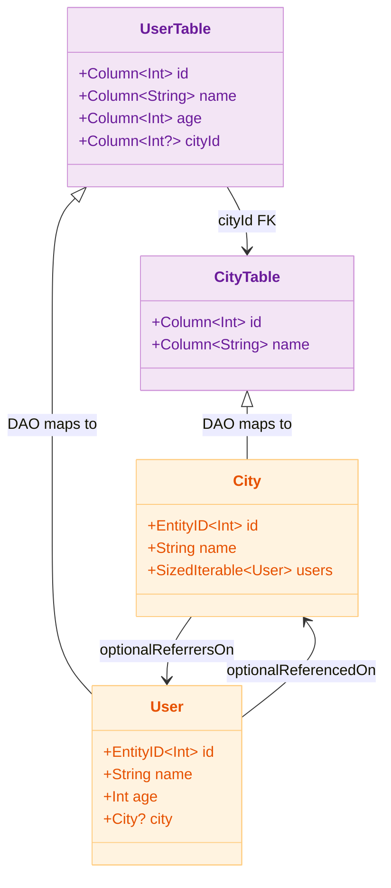

# 03 Exposed Basic

English | [한국어](./README.ko.md)

An introductory chapter for first-time Exposed learners. DSL and DAO are compared side-by-side, and the common query/save flow is learned through test-driven practice.

## Overview

Exposed provides two data access patterns. The **DSL (SQL DSL)** pattern expresses SQL as a Kotlin type-safe function chain, while the **DAO** pattern operates in an ORM style via `Entity`/`EntityClass`. Both patterns are practised side-by-side with the same domain (`City`/`User`) so you can observe the differences directly.

## Learning Goals

- Clearly understand the role differences between DSL and DAO, then reproduce common CRUD scenarios.
- Gain stable query-writing experience by verifying conditional/sorting/paging results through test code.
- Organise the structures (schema/utility classes) to be reused in `04-exposed-ddl` and `05-exposed-dml`.

## Included Modules

| Module                  | Description                                                           |
|-----------------------|-----------------------------------------------------------------------|
| `exposed-sql-example` | Test-based example confirming the basic SELECT/INSERT/UPDATE/DELETE flow with a DSL focus |
| `exposed-dao-example` | Example covering DAO (Entity) modelling, relationship mapping, and coroutine transaction cases |

## DSL vs DAO Pattern Comparison

| Item              | DSL (SQL DSL)                                        | DAO (Entity/EntityClass)                           |
|-----------------|------------------------------------------------------|----------------------------------------------------|
| Schema definition | `object CityTable : Table("cities")`               | `object CityTable : IntIdTable("cities")`          |
| Record insert   | `CityTable.insert { it[name] = "Seoul" }`            | `City.new { name = "Seoul" }`                      |
| Record query    | `CityTable.selectAll().where { id eq 1 }`            | `City.findById(1)` / `City.all()`                  |
| Record update   | `CityTable.update({ id eq 1 }) { it[name] = "..." }` | `city.name = "..."` (auto-applied within transaction) |
| Record delete   | `CityTable.deleteWhere { id eq 1 }`                  | `city.delete()`                                    |
| Relation query  | `CityTable.innerJoin(UserTable).selectAll()`         | `city.users` (Lazy) / `.with(City::users)` (Eager) |
| Result type     | `ResultRow` (Map-like)                               | `Entity` instance (object model)                   |
| Aggregation/join| Freely expressible with DSL chaining                 | Complex aggregations: recommended to mix with DSL  |
| Coroutine support | `newSuspendedTransaction { }`                      | Entity access within `newSuspendedTransaction { }` |
| N+1 risk        | None (explicit JOIN)                                 | Caution needed with Lazy Loading                   |

## Domain Model (classDiagram)



## DSL-Style Schema Definition

```kotlin
// DSL — uses plain Table, PrimaryKey declared explicitly
object CityTable : Table("cities") {
    val id = integer("id").autoIncrement()
    val name = varchar("name", length = 50)
    override val primaryKey = PrimaryKey(id, name = "PK_Cities_ID")
}

object UserTable : Table("users") {
    val id = varchar("id", length = 10)
    val name = varchar("name", length = 50)
    val cityId = optReference("city_id", CityTable.id)
    override val primaryKey = PrimaryKey(id, name = "PK_User_ID")
}
```

## DAO-Style Schema Definition

```kotlin
// DAO — inherits IntIdTable, paired with an Entity class
object CityTable : IntIdTable("cities") {
    val name = varchar("name", 50)
}

object UserTable : IntIdTable("users") {
    val name = varchar("name", 50)
    val age = integer("age")
    val cityId = optReference("city_id", CityTable)
}

class City(id: EntityID<Int>) : IntEntity(id) {
    companion object : IntEntityClass<City>(CityTable)
    var name: String by CityTable.name
    val users: SizedIterable<User> by User optionalReferrersOn UserTable.cityId
}

class User(id: EntityID<Int>) : IntEntity(id) {
    companion object : IntEntityClass<User>(UserTable)
    var name: String by UserTable.name
    var age: Int by UserTable.age
    var city: City? by City optionalReferencedOn UserTable.cityId
}
```

## Recommended Study Order

1. `exposed-sql-example` — Basic SELECT/INSERT/UPDATE/DELETE with DSL
2. `exposed-dao-example` — Entity CRUD, relationship mapping, Eager Loading

## Prerequisites

- Kotlin basic syntax and functional idioms
- Relational database fundamentals (tables, PK/FK)

## Running Tests

```bash
# DSL example tests
./gradlew :03-exposed-basic:exposed-sql-example:test

# DAO example tests
./gradlew :03-exposed-basic:exposed-dao-example:test

# Fast tests targeting H2 only
./gradlew :03-exposed-basic:exposed-sql-example:test -PuseFastDB=true
./gradlew :03-exposed-basic:exposed-dao-example:test -PuseFastDB=true
```

## Test Points

- Verify that the same business scenario can be reproduced in both DSL and DAO
- Confirm that query conditions, sorting, and paging results match expected values
- Identify query patterns with N+1 potential early
- Pin tests to prevent lazy entity access from occurring outside the transaction boundary

## Next Chapter

- [04-exposed-ddl](../04-exposed-ddl/README.md): Extends into DB connection and schema definition practice.
