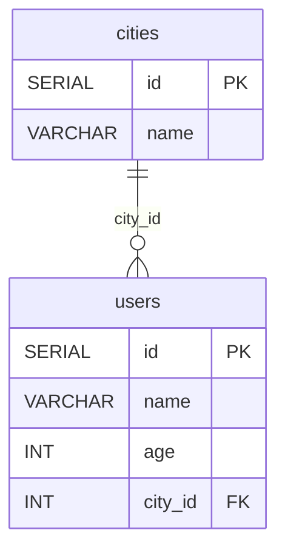
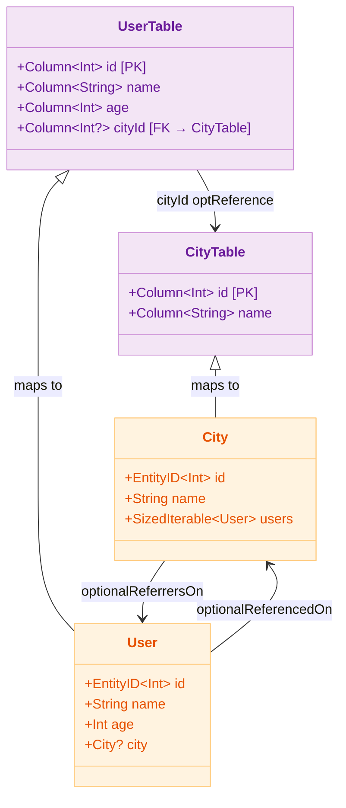

# 03 Exposed Basic: DAO 예제

[English](./README.md) | 한국어

Exposed DAO(Entity) 패턴의 기본을 학습하는 모듈입니다. `Entity`/`EntityClass` 모델링, 관계 매핑(`referencedOn`,
`referrersOn`), CRUD, 코루틴 연동을 다룹니다.

## 개요

Exposed DAO 패턴은 `IntIdTable`과 `IntEntity`/
`IntEntityClass` 쌍으로 ORM 스타일의 데이터 접근을 제공합니다. 테이블 컬럼을 Kotlin 프로퍼티로 위임(delegate)하여 객체처럼 다루며, 관계는 `referencedOn`/
`referrersOn`으로 선언합니다.

## 학습 목표

- `IntEntity`/`IntEntityClass` 기반 Entity 모델링을 익힌다.
- `referencedOn`(many-to-one), `referrersOn`(one-to-many) 관계 매핑을 이해한다.
- `.with()` eager loading으로 N+1 문제를 방지한다.
- `newSuspendedTransaction` 기반 코루틴 트랜잭션에서 DAO를 사용한다.

## 선수 지식

- [`../exposed-sql-example/README.md`](../exposed-sql-example/README.md)

## ERD



## 도메인 모델



## 핵심 개념

### Entity / Table 선언

```kotlin
object CityTable: IntIdTable("cities") {
    val name = varchar("name", 50)
}

object UserTable: IntIdTable("users") {
    val name = varchar("name", 50)
    val age = integer("age")
    val cityId = optReference("city_id", CityTable)  // nullable FK
}

// City Entity — one-to-many: users
class City(id: EntityID<Int>): IntEntity(id) {
    companion object: IntEntityClass<City>(CityTable)

    var name: String by CityTable.name

    // one-to-many: 이 City에 속한 User 목록 (Lazy by default)
    val users: SizedIterable<User> by User optionalReferrersOn UserTable.cityId
}

// User Entity — many-to-one: city
class User(id: EntityID<Int>): IntEntity(id) {
    companion object: IntEntityClass<User>(UserTable)

    var name: String by UserTable.name
    var age: Int by UserTable.age

    // many-to-one: nullable FK
    var city: City? by City optionalReferencedOn UserTable.cityId
}
```

### CRUD

```kotlin
transaction {
    // INSERT
    val seoul = City.new { name = "Seoul" }
    val user = User.new {
        name = "debop"
        age = 56
        city = seoul
    }

    // SELECT by id
    val found = User.findById(user.id)

    // UPDATE — 트랜잭션 내에서 프로퍼티 변경 시 자동 반영
    found?.name = "debop (updated)"

    // DELETE
    found?.delete()
}
```

### Eager Loading으로 N+1 방지

```kotlin
// 문제 상황 (Lazy Loading — N+1 발생)
City.all().forEach { city ->
    city.users.forEach { user -> println(user.name) }  // N번 추가 쿼리
}

// 해결책 (Eager Loading — .with() 사용)
// City 1회 + User 1회 = 총 2회 쿼리
City.find { CityTable.name eq "Seoul" }
    .with(City::users)          // users를 미리 로딩
    .forEach { city ->
        city.users.forEach { println(it.name) }
    }
```

### 코루틴 트랜잭션 내 DAO 사용

```kotlin
// newSuspendedTransaction 내에서 Entity 접근
suspend fun withSuspendedCityUsers(testDB: TestDB, statement: suspend JdbcTransaction.() -> Unit) {
    withTablesSuspending(testDB, CityTable, UserTable) {
        populateSamples()
        flushCache()
        entityCache.clear()
        statement()
    }
}

// 사용 예시
withSuspendedCityUsers(testDB) {
    val users = User.find { UserTable.age greaterEq intLiteral(18) }
        .with(User::city)
        .toList()
}
```

## 예제 구성

| 파일                              | 설명                                 |
|---------------------------------|------------------------------------|
| `Schema.kt`                     | Entity/Table 정의, 샘플 데이터 삽입, 테스트 헬퍼 |
| `ExposedDaoExample.kt`          | 동기 DAO CRUD, 관계 조회, Eager Loading  |
| `ExposedDaoSuspendedExample.kt` | 코루틴 DAO 예제 (동일 시나리오 비동기 실행)        |

## 테스트 실행 방법

```bash
# 전체 테스트
./gradlew :03-exposed-basic:exposed-dao-example:test

# H2만 대상으로 빠른 테스트
./gradlew :03-exposed-basic:exposed-dao-example:test -PuseFastDB=true

# 특정 테스트 클래스만 실행
./gradlew :03-exposed-basic:exposed-dao-example:test \
    --tests "exposed.dao.example.ExposedDaoExample"
```

## 복잡한 시나리오

### N+1 문제와 Eager Loading

DAO 패턴에서 연관 엔티티를 반복 접근하면 N+1 쿼리 문제가 발생합니다.

관련 테스트:

- `ExposedDaoExample` — `DAO Entity를 조건절로 검색하기 01` : one-to-many eager loading
- `ExposedDaoExample` — `DAO Entity를 조건절로 검색하기 02` : many-to-one eager loading

### 코루틴 트랜잭션 내 DAO 사용

관련 테스트: `ExposedDaoSuspendedExample`

## 실습 체크리스트

- DAO와 DSL로 동일 유스케이스를 각각 구현해 비교한다.
- 관계 조회 시 eager loading 유무에 따른 쿼리 수를 비교한다.
- 트랜잭션 경계 밖에서 Entity 지연 접근을 피한다.
- 관계 탐색이 깊어질수록 N+1 위험을 테스트로 고정한다.

## 다음 챕터

- [`../../04-exposed-ddl/README.md`](../../04-exposed-ddl/README.md)
