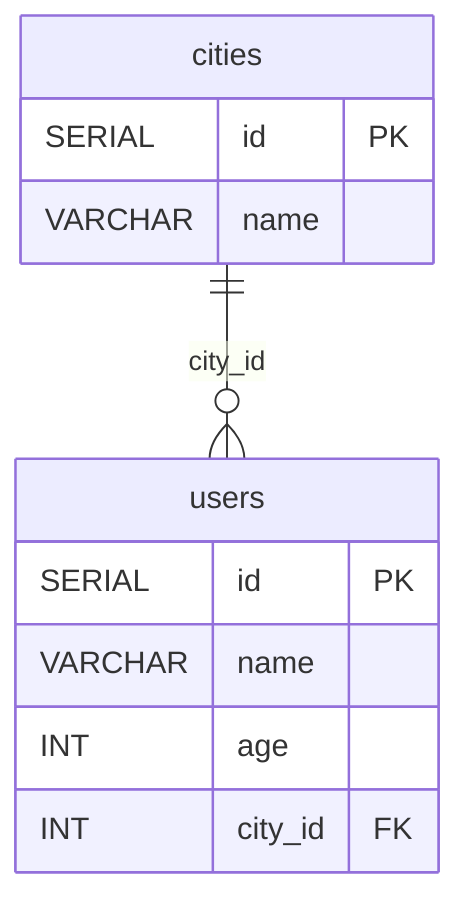
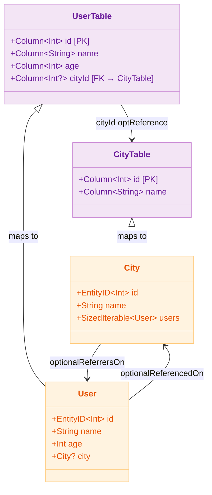

# 03 Exposed Basic: DAO Example

English | [한국어](./README.ko.md)

A module for learning the fundamentals of the Exposed DAO (Entity) pattern. Covers `Entity`/`EntityClass` modelling, relationship mapping (`referencedOn`, `referrersOn`), CRUD, and coroutine integration.

## Overview

The Exposed DAO pattern provides ORM-style data access via an `IntIdTable` and `IntEntity`/`IntEntityClass` pair. Table columns are delegated to Kotlin properties so you can work with them like objects, and relationships are declared with `referencedOn`/`referrersOn`.

## Learning Goals

- Learn Entity modelling based on `IntEntity`/`IntEntityClass`.
- Understand `referencedOn` (many-to-one) and `referrersOn` (one-to-many) relationship mapping.
- Prevent the N+1 problem with `.with()` eager loading.
- Use DAO within coroutine transactions based on `newSuspendedTransaction`.

## Prerequisites

- [`../exposed-sql-example/README.md`](../exposed-sql-example/README.md)

## ERD



## Domain Model



## Core Concepts

### Entity / Table Declaration

```kotlin
object CityTable: IntIdTable("cities") {
    val name = varchar("name", 50)
}

object UserTable: IntIdTable("users") {
    val name = varchar("name", 50)
    val age = integer("age")
    val cityId = optReference("city_id", CityTable)  // nullable FK
}

// City Entity — one-to-many: users
class City(id: EntityID<Int>): IntEntity(id) {
    companion object: IntEntityClass<City>(CityTable)

    var name: String by CityTable.name

    // one-to-many: list of Users belonging to this City (Lazy by default)
    val users: SizedIterable<User> by User optionalReferrersOn UserTable.cityId
}

// User Entity — many-to-one: city
class User(id: EntityID<Int>): IntEntity(id) {
    companion object: IntEntityClass<User>(UserTable)

    var name: String by UserTable.name
    var age: Int by UserTable.age

    // many-to-one: nullable FK
    var city: City? by City optionalReferencedOn UserTable.cityId
}
```

### CRUD

```kotlin
transaction {
    // INSERT
    val seoul = City.new { name = "Seoul" }
    val user = User.new {
        name = "debop"
        age = 56
        city = seoul
    }

    // SELECT by id
    val found = User.findById(user.id)

    // UPDATE — property changes within a transaction are reflected automatically
    found?.name = "debop (updated)"

    // DELETE
    found?.delete()
}
```

### Preventing N+1 with Eager Loading

```kotlin
// Problem (Lazy Loading — N+1 occurs)
City.all().forEach { city ->
    city.users.forEach { user -> println(user.name) }  // N additional queries
}

// Solution (Eager Loading — use .with())
// City 1 query + User 1 query = 2 queries total
City.find { CityTable.name eq "Seoul" }
    .with(City::users)          // pre-load users
    .forEach { city ->
        city.users.forEach { println(it.name) }
    }
```

### Using DAO within a Coroutine Transaction

```kotlin
// Entity access inside newSuspendedTransaction
suspend fun withSuspendedCityUsers(testDB: TestDB, statement: suspend JdbcTransaction.() -> Unit) {
    withTablesSuspending(testDB, CityTable, UserTable) {
        populateSamples()
        flushCache()
        entityCache.clear()
        statement()
    }
}

// Usage example
withSuspendedCityUsers(testDB) {
    val users = User.find { UserTable.age greaterEq intLiteral(18) }
        .with(User::city)
        .toList()
}
```

## Example Files

| File                              | Description                                           |
|---------------------------------|-------------------------------------------------------|
| `Schema.kt`                     | Entity/Table definitions, sample data insertion, test helpers |
| `ExposedDaoExample.kt`          | Synchronous DAO CRUD, relationship queries, Eager Loading |
| `ExposedDaoSuspendedExample.kt` | Coroutine DAO example (same scenarios run asynchronously) |

## Running Tests

```bash
# Full tests
./gradlew :03-exposed-basic:exposed-dao-example:test

# Fast tests targeting H2 only
./gradlew :03-exposed-basic:exposed-dao-example:test -PuseFastDB=true

# Run a specific test class
./gradlew :03-exposed-basic:exposed-dao-example:test \
    --tests "exposed.dao.example.ExposedDaoExample"
```

## Advanced Scenarios

### N+1 Problem and Eager Loading

Repeatedly accessing related entities in the DAO pattern causes N+1 query issues.

Related tests:

- `ExposedDaoExample` — `DAO Entity를 조건절로 검색하기 01` : one-to-many eager loading
- `ExposedDaoExample` — `DAO Entity를 조건절로 검색하기 02` : many-to-one eager loading

### Using DAO within a Coroutine Transaction

Related test: `ExposedDaoSuspendedExample`

## Practice Checklist

- Implement the same use case in both DAO and DSL and compare.
- Compare the number of queries with and without eager loading during relationship queries.
- Avoid lazy entity access outside the transaction boundary.
- As relationship traversal deepens, pin N+1 risks with tests.

## Next Chapter

- [`../../04-exposed-ddl/README.md`](../../04-exposed-ddl/README.md)
