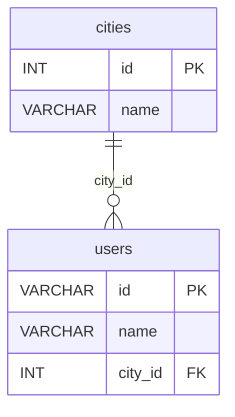
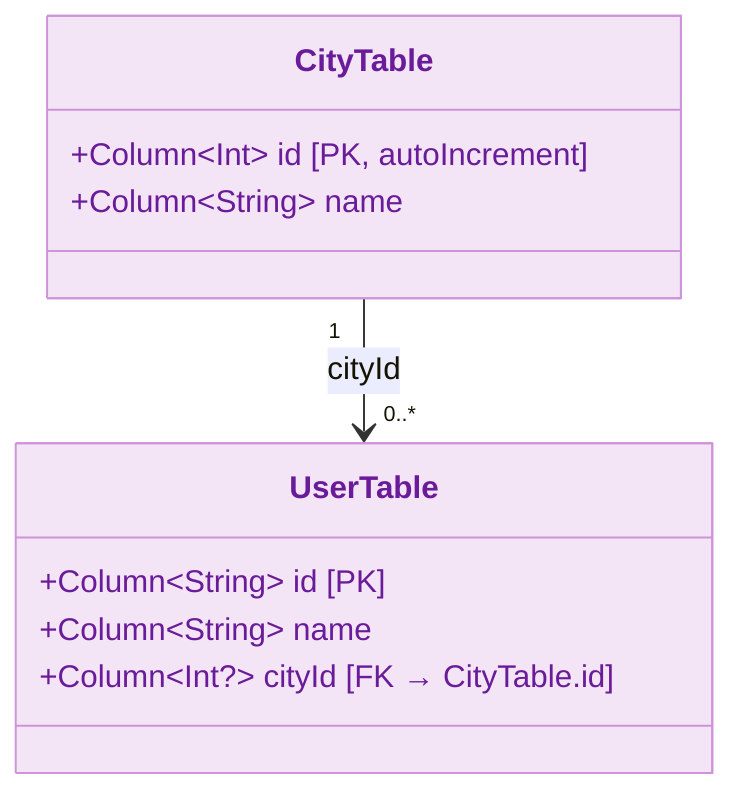

# 03 Exposed Basic: SQL DSL 예제

[English](./README.md) | 한국어

Exposed SQL DSL의 기본 사용법을 학습하는 모듈입니다. 테이블 정의, CRUD, 조인, 집계, 코루틴 기반 비동기 쿼리까지 실습합니다.

## 개요

Exposed DSL은 SQL 쿼리를 Kotlin 타입 안전 함수 체인으로 표현합니다. `Table` 객체를 정의하고 `transaction { }` 블록 안에서 `insert`, `selectAll`,
`update`, `deleteWhere` 등을 조합하여 쿼리를 구성합니다. 동일한 쿼리를 코루틴 환경에서는 `newSuspendedTransaction { }` 으로 실행합니다.

## 학습 목표

- Exposed DSL로 타입 안전한 쿼리를 작성한다.
- CRUD/조인/집계를 DSL 스타일로 구현한다.
- 동기/코루틴 접근 방식의 차이를 이해한다.

## 선수 지식

- [`../README.md`](../README.md)

## ERD



## DSL 쿼리 흐름

```mermaid
%%{init: {"theme": "neutral", "themeVariables": {"fontFamily": "'Comic Mono', 'goorm sans code', 'JetBrains Mono', 'goorm sans'"}}}%%
sequenceDiagram
    participant App as 애플리케이션
    participant TX as transaction { }
    participant DSL as Exposed DSL
    participant DB as Database

    App ->> TX: transaction { }
    TX ->> DSL: CityTable.insert { it[name] = "Seoul" }
    DSL ->> DB: INSERT INTO cities (name) VALUES (?)
    DB -->> DSL: generated id
    DSL -->> TX: ResultRow

    TX ->> DSL: UserTable.insert { it[id] = "debop"; it[cityId] = seoulId }
    DSL ->> DB: INSERT INTO users (id, name, city_id) VALUES (?, ?, ?)
    DB -->> DSL: OK

    TX ->> DSL: CityTable.innerJoin(UserTable).selectAll()
    DSL ->> DB: SELECT * FROM cities INNER JOIN users ON ...
    DB -->> DSL: ResultSet
    DSL -->> TX: List~ResultRow~
    TX -->> App: 결과 반환
```

## 도메인 모델



### 테이블 정의

```kotlin
object CityTable: Table("cities") {
    val id = integer("id").autoIncrement()
    val name = varchar("name", length = 50)
    override val primaryKey = PrimaryKey(id, name = "PK_Cities_ID")
}

object UserTable: Table("users") {
    val id = varchar("id", length = 10)
    val name = varchar("name", length = 50)
    val cityId = optReference("city_id", CityTable.id)
    override val primaryKey = PrimaryKey(id, name = "PK_User_ID")
}
```

## 핵심 개념

### INSERT

```kotlin
// 기본 INSERT
val seoulId = CityTable.insert {
    it[name] = "Seoul"
} get CityTable.id

// 표현식 기반 INSERT — SUBSTRING(TRIM('   Daegu   '), 1, 2)
CityTable.insert {
    it.update(name, stringLiteral("   Daegu   ").trim().substring(1, 2))
}
```

### SELECT + WHERE

```kotlin
// 단순 조건 조회
CityTable.selectAll()
    .where { CityTable.id eq seoulId }
    .single()[CityTable.name]

// andWhere / orWhere 체이닝
UserTable.innerJoin(CityTable)
    .select(UserTable.name, CityTable.name)
    .where { (UserTable.id eq "debop") or (UserTable.name eq "Jane.Doe") }
    .andWhere { UserTable.id eq "jane" }
```

### JOIN + GROUP BY + 집계

```kotlin
// 도시별 사용자 수 집계
val userCountsByCity = CityTable.innerJoin(UserTable)
    .select(CityTable.name, UserTable.id.count())
    .groupBy(CityTable.name)
    .associate { it[CityTable.name] to it[UserTable.id.count()] }
```

### UPDATE / DELETE

```kotlin
// UPDATE
UserTable.update({ UserTable.id eq "debop" }) {
    it[name] = "Debop.Bae (Updated)"
}

// DELETE
UserTable.deleteWhere { UserTable.cityId.isNull() }
```

### 코루틴 기반 쿼리

```kotlin
// newSuspendedTransaction 내에서 동일한 DSL 사용
suspend fun withSuspendedCityUsers(testDB: TestDB, statement: suspend JdbcTransaction.() -> Unit) {
    withTablesSuspending(testDB, CityTable, UserTable) {
        insertSampleData()
        commit()
        statement()
    }
}
```

## 예제 구성

| 파일                              | 설명                          |
|---------------------------------|-----------------------------|
| `Schema.kt`                     | 테이블 정의 + 샘플 데이터 삽입 헬퍼       |
| `ExposedSQLExample.kt`          | 동기 DSL CRUD/조인/집계 예제        |
| `ExposedSQLSuspendedExample.kt` | 코루틴 DSL 예제 (동일 시나리오 비동기 실행) |

## 테스트 실행 방법

```bash
# 전체 테스트
./gradlew :exposed-sql-example:test

# H2만 대상으로 빠른 테스트
./gradlew :exposed-sql-example:test -PuseFastDB=true

# 특정 테스트 클래스만 실행
./gradlew :exposed-sql-example:test \
    --tests "exposed.sql.example.ExposedSQLExample"
```

## 복잡한 시나리오

### 조인 + 집계 쿼리

```kotlin
// City 1회 + User 1회 JOIN 후 집계
val userCountsByCity = CityTable.innerJoin(UserTable)
    .select(CityTable.name, UserTable.id.count())
    .groupBy(CityTable.name)
    .associate { it[CityTable.name] to it[UserTable.id.count()] }
```

관련 테스트:

- `ExposedSQLExample` — `use functions and group by`
- `ExposedSQLSuspendedExample` — `use functions and group by`

### andWhere / orWhere 체이닝

```kotlin
UserTable
    .innerJoin(CityTable)
    .select(UserTable.name, CityTable.name)
    .where { (UserTable.id eq "debop") or (UserTable.name eq "Jane.Doe") }
    .andWhere { UserTable.id eq "jane" }
```

관련 테스트: `ExposedSQLExample` — `manual inner join`

## 실습 체크리스트

- 동일 시나리오를 동기/코루틴 경로로 각각 실행해 결과를 비교한다.
- 조인 + 집계 쿼리를 직접 확장해본다.
- 복잡한 DSL 체인은 중간 표현식을 분리해 가독성을 유지한다.

## 다음 모듈

- [`../exposed-dao-example/README.md`](../exposed-dao-example/README.md)
