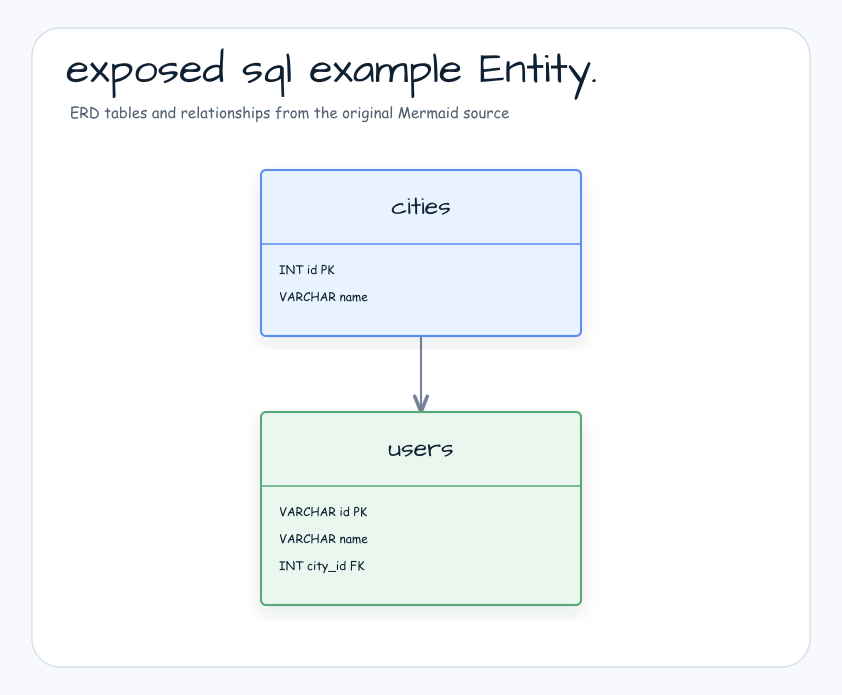
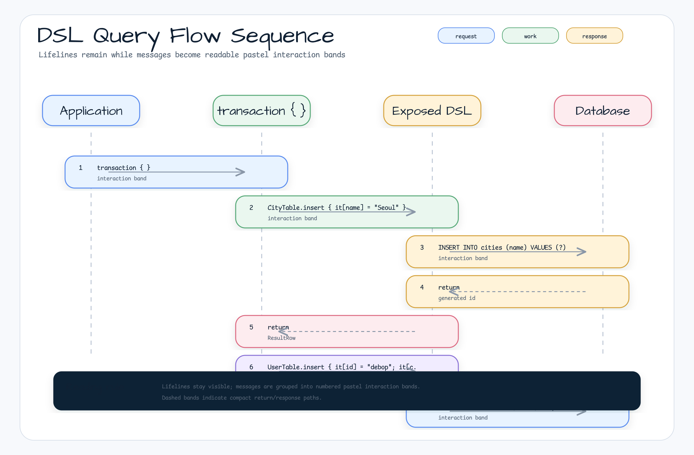
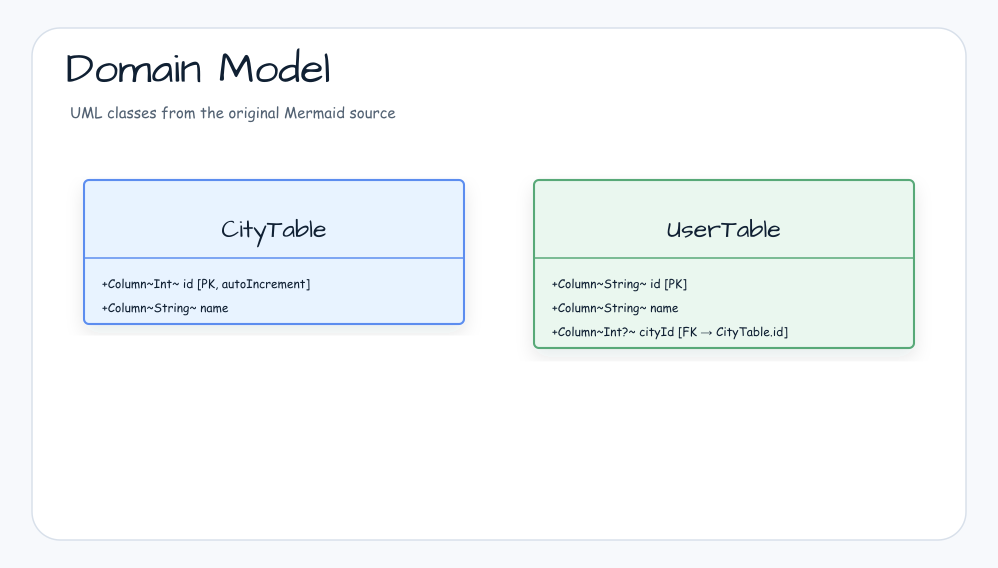

# 03 Exposed Basic: SQL DSL 예제

[English](./README.md) | 한국어

Exposed SQL DSL을 테스트로 익히는 모듈입니다. 테이블 정의, 샘플 데이터 준비, update/delete, 조인, 집계, 코루틴 트랜잭션 안에서의 동일 DSL 실행을 다룹니다.

## 개요

Exposed DSL은 SQL 쿼리를 Kotlin 타입 안전 함수 체인으로 표현합니다. `Schema.kt`는 `cities`, `users`를 일반 `Table` 객체로 정의하고 도시 3개, 사용자 5개를 샘플로 넣습니다. 각 테스트는 공용 트랜잭션 헬퍼 안에서 `update`, `deleteWhere`, `innerJoin`, `leftJoin`, `groupBy`, `select`를 조합합니다. `ExposedSQLSuspendedExample`은 같은 케이스를 `newSuspendedTransaction { }` 기반 suspending 헬퍼로 반복합니다.

## 학습 목표

- Exposed SQL DSL로 타입 안전한 update, delete, join, aggregation 쿼리를 작성한다.
- nullable foreign key가 조인 결과에 어떤 영향을 주는지 확인한다.
- 동기 헬퍼와 같은 DSL 본문을 코루틴 트랜잭션에서 실행하는 suspending 헬퍼를 비교한다.

## 선수 지식

- [`../README.md`](../README.md)

## ERD



## DSL 쿼리 흐름



## 도메인 모델



### 테이블 정의

```kotlin
object CityTable: Table("cities") {
    val id = integer("id").autoIncrement()
    val name = varchar("name", length = 50)
    override val primaryKey = PrimaryKey(id, name = "PK_Cities_ID")
}

object UserTable: Table("users") {
    val id = varchar("id", length = 10)
    val name = varchar("name", length = 50)
    val cityId = optReference("city_id", CityTable.id)
    override val primaryKey = PrimaryKey(id, name = "PK_User_ID")
}
```

## 핵심 개념

### INSERT

```kotlin
// 기본 INSERT
val seoulId = CityTable.insert {
    it[name] = "Seoul"
} get CityTable.id

// 표현식 기반 INSERT — SUBSTRING(TRIM('   Daegu   '), 1, 2)
CityTable.insert {
    it.update(name, stringLiteral("   Daegu   ").trim().substring(1, 2))
}
```

### SELECT + WHERE

```kotlin
// 단순 조건 조회
CityTable.selectAll()
    .where { CityTable.id eq seoulId }
    .single()[CityTable.name]

// andWhere / orWhere 체이닝
UserTable.innerJoin(CityTable)
    .select(UserTable.name, CityTable.name)
    .where { (UserTable.id eq "debop") or (UserTable.name eq "Jane.Doe") }
    .andWhere { UserTable.id eq "jane" }
```

### JOIN + GROUP BY + 집계

```kotlin
// 도시별 사용자 수 집계
val userCountsByCity = CityTable.innerJoin(UserTable)
    .select(CityTable.name, UserTable.id.count())
    .groupBy(CityTable.name)
    .associate { it[CityTable.name] to it[UserTable.id.count()] }
```

### UPDATE / DELETE

```kotlin
// UPDATE
UserTable.update({ UserTable.id eq "debop" }) {
    it[name] = "Debop.Bae (Updated)"
}

// DELETE
UserTable.deleteWhere { UserTable.cityId.isNull() }
```

### 코루틴 기반 쿼리

```kotlin
// newSuspendedTransaction 내에서 동일한 DSL 사용
suspend fun withSuspendedCityUsers(testDB: TestDB, statement: suspend JdbcTransaction.() -> Unit) {
    withTablesSuspending(testDB, CityTable, UserTable) {
        insertSampleData()
        commit()
        statement()
    }
}
```

## 예제 구성

| 파일                              | 설명                          |
|---------------------------------|-----------------------------|
| `Schema.kt`                     | `CityTable`, `UserTable`, 샘플 행, 동기/suspending 트랜잭션 헬퍼 |
| `ExposedSQLExample.kt`          | 동기 DSL update, delete, join, aggregation 테스트 |
| `ExposedSQLSuspendedExample.kt` | `withSuspendedCityUsers`로 같은 시나리오를 반복하는 코루틴 DSL 테스트 |

## 테스트 실행 방법

```bash
# 전체 테스트
./gradlew :exposed-sql-example:test

# H2만 대상으로 빠른 테스트
./gradlew :exposed-sql-example:test -PuseFastDB=true

# 특정 테스트 클래스만 실행
./gradlew :exposed-sql-example:test \
    --tests "exposed.sql.example.ExposedSQLExample"
```

## 복잡한 시나리오

### 조인 + 집계 쿼리

```kotlin
// City 1회 + User 1회 JOIN 후 집계
val userCountsByCity = CityTable.innerJoin(UserTable)
    .select(CityTable.name, UserTable.id.count())
    .groupBy(CityTable.name)
    .associate { it[CityTable.name] to it[UserTable.id.count()] }
```

관련 테스트:

- `ExposedSQLExample` — `use functions and group by`
- `ExposedSQLSuspendedExample` — `use functions and group by`

### andWhere / orWhere 체이닝

```kotlin
UserTable
    .innerJoin(CityTable)
    .select(UserTable.name, CityTable.name)
    .where { (UserTable.id eq "debop") or (UserTable.name eq "Jane.Doe") }
    .andWhere { UserTable.id eq "jane" }
```

관련 테스트: `ExposedSQLExample` — `manual inner join`

## 실습 체크리스트

- 같은 DSL 시나리오를 동기/코루틴 경로로 각각 실행해 결과를 비교한다.
- 조인 + 집계 쿼리를 직접 확장해본다.
- 복잡한 DSL 체인은 중간 표현식을 분리해 가독성을 유지한다.

## 다음 모듈

- [`../exposed-dao-example/README.md`](../exposed-dao-example/README.md)
