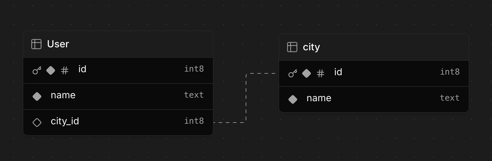

# exposed-sql-example

Exposed DSL 방식으로 SQL 문을 생성하는 법을 알아보기 위한 예제 프로젝트입니다.

## 예제 ERD

여기에 사용되는 ERD는 다음과 같습니다. 도시에 살고 있는 사용자를 표현하기 위한 ERD를 정의합니다.
`cities` 와 `users` 는 1:N 관계입니다.



## 테이블 정의

Kotlin object인 `CityTable` 은  `cities` 테이블을 정의합니다.

`CityTable.id` 는 auto increment 속성을 가지고, primary key로 설정합니다.

```kotlin
object CityTable: Table("cities") {
    val id = integer("id").autoIncrement()
    val name = varchar("name", length = 50)
    
    override val primaryKey = PrimaryKey(id, name = "PK_Cities_ID")
}
```

`UserTable` 은 `users` 테이블을 정의합니다. id 는 varchar 타입으로 primary key 로 설정합니다.
`cityId` 는 `CityTable` 의 id 를 참조하는 외래키로 설정합니다.

```kotlin
object UserTable: Table("users") {
    val id = varchar("id", length = 10)
    val name = varchar("name", length = 50)
    val cityId = optReference("city_id", CityTable.id)
    
    override val primaryKey = PrimaryKey(id, name = "PK_User_ID")
}
```

## 테이블 사용

Exposed 의 `Table` 을 상속받은 `CityTable` 과 `UserTable` 을 사용하여, 쿼리를 작성하는 법을 알아보겠습니다.

### Inner Join 을 통한 조회

다음 코드는 `UserTable` 과 `CityTable` 을 inner join 하여, `UserTable` 의 name 과 `CityTable` 의 name 을 조회합니다.

```kotlin
@ParameterizedTest
@MethodSource(ENABLE_DIALECTS_METHOD)
fun `join with foreign key`(testDB: TestDB) {
    withCityUsers(testDB) {
        UserTable
            .innerJoin(CityTable)
            .select(UserTable.name, UserTable.cityId, CityTable.name)
            .where { CityTable.name eq "Busan" }
            .orWhere { UserTable.cityId.isNull() }
            .forEach {
                if (it[UserTable.cityId] != null) {
                    log.info { "${it[UserTable.name]} lives in ${it[CityTable.name]}" }
                } else {
                    log.info { "${it[UserTable.name]} lives nowhere" }
                }
            }
    }
}
```

위 메소드에서 생성되는 SQL 문은 다음과 같습니다. SQL 생성을 위한 Kotlin DSL 이 상당히 직과적이라고 생각합니다. 사용자가 어느정도 SQL 문에 대해 알고 있다면, Exposed DSL 을 사용하여 SQL 문을 작성하는 것이 어렵지 않을 것입니다.

```sql
-- Postgres
SELECT users."name",
       users.city_id,
       cities."name"
  FROM users INNER JOIN cities ON cities.id = users.city_id
 WHERE (cities."name" = 'Busan')
    OR (users.city_id IS NULL)
```
