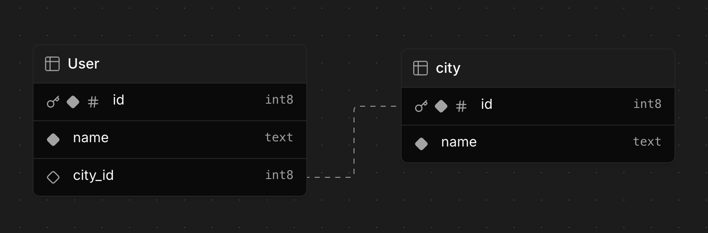

# 03 Exposed 기본: Exposed SQL DSL 예제

이 모듈(
`exposed-sql-example`)은 Exposed의 SQL DSL(Domain Specific Language)을 사용하여 관계형 데이터베이스와 직접 상호작용하는 실용적인 예제를 제공합니다. DAO(Data Access Object) 패턴에 의존하지 않고 Exposed의 유창한 API를 사용하여 기본적인 CRUD(Create, Read, Update, Delete) 연산, 테이블 조인, 집계 함수를 수행하는 방법을 보여줍니다. 간단한 "City와 User" 도메인을 위한 동기식과 비동기식(코루틴 기반) 데이터 접근 방식을 모두 제공합니다.

## 주요 기능 및 구성 요소

### 1. 도메인 스키마 (`Schema.kt`)

- **테이블 정의**: `CityTable`과 `UserTable`을 `Table` 객체로 정의하여 도시와 사용자를 위한 스키마를 구축합니다. 명시적인 기본키와 외래키 관계를 포함합니다.
- **샘플 데이터 삽입**: `insertSampleData` 함수는 SQL DSL을 직접 사용하여 데이터를 삽입하는 방법을 보여주며, 삽입 시 SQL 함수(`trim`,
  `substring`) 사용 예제도 포함합니다.
- **테스트 설정 헬퍼**: 스키마 생성과 샘플 데이터 채우기를 포함한 테스트 환경 구성을 위한 `withCityUsers`와 `withSuspendedCityUsers`를 제공합니다.

### 2. 동기식 SQL DSL 연산 (`ExposedSQLExample.kt`)

- **데이터 수정**: `WHERE` 절이 있는 `UPDATE` 문으로 레코드를 수정하는 예제입니다.
- **데이터 삭제**: `deleteWhere`와 특정 조건을 사용한 `DELETE` 문 예제입니다.
- **테이블 조인**: 외래키 관계를 기반으로 `UserTable`과 `CityTable`을 연결하는 `INNER JOIN` 연산 예제입니다(암시적/명시적 모두 포함).
- **쿼리 및 필터링**: 다양한 `WHERE` 조건(`eq`, `like`, `isNull`, `or`)을 사용하여 데이터를 필터링하고 조회하는 `SELECT` 쿼리를 수행합니다.
- **집계 함수 및 그룹화**: 분석 쿼리(예: 도시별 사용자 수 계산)를 위해 `count()`와 같은 집계 함수를 `groupBy()`와 함께 사용합니다.

### 3. 비동기 SQL DSL 연산 (`ExposedSQLSuspendedExample.kt`)

- **코루틴 통합**: Kotlin Coroutines의 suspend 컨텍스트 내에서 동일한 SQL DSL 연산(수정, 삭제, 조인, 쿼리, 집계)을 수행하는 방법을 보여줍니다.
- **반응형 데이터 접근**: `runSuspendIO`와
  `withSuspendedCityUsers`를 사용하여 논블로킹 데이터베이스 상호작용을 구현하며, Exposed의 SQL DSL이 반응형 애플리케이션에 적합함을 보여줍니다.

## 목적

이 모듈은 다음을 이해하는 데 도움이 됩니다:

- 데이터베이스 상호작용을 위한 Exposed의 직접적인 SQL DSL 접근 방식
- 유창한 API를 사용한 일반적인 데이터베이스 연산(CRUD, 조인, 집계) 수행 방법
- 비동기 프로그래밍을 위한 Exposed SQL DSL과 Kotlin Coroutines 통합
- Exposed의 DAO와 SQL DSL 패턴의 차이점

## 시작하기

이 예제들을 살펴보려면:

1. `src/test/kotlin/exposed/sql/example`의 소스 코드를 검토합니다.
2. IDE 또는 Gradle을 사용하여 테스트 케이스를 실행하고 Exposed의 SQL DSL 기능을 동기식 및 비동기식으로 확인합니다.

이 모듈은 Exposed의 직접 SQL DSL 기능을 마스터하기 위한 명확하고 간결한 가이드를 제공합니다.

## City-User 스키마 한눈에 보기



이 모듈의 모든 예제는 위 스키마를 기준으로 동작합니다. City는 `cities` 테이블, User는 `users` 테이블에 저장되며,
`users.city_id -> cities.id` 외래키 관계를 가집니다.

## 스키마와 Exposed 코드 (초보자용 요약)

### 1) DB 스키마 (DDL 요약)

```sql
CREATE TABLE cities (
    id SERIAL PRIMARY KEY,
    name VARCHAR(50) NOT NULL
);

CREATE TABLE users (
    id VARCHAR(10) PRIMARY KEY,
    name VARCHAR(50) NOT NULL,
    city_id INT NULL,
    CONSTRAINT fk_users_city_id__id
        FOREIGN KEY (city_id) REFERENCES cities(id)
);
```

### 2) Exposed Table 코드 (이 모듈에서 실제 사용)

`src/test/kotlin/exposed/sql/example/Schema.kt` 에 정의되어 있습니다.

```kotlin
object CityTable: Table("cities") {
  val id = integer("id").autoIncrement()
  val name = varchar("name", length = 50)
  override val primaryKey = PrimaryKey(id, name = "PK_Cities_ID")
}

object UserTable: Table("users") {
  val id = varchar("id", length = 10)
  val name = varchar("name", length = 50)
  val cityId = optReference("city_id", CityTable.id)
  override val primaryKey = PrimaryKey(id, name = "PK_User_ID")
}
```

### 3) Exposed Entity 코드 (DAO 방식 참고용)

이 모듈은 SQL DSL만 사용하므로 Entity를 직접 사용하지 않습니다. 다만, 같은 스키마를 DAO 방식으로 매핑하면 아래와 같이 표현할 수 있습니다.

```kotlin
object CityTable: IntIdTable("cities") {
  val name = varchar("name", 50)
}

object UserTable: IdTable<String>("users") {
  val id = varchar("id", 10).entityId()
  val name = varchar("name", 50)
  val cityId = optReference("city_id", CityTable)
  override val primaryKey = PrimaryKey(id)
}

class City(id: EntityID<Int>): IntEntity(id) {
  companion object: IntEntityClass<City>(CityTable)

  var name by CityTable.name
  val users by User optionalReferrersOn UserTable.cityId
}

class User(id: EntityID<String>): Entity<String>(id) {
  companion object: EntityClass<String, User>(UserTable)

  var name by UserTable.name
  var city by City optionalReferencedOn UserTable.cityId
}
```

## DAO vs SQL DSL (간단 비교)

| 구분    | DAO                               | SQL DSL                     |
|-------|-----------------------------------|-----------------------------|
| 중심 개념 | `Entity` / `EntityClass`          | `Table` / `Query`           |
| 조회 방식 | `City.all()`, `User.find { ... }` | `CityTable.select { ... }`  |
| 관계 접근 | `city.users`, `user.city`         | `innerJoin`, `reference` 컬럼 |
| 변경 감지 | 엔티티 프로퍼티 변경 → flush               | 명시적 `update`/`insert`       |
| 사용 적합 | 객체 중심 도메인 모델                      | SQL 중심, 복잡한 쿼리              |

## 테스트 실행

```bash
# 전체 테스트 실행
./gradlew :03-exposed-basic:exposed-sql-example:test
```

모든 테스트는 `@ParameterizedTest`를 사용하여 H2, MySQL, PostgreSQL 등 다양한 데이터베이스 환경에서 실행됩니다.

## 더 읽어보기

- [7.1 DML 함수](https://debop.notion.site/1ad2744526b0800baf1ce81c31f3cbf9?v=1ad2744526b08007ab62000c0901bcfa)
