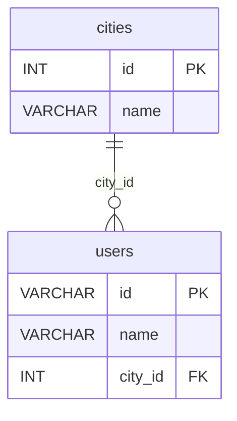
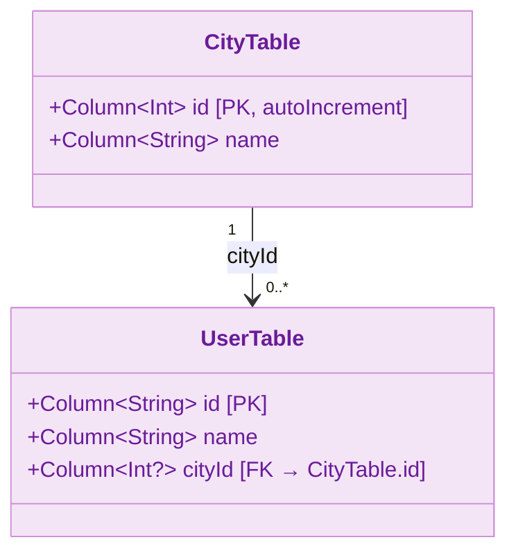

# 03 Exposed Basic: SQL DSL Example

English | [한국어](./README.ko.md)

A module for learning the basic usage of Exposed SQL DSL. Covers table definition, CRUD, joins, aggregation, and coroutine-based async queries.

## Overview

Exposed DSL expresses SQL queries as Kotlin type-safe function chains. You define a `Table` object and compose queries inside a `transaction { }` block using `insert`, `selectAll`, `update`, `deleteWhere`, and more. The same queries run in a coroutine environment via `newSuspendedTransaction { }`.

## Learning Goals

- Write type-safe queries with Exposed DSL.
- Implement CRUD/joins/aggregation in DSL style.
- Understand the differences between synchronous and coroutine approaches.

## Prerequisites

- [`../README.md`](../README.md)

## ERD


```mermaid
%%{init: {"theme": "neutral", "themeVariables": {"fontFamily": "'Comic Mono', 'goorm sans code', 'JetBrains Mono', 'goorm sans'"}}}%%
erDiagram
    cities {
        INT id PK
        VARCHAR name
    }
    users {
        VARCHAR id PK
        VARCHAR name
        INT city_id FK
    }
    cities ||--o{ users : "city_id"
```

## DSL Query Flow

```mermaid
%%{init: {"theme": "neutral", "themeVariables": {"fontFamily": "'Comic Mono', 'goorm sans code', 'JetBrains Mono', 'goorm sans'"}}}%%
sequenceDiagram
    box rgb(227, 242, 253) Application
        participant App as Application
    end
    box rgb(232, 245, 233) Exposed Layer
        participant TX as transaction { }
        participant DSL as Exposed DSL
    end
    box rgb(255, 243, 224) Database
        participant DB as Database
    end

    App ->> TX: transaction { }
    TX ->> DSL: CityTable.insert { it[name] = "Seoul" }
    DSL ->> DB: INSERT INTO cities (name) VALUES (?)
    DB -->> DSL: generated id
    DSL -->> TX: ResultRow

    TX ->> DSL: UserTable.insert { it[id] = "debop"; it[cityId] = seoulId }
    DSL ->> DB: INSERT INTO users (id, name, city_id) VALUES (?, ?, ?)
    DB -->> DSL: OK

    TX ->> DSL: CityTable.innerJoin(UserTable).selectAll()
    DSL ->> DB: SELECT * FROM cities INNER JOIN users ON ...
    DB -->> DSL: ResultSet
    DSL -->> TX: List~ResultRow~
    TX -->> App: Return result
```

## Domain Model


```mermaid
%%{init: {"theme": "neutral", "themeVariables": {"fontFamily": "'Comic Mono', 'goorm sans code', 'JetBrains Mono', 'goorm sans'"}}}%%
classDiagram
    class CityTable {
        +Column~Int~ id  [PK, autoIncrement]
        +Column~String~ name
    }
    class UserTable {
        +Column~String~ id  [PK]
        +Column~String~ name
        +Column~Int?~ cityId  [FK → CityTable.id]
    }
    CityTable "1" --> "0..*" UserTable: cityId

    style CityTable fill:#F3E5F5,stroke:#CE93D8,color:#6A1B9A
    style UserTable fill:#F3E5F5,stroke:#CE93D8,color:#6A1B9A
```

### Table Definition

```kotlin
object CityTable: Table("cities") {
    val id = integer("id").autoIncrement()
    val name = varchar("name", length = 50)
    override val primaryKey = PrimaryKey(id, name = "PK_Cities_ID")
}

object UserTable: Table("users") {
    val id = varchar("id", length = 10)
    val name = varchar("name", length = 50)
    val cityId = optReference("city_id", CityTable.id)
    override val primaryKey = PrimaryKey(id, name = "PK_User_ID")
}
```

## Core Concepts

### INSERT

```kotlin
// Basic INSERT
val seoulId = CityTable.insert {
    it[name] = "Seoul"
} get CityTable.id

// Expression-based INSERT — SUBSTRING(TRIM('   Daegu   '), 1, 2)
CityTable.insert {
    it.update(name, stringLiteral("   Daegu   ").trim().substring(1, 2))
}
```

### SELECT + WHERE

```kotlin
// Simple conditional query
CityTable.selectAll()
    .where { CityTable.id eq seoulId }
    .single()[CityTable.name]

// andWhere / orWhere chaining
UserTable.innerJoin(CityTable)
    .select(UserTable.name, CityTable.name)
    .where { (UserTable.id eq "debop") or (UserTable.name eq "Jane.Doe") }
    .andWhere { UserTable.id eq "jane" }
```

### JOIN + GROUP BY + Aggregation

```kotlin
// Aggregate user count per city
val userCountsByCity = CityTable.innerJoin(UserTable)
    .select(CityTable.name, UserTable.id.count())
    .groupBy(CityTable.name)
    .associate { it[CityTable.name] to it[UserTable.id.count()] }
```

### UPDATE / DELETE

```kotlin
// UPDATE
UserTable.update({ UserTable.id eq "debop" }) {
    it[name] = "Debop.Bae (Updated)"
}

// DELETE
UserTable.deleteWhere { UserTable.cityId.isNull() }
```

### Coroutine-Based Queries

```kotlin
// Use the same DSL inside newSuspendedTransaction
suspend fun withSuspendedCityUsers(testDB: TestDB, statement: suspend JdbcTransaction.() -> Unit) {
    withTablesSuspending(testDB, CityTable, UserTable) {
        insertSampleData()
        commit()
        statement()
    }
}
```

## Example Files

| File                              | Description                                         |
|---------------------------------|-----------------------------------------------------|
| `Schema.kt`                     | Table definitions + sample data insertion helper    |
| `ExposedSQLExample.kt`          | Synchronous DSL CRUD/join/aggregation examples      |
| `ExposedSQLSuspendedExample.kt` | Coroutine DSL example (same scenarios async)        |

## Running Tests

```bash
# Full tests
./gradlew :03-exposed-basic:exposed-sql-example:test

# Fast tests targeting H2 only
./gradlew :03-exposed-basic:exposed-sql-example:test -PuseFastDB=true

# Run a specific test class
./gradlew :03-exposed-basic:exposed-sql-example:test \
    --tests "exposed.sql.example.ExposedSQLExample"
```

## Advanced Scenarios

### Join + Aggregation Query

```kotlin
// City 1 query + User 1 JOIN query, then aggregate
val userCountsByCity = CityTable.innerJoin(UserTable)
    .select(CityTable.name, UserTable.id.count())
    .groupBy(CityTable.name)
    .associate { it[CityTable.name] to it[UserTable.id.count()] }
```

Related tests:

- `ExposedSQLExample` — `use functions and group by`
- `ExposedSQLSuspendedExample` — `use functions and group by`

### andWhere / orWhere Chaining

```kotlin
UserTable
    .innerJoin(CityTable)
    .select(UserTable.name, CityTable.name)
    .where { (UserTable.id eq "debop") or (UserTable.name eq "Jane.Doe") }
    .andWhere { UserTable.id eq "jane" }
```

Related test: `ExposedSQLExample` — `manual inner join`

## Practice Checklist

- Run the same scenario on both synchronous and coroutine paths and compare results.
- Extend the join + aggregation query on your own.
- For complex DSL chains, separate intermediate expressions to maintain readability.

## Next Module

- [`../exposed-dao-example/README.md`](../exposed-dao-example/README.md)
