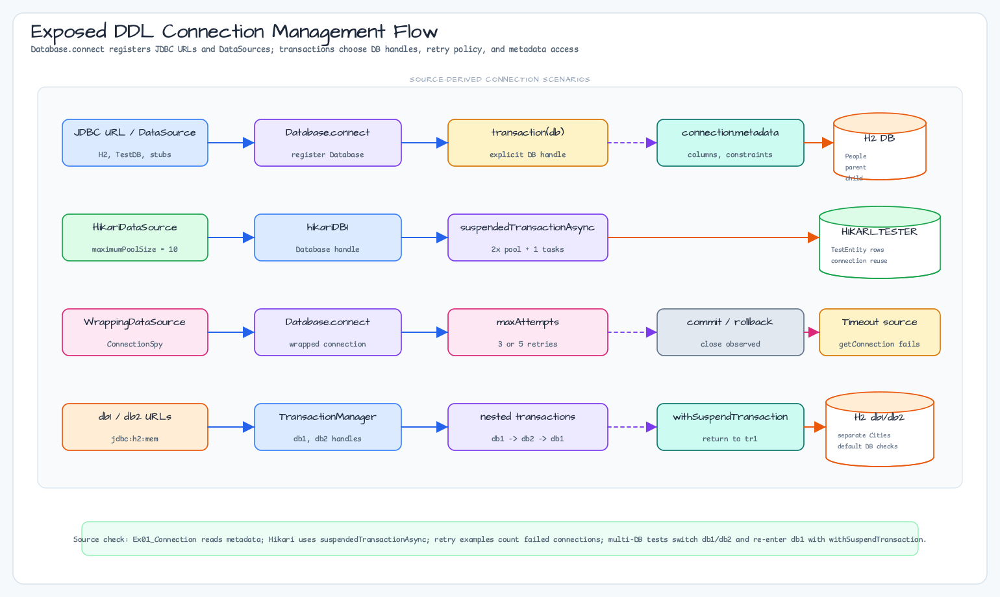

# 04 Exposed DDL: 연결 관리 (01-connection)

[English](./README.md) | 한국어

Exposed 데이터베이스 연결 설정과 연결 안정성 검증을 다루는 모듈입니다. 메타데이터 조회, 트랜잭션 재시도 횟수, H2 HikariCP 커넥션 재사용, H2 다중 DB 트랜잭션 시나리오를 실습합니다.

## 개요

`Database.connect()`는 Exposed의 진입점입니다. URL 문자열 또는 `DataSource`를 받아 `TransactionManager`에 `Database` 핸들을 등록합니다. 이 모듈에서는 정상 연결 외에 컬럼/제약조건 메타데이터 조회, rollback/commit/getConnection 실패 후 재시도 횟수, 풀 크기보다 많은 작업을 실행할 때의 HikariCP 커넥션 재사용, H2 다중 DB 중첩 트랜잭션을 검증합니다.

## 학습 목표

- `Database.connect` 구성 방식(URL/DataSource)을 이해한다.
- `maxAttempts`와 `DatabaseConfig.defaultMaxAttempts`를 통한 트랜잭션 재시도 동작을 익힌다.
- 코루틴 트랜잭션 수가 `maximumPoolSize`를 초과할 때 HikariCP 커넥션이 재사용되는지 확인한다.
- 명시적 DB 핸들, 기본 DB 선택, 다중 DB 중첩 트랜잭션을 이해한다.

## 선수 지식

- JDBC DataSource 기본
- [`../README.ko.md`](../README.ko.md)

## 아키텍처 흐름



## 핵심 개념

### 기본 연결

```kotlin
// URL 기반 연결
val db = Database.connect(
    url = "jdbc:h2:mem:test;DB_CLOSE_DELAY=-1",
    driver = "org.h2.Driver"
)

// DataSource 기반 연결 (HikariCP)
val hikariConfig = HikariConfig().apply {
    jdbcUrl = "jdbc:h2:mem:test;DB_CLOSE_DELAY=-1"
    driverClassName = "org.h2.Driver"
    maximumPoolSize = 10
}
val db = Database.connect(HikariDataSource(hikariConfig))
```

### 연결 예외 재시도

```kotlin
// ConnectionSpy로 commit/rollback/close 실패를 강제한 뒤
// 트랜잭션 블록에서 재시도 횟수를 설정합니다. 테스트는 래핑된 커넥션이 정확히 5개인지 검증합니다.
val db = Database.connect(datasource = wrappingDataSource)

transaction(db = db) {
    maxAttempts = 5
    exec("SELECT 1;")
}
```

### 타임아웃 우선순위

```kotlin
// DatabaseConfig는 기본값을 제공하고, 트랜잭션 블록의 설정은 이를 덮어쓸 수 있음
val db = Database.connect(
    datasource = dataSource,
    databaseConfig = DatabaseConfig { defaultMaxAttempts = 3 }
)

transaction(db) {
    maxAttempts = 5  // 이 값이 defaultMaxAttempts = 3보다 우선 적용됨
    // ...
}
```

### 커넥션 풀 고갈 복구 (H2)

```kotlin
// maximumPoolSize(10) * 2 + 1 = 21개 비동기 트랜잭션 동시 실행
// 풀이 소진되어도 커넥션 반환 후 재활용 → 모두 성공
val jobs = (1..21).map {
    suspendedTransactionAsync(Dispatchers.IO, db) {
        // SELECT/INSERT 작업
    }
}
jobs.awaitAll()
```

### 다중 DB 중첩 트랜잭션 (H2)

```kotlin
// 3단 중첩 트랜잭션 — 각 DB의 격리 수준이 독립적으로 유지됨
transaction(db1) {
    // db1 작업
    transaction(db2) {
        // db2 작업
        transaction(db1) {
            // db1 재진입
        }
    }
}
```

## 예제 구성

| 파일                             | 설명                                                |
|--------------------------------|---------------------------------------------------|
| `Ex01_Connection.kt`           | URL/DataSource 기반 기본 연결                           |
| `Ex02_ConnectionException.kt`  | `ConnectionSpy`로 commit/rollback/close 실패 강제 + 트랜잭션 내 `maxAttempts` |
| `Ex03_ConnectionTimeout.kt`    | `getConnection()` 실패 재시도 횟수와 `defaultMaxAttempts` vs 트랜잭션 내 `maxAttempts` 우선순위 |
| `DataSourceStub.kt`            | 테스트용 DataSource 스텁                                |
| `h2/Ex01_H2_ConnectionPool.kt` | HikariCP 풀 고갈 + 재활용 시나리오 (H2 전용)                  |
| `h2/Ex02_H2_MultiDatabase.kt`  | 다중 DB 중첩 트랜잭션 격리 검증 (H2 전용)                       |

## H2 전용 테스트 한계

`h2/` 디렉터리 파일들은 **H2 인메모리 DB 전용**입니다.

- H2는 `DB_CLOSE_DELAY=-1` 옵션으로 프로세스 종료 전까지 인메모리 DB를 유지합니다.
- `TransactionManager.defaultDatabase` 동작 검증은 H2 환경에서만 안정적으로 재현됩니다.
- 실제 운영 DB에서 다중 DB 연결이 필요하다면 각 드라이버의 연결 문자열과 커넥션 풀 설정을 별도 검토해야 합니다.

## 테스트 실행 방법

```bash
# 전체 모듈 테스트
./gradlew :01-connection:test

# 특정 테스트 클래스만 실행
./gradlew :01-connection:test \
    --tests "exposed.examples.connection.Ex01_Connection"

# H2 전용 테스트
./gradlew :01-connection:test \
    --tests "exposed.examples.connection.h2.*"
```

## 복잡한 시나리오

### 커넥션 풀 설정 (`h2/Ex01_H2_ConnectionPool.kt`)

HikariCP `maximumPoolSize`를 초과하는 수의 코루틴 트랜잭션을
`suspendedTransactionAsync`로 동시에 실행합니다. 풀이 소진되더라도 커넥션이 반환되면 재활용되어 모든 작업이 정상 완료됨을 확인합니다.

```
커넥션 풀 크기(10) * 2 + 1 = 21개 비동기 트랜잭션 → 모두 성공
```

### 다중 DB 중첩 트랜잭션 (`h2/Ex02_H2_MultiDatabase.kt`)

`transaction(db1) { ... transaction(db2) { ... transaction(db1) { } } }` 형태의 3단 중첩 트랜잭션을 통해 각 DB의 격리 수준이 올바르게 유지되는지 검증합니다.

### 커넥션 예외 재시도 (`Ex02_ConnectionException.kt`)

`ConnectionSpy`로 실제 연결을 래핑하여 commit, rollback, close 시 예외를 강제로 발생시킵니다. 트랜잭션 블록에서 `maxAttempts = 5`를 설정했을 때 정확히 5번 재시도 후 예외가 전파되는지 검증합니다.

### 타임아웃 우선순위 (`Ex03_ConnectionTimeout.kt`)

`getConnection()`이 항상 실패하는 `DataSource`를 사용합니다. 첫 번째 테스트는 트랜잭션 블록에 `maxAttempts = 3`을 직접 설정하고, 두 번째 테스트는 블록 설정이 없을 때 `DatabaseConfig.defaultMaxAttempts = 3`이 적용되며 블록의 `maxAttempts = 5`가 이를 덮어쓰는지 확인합니다.

## 실습 체크리스트

- 잘못된 URL/계정으로 실패 시나리오를 재현한다.
- 타임아웃 값을 조정하며 실패 시간을 비교한다.
- 과도한 재시도 루프를 방지한다.
- 테스트 간 DB 상태가 공유되지 않도록 분리한다.

## 다음 모듈

- [`../02-ddl/README.ko.md`](../02-ddl/README.ko.md)
