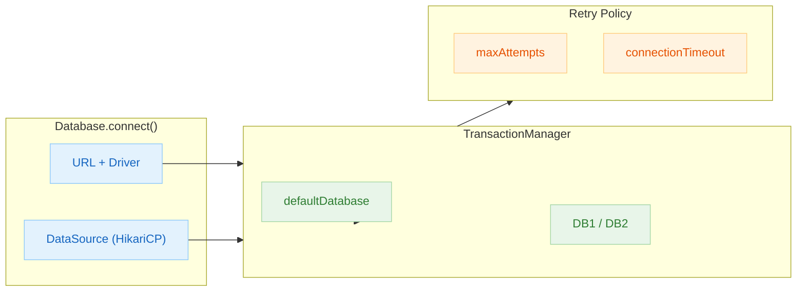

# 04 Exposed DDL: Connection Management (01-connection)

English | [한국어](./README.ko.md)

A module covering Exposed database connection setup and connection reliability verification. Covers connection exceptions, timeouts, H2 connection pool, and multi-DB connection scenarios.

## Overview

`Database.connect()` is the entry point for Exposed. It accepts a URL string or a `DataSource` and initializes the internal `TransactionManager`. Beyond normal connections, this module validates retry on exception, timeout precedence, HikariCP pool exhaustion recovery, and nested multi-DB transactions.

## Learning Objectives

- Understand `Database.connect` configuration modes (URL / DataSource).
- Learn connection exception/timeout handling patterns and `maxAttempts` retry configuration.
- Verify connection reuse behavior after HikariCP pool exhaustion.
- Understand transaction isolation strategies for multi-DB connections.

## Prerequisites

- Basic knowledge of JDBC DataSource
- [`../README.md`](../README.md)

## Architecture Flow



## Key Concepts

### Basic Connection

```kotlin
// URL-based connection
val db = Database.connect(
    url = "jdbc:h2:mem:test;DB_CLOSE_DELAY=-1",
    driver = "org.h2.Driver"
)

// DataSource-based connection (HikariCP)
val hikariConfig = HikariConfig().apply {
    jdbcUrl = "jdbc:h2:mem:test;DB_CLOSE_DELAY=-1"
    driverClassName = "org.h2.Driver"
    maximumPoolSize = 10
}
val db = Database.connect(HikariDataSource(hikariConfig))
```

### Connection Exception Retry

```kotlin
// Force exception on commit/rollback/close via ConnectionSpy
// With maxAttempts = 5, exactly 5 retries before exception propagation
val db = Database.connect(
    datasource = ConnectionSpy(dataSource) { throw SQLException("forced") },
    databaseConfig = DatabaseConfig { maxAttempts = 5 }
)
```

### Timeout Precedence

```kotlin
// Transaction block setting takes priority over DatabaseConfig default
val db = Database.connect(
    datasource = dataSource,
    databaseConfig = DatabaseConfig { defaultMaxAttempts = 3 }
)

transaction(db) {
    maxAttempts = 1  // This value takes precedence (defaultMaxAttempts = 3 is ignored)
    // ...
}
```

### Connection Pool Exhaustion Recovery (H2)

```kotlin
// Run maximumPoolSize(10) * 2 + 1 = 21 async transactions concurrently
// Connections are reused after return even when pool is exhausted → all succeed
val jobs = (1..21).map {
    suspendedTransactionAsync(Dispatchers.IO, db) {
        // SELECT/INSERT operations
    }
}
jobs.awaitAll()
```

### Nested Multi-DB Transactions (H2)

```kotlin
// 3-level nested transactions — each DB's isolation level is maintained independently
transaction(db1) {
    // db1 operations
    transaction(db2) {
        // db2 operations
        transaction(db1) {
            // db1 re-entry
        }
    }
}
```

## Example Files

| File                           | Description                                                  |
|--------------------------------|--------------------------------------------------------------|
| `Ex01_Connection.kt`           | Basic URL/DataSource-based connections                       |
| `Ex02_ConnectionException.kt`  | Force exceptions via `ConnectionSpy` + `maxAttempts` retry   |
| `Ex03_ConnectionTimeout.kt`    | `defaultMaxAttempts` vs transaction-level `maxAttempts` precedence |
| `DataSourceStub.kt`            | DataSource stub for testing                                  |
| `h2/Ex01_H2_ConnectionPool.kt` | HikariCP pool exhaustion + reuse scenarios (H2 only)         |
| `h2/Ex02_H2_MultiDatabase.kt`  | Multi-DB nested transaction isolation verification (H2 only) |

## H2-Only Test Limitations

Files in the `h2/` directory are **H2 in-memory DB only**.

- H2 keeps the in-memory DB alive until process exit using the `DB_CLOSE_DELAY=-1` option.
- `TransactionManager.defaultDatabase` behavior can only be reliably reproduced in an H2 environment.
- For multi-DB connections in production, review the connection string and pool configuration for each driver separately.

## Running Tests

```bash
# Run all module tests
./gradlew :04-exposed-ddl:01-connection:test

# Run a specific test class
./gradlew :04-exposed-ddl:01-connection:test \
    --tests "exposed.examples.connection.Ex01_Connection"

# Run H2-only tests
./gradlew :04-exposed-ddl:01-connection:test \
    --tests "exposed.examples.connection.h2.*"
```

## Complex Scenarios

### Connection Pool Configuration (`h2/Ex01_H2_ConnectionPool.kt`)

Runs more coroutine transactions concurrently than the HikariCP `maximumPoolSize` allows using `suspendedTransactionAsync`. Verifies that all operations complete successfully by reusing connections as they are returned to the pool.

```
Connection pool size(10) * 2 + 1 = 21 async transactions → all succeed
```

### Multi-DB Nested Transactions (`h2/Ex02_H2_MultiDatabase.kt`)

Verifies that each DB's isolation level is correctly maintained via a 3-level nested transaction: `transaction(db1) { ... transaction(db2) { ... transaction(db1) { } } }`.

### Connection Exception Retry (`Ex02_ConnectionException.kt`)

Wraps the actual connection with `ConnectionSpy` to force exceptions on commit/rollback/close. Verifies that the exception propagates after exactly 5 retries when `maxAttempts = 5`.

### Timeout Precedence (`Ex03_ConnectionTimeout.kt`)

Verifies which value takes precedence between `DatabaseConfig.defaultMaxAttempts` and `maxAttempts` inside a transaction block. The transaction block setting always wins.

## Practice Checklist

- Reproduce failure scenarios with incorrect URL/credentials.
- Compare failure times by adjusting timeout values.
- Prevent excessive retry loops.
- Ensure DB state is not shared between tests.

## Next Module

- [`../02-ddl/README.md`](../02-ddl/README.md)
