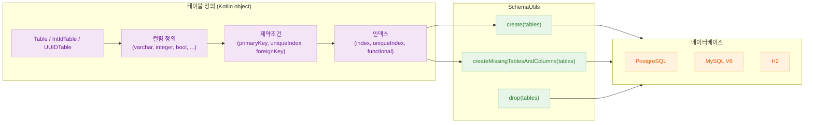
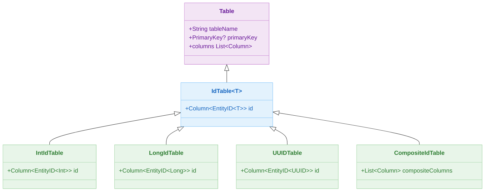
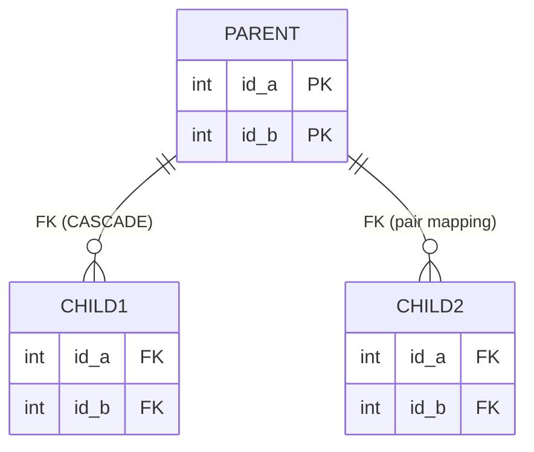

# 04 Exposed DDL: 스키마 정의 (02-ddl)

[English](./README.md) | 한국어

Exposed DDL API로 테이블, 컬럼, 인덱스, 시퀀스, 커스텀 enum을 정의하는 모듈입니다. `SchemaUtils`를 통한 DDL 실행과 마이그레이션 패턴을 다룹니다.

## 개요

Exposed에서 스키마 정의는 `object` 선언으로 이루어집니다. `Table`, `IntIdTable`, `UUIDTable` 등을 상속하여 컬럼과 제약조건을 선언하고,
`SchemaUtils.create()` /
`createMissingTablesAndColumns()`로 DDL을 실행합니다. DB Dialect별 차이(PostgreSQL, MySQL, H2)를 파라미터화 테스트로 검증합니다.

## 학습 목표

- 테이블/컬럼/제약조건 정의를 익힌다.
- 복합 PK, 복합 FK, 조건부/함수형 인덱스, 시퀀스 사용법을 익힌다.
- `SchemaUtils`로 스키마 생성·마이그레이션·삭제를 관리한다.
- DB별 DDL 차이(enum 타입, INVISIBLE 컬럼, partial index)를 파악한다.

## 선수 지식

- [`../01-connection/README.ko.md`](../01-connection/README.ko.md)

## 아키텍처 흐름



## 테이블 클래스 계층



## 복합 PK / FK 관계 ERD



## 컬럼 타입 표

| Exposed 함수               | SQL 타입 (PostgreSQL)       | SQL 타입 (MySQL V8) | 설명                        |
|--------------------------|---------------------------|-------------------|---------------------------|
| `integer(name)`          | `INT`                     | `INT`             | 32비트 정수                   |
| `long(name)`             | `BIGINT`                  | `BIGINT`          | 64비트 정수                   |
| `varchar(name, length)`  | `VARCHAR(n)`              | `VARCHAR(n)`      | 가변 길이 문자열                 |
| `text(name)`             | `TEXT`                    | `TEXT`            | 무제한 텍스트                   |
| `bool(name)`             | `BOOLEAN`                 | `TINYINT(1)`      | 불리언                       |
| `decimal(name, p, s)`    | `DECIMAL(p, s)`           | `DECIMAL(p, s)`   | 고정 소수점                    |
| `double(name)`           | `DOUBLE PRECISION`        | `DOUBLE`          | 부동 소수점                    |
| `uuid(name)`             | `UUID`                    | `BINARY(16)`      | UUID                      |
| `binary(name, length)`   | `BYTEA`                   | `VARBINARY(n)`    | 바이트 배열                    |
| `blob(name)`             | `OID`                     | `BLOB`            | 대용량 바이너리                  |
| `date(name)`             | `DATE`                    | `DATE`            | 날짜                        |
| `datetime(name)`         | `TIMESTAMP`               | `DATETIME`        | 날짜+시간                     |
| `timestamp(name)`        | `TIMESTAMP WITH TZ`       | `TIMESTAMP`       | 타임스탬프                     |
| `enumerationByName(...)` | `VARCHAR`                 | `VARCHAR`         | Enum → 이름 문자열 저장 (이식성 높음) |
| `customEnumeration(...)` | `CREATE TYPE ... AS ENUM` | `ENUM(...)`       | DB 네이티브 Enum 타입           |

## 핵심 개념

### 기본 테이블 정의

```kotlin
// 단일 PK (자동 증가)
object BookTable : Table("book") {
    val id = integer("id").autoIncrement()
    override val primaryKey = PrimaryKey(id, name = "PK_Book_ID")
}

// 복합 PK
object PersonTable : Table("person") {
    val id1 = integer("id1")
    val id2 = integer("id2")
    override val primaryKey = PrimaryKey(id1, id2, name = "PK_Person_ID")
}

// IntIdTable 상속 — id 컬럼 + PK 자동 정의
object CityTable : IntIdTable("cities") {
    val name = varchar("name", 50)
}
```

### 복합 Foreign Key

```kotlin
// 방법 1: target = parent.primaryKey 사용
val child = object : Table("child1") {
    val idA = integer("id_a")
    val idB = integer("id_b")
    init {
        foreignKey(
            idA, idB,
            target = parent.primaryKey,
            onDelete = ReferenceOption.CASCADE,
            onUpdate = ReferenceOption.CASCADE,
            name = "MyForeignKey1"
        )
    }
}

// 방법 2: 컬럼 pair 매핑
foreignKey(
    idA to parent.pidA, idB to parent.pidB,
    onDelete = ReferenceOption.CASCADE,
    onUpdate = ReferenceOption.CASCADE,
    name = "MyForeignKey1"
)
```

생성되는 DDL (PostgreSQL):

```sql
CREATE TABLE IF NOT EXISTS child1 (
    id_a INT NOT NULL,
    id_b INT NOT NULL,
    CONSTRAINT myforeignkey1 FOREIGN KEY (id_a, id_b)
        REFERENCES parent1(id_a, id_b) ON DELETE CASCADE ON UPDATE CASCADE
)
```

### 컬럼 제약조건

```kotlin
object TesterTable : Table("tester") {
    val name = varchar("name", 255).uniqueIndex()          // UNIQUE 인덱스
    val score = integer("score").default(0)                // 기본값
    val memo = text("memo").nullable()                     // NULL 허용
    val amount = integer("amount")
        .withDefinition("COMMENT", stringLiteral("금액"))   // 컬럼 주석 (H2/MySQL 전용)
    val active = bool("active")
        .nullable()
        .withDefinition("INVISIBLE")                       // INVISIBLE 컬럼 (H2/MySQL 전용)
}
```

### 인덱스 유형

```kotlin
object IndexTable : Table("index_table") {
    val id = integer("id").autoIncrement()
    val name = varchar("name", 255)
    val item = varchar("item", 255)
    val amount = decimal("amount", 10, 2)
    val flag = bool("flag").default(false)

    override val primaryKey = PrimaryKey(id)

    // 표준 인덱스
    val byName = index("idx_by_name", isUnique = false, name)

    // Partial index (PostgreSQL 전용) — flag = TRUE 조건부
    val partialIdx = index("idx_partial", isUnique = false, name) {
        flag eq true
    }

    // Functional index — LOWER(item) 함수 기반 (PostgreSQL, MySQL 8)
    val funcIdx = index("idx_lower_item", isUnique = false, item.lowerCase())
}
```

### 시퀀스

```kotlin
// PostgreSQL / Oracle에서 지원
val idSeq = Sequence("id_seq", startWith = 1, incrementBy = 1)

object SeqTable : Table("seq_table") {
    val id = integer("id").defaultExpression(NextVal(idSeq))
    override val primaryKey = PrimaryKey(id)
}

withDb(testDB) {
    SchemaUtils.createSequence(idSeq)
    SchemaUtils.create(SeqTable)
}
```

### Enum 컬럼

```kotlin
enum class Status { ACTIVE, INACTIVE, DELETED }

object EnumTable : Table("enum_table") {
    // 방법 1: Enum 이름을 VARCHAR로 저장 — DB 이식성 높음
    val statusByName = enumerationByName("status_by_name", 10, Status::class)

    // 방법 2: DB 네이티브 ENUM 타입 — PostgreSQL/MySQL 전용
    val statusNative = customEnumeration(
        name = "status_native",
        sql = "STATUS_ENUM",                                // PostgreSQL: CREATE TYPE
        fromDb = { value -> Status.valueOf(value as String) },
        toDb = { it.name }
    )
}
```

### SchemaUtils 사용

```kotlin
transaction {
    // 테이블 생성
    SchemaUtils.create(CityTable, UserTable)

    // 누락된 테이블/컬럼만 추가 (마이그레이션)
    SchemaUtils.createMissingTablesAndColumns(CityTable, UserTable)

    // 테이블 삭제
    SchemaUtils.drop(CityTable, UserTable)

    // 존재 여부 확인
    CityTable.exists()
}
```

## 예제 구성

| 파일                                     | 설명                                             |
|----------------------------------------|------------------------------------------------|
| `Ex01_CreateDatabase.kt`               | DB 생성 (지원 환경 — PostgreSQL)                     |
| `Ex02_CreateTable.kt`                  | 단일/복합 PK, 복합 FK, 중복 컬럼 예외                      |
| `Ex03_CreateMissingTableAndColumns.kt` | 누락 테이블/컬럼 보완, 마이그레이션 시나리오                      |
| `Ex04_ColumnDefinition.kt`             | 컬럼 주석(`COMMENT`), `INVISIBLE` 컬럼 (H2/MySQL 전용) |
| `Ex05_CreateIndex.kt`                  | 표준/Hash/Partial/Functional 인덱스                 |
| `Ex06_Sequence.kt`                     | 시퀀스 생성·사용 (PostgreSQL/Oracle)                  |
| `Ex07_CustomEnumeration.kt`            | `enumerationByName` vs `customEnumeration`     |
| `Ex10_DDL_Examples.kt`                 | 38개 종합 DDL 시나리오 (체크 제약, 스키마 간 FK, UUID 컬럼 등)   |

## 테스트 실행 방법

```bash
# 전체 모듈 테스트
./gradlew :04-exposed-ddl:02-ddl:test

# H2만 대상으로 빠른 테스트
./gradlew :04-exposed-ddl:02-ddl:test -PuseFastDB=true

# 특정 테스트 클래스만 실행
./gradlew :04-exposed-ddl:02-ddl:test --tests "exposed.examples.ddl.Ex02_CreateTable"
./gradlew :04-exposed-ddl:02-ddl:test --tests "exposed.examples.ddl.Ex10_DDL_Examples"
```

## 복잡한 시나리오

### 복합 PK / 복합 FK (`Ex02_CreateTable.kt`)

2컬럼 복합 PK 정의 후, `foreignKey(idA, idB, target = parent.primaryKey)` 방식과
`foreignKey(idA to parent.pidA, idB to parent.pidB)` 방식 두 가지로 복합 FK를 생성합니다. `ON DELETE CASCADE` /
`ON UPDATE CASCADE` 옵션을 함께 적용합니다.

### 스키마 마이그레이션 (`Ex03_CreateMissingTableAndColumns.kt`)

`createMissingTablesAndColumns`를 이용해 이미 존재하는 테이블에 누락된 `uniqueIndex`를 추가하거나,
`autoIncrement` 속성을 제거하는 마이그레이션 시나리오를 검증합니다. 두 Exposed Table 객체가 동일한 물리 테이블을 가리킬 때의 동작을 확인합니다.

### 커스텀 컬럼 타입 — Enum (`Ex07_CustomEnumeration.kt`)

- `enumerationByName`: Enum 이름을 VARCHAR로 저장 (이식성 높음)
- `customEnumeration`: DB 네이티브 ENUM 타입 사용 (PostgreSQL `CREATE TYPE … AS ENUM`, MySQL `ENUM(…)`)
- Enum 컬럼을 `reference()`로 참조하는 FK 시나리오

### Functional / Partial 인덱스 (`Ex05_CreateIndex.kt`)

- **Partial index**: `WHERE flag = TRUE` 조건부 인덱스 (PostgreSQL 전용)
- **Functional index**: `LOWER(item)`, `amount * price` 등 함수식 기반 인덱스 (PostgreSQL, MySQL 8)
- `getIndices()`로 생성된 인덱스 수 검증

### DDL 종합 예제 (`Ex10_DDL_Examples.kt`)

체크 제약조건, 스키마 간 FK, 복합 FK의 unique index 참조, inner join 다중 FK,
`DROP TABLE` 시 캐시 플러시 동작, UUID/불리언/텍스트 컬럼 타입 등 38개 시나리오를 포함합니다.

## 실습 체크리스트

- 인덱스 전/후 실행계획 차이를 확인한다.
- enum/sequence 지원 차이를 DB별로 비교한다.
- DDL은 운영 배포 시 잠금 영향도를 사전 점검한다.
- `createMissingTablesAndColumns` 사용 시 예상치 못한 변경을 검토한다.

## 다음 챕터

- [05-exposed-dml](../../05-exposed-dml/README.ko.md): DML/트랜잭션/Entity API 중심 학습으로 넘어갑니다.
