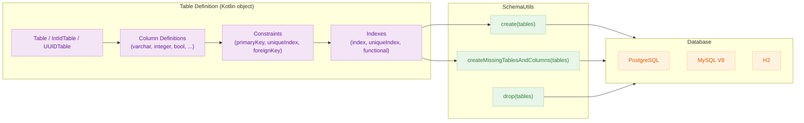
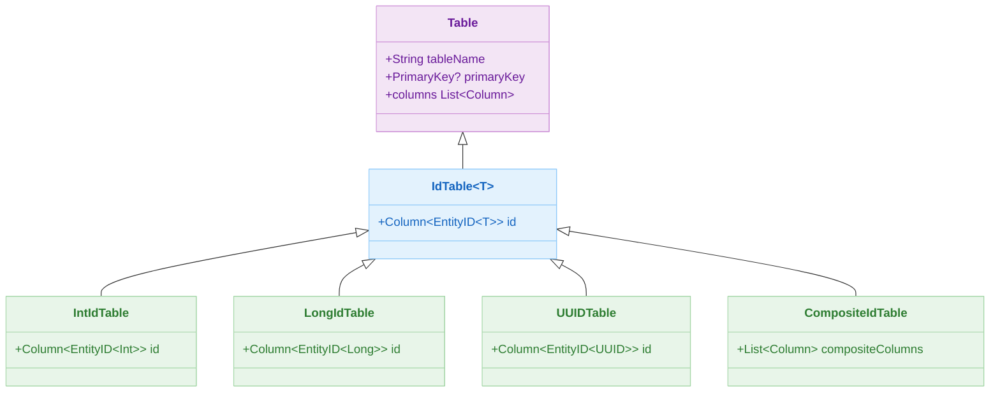
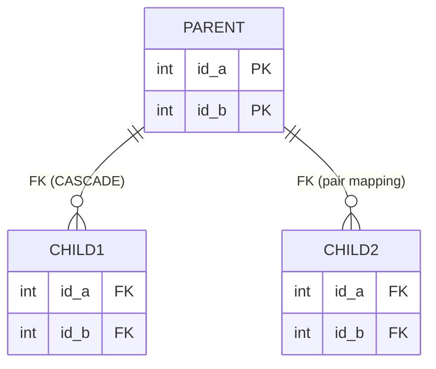

# 04 Exposed DDL: Schema Definition (02-ddl)

English | [한국어](./README.ko.md)

A module for defining tables, columns, indexes, sequences, and custom enums using the Exposed DDL API. Covers DDL execution and migration patterns via `SchemaUtils`.

## Overview

Schema definition in Exposed is done through `object` declarations. You extend `Table`, `IntIdTable`, `UUIDTable`, etc. to declare columns and constraints, then execute DDL via `SchemaUtils.create()` / `createMissingTablesAndColumns()`. DB Dialect differences (PostgreSQL, MySQL, H2) are validated with parameterized tests.

## Learning Objectives

- Learn to define tables, columns, and constraints.
- Understand composite PKs, composite FKs, conditional/functional indexes, and sequences.
- Manage schema creation, migration, and deletion with `SchemaUtils`.
- Identify per-DB DDL differences (enum types, INVISIBLE columns, partial indexes).

## Prerequisites

- [`../01-connection/README.md`](../01-connection/README.md)

## Architecture Flow



## Table Class Hierarchy



## Composite PK / FK Relationship ERD



## Column Type Reference

| Exposed Function         | SQL Type (PostgreSQL)     | SQL Type (MySQL V8) | Description              |
|--------------------------|---------------------------|---------------------|--------------------------|
| `integer(name)`          | `INT`                     | `INT`               | 32-bit integer           |
| `long(name)`             | `BIGINT`                  | `BIGINT`            | 64-bit integer           |
| `varchar(name, length)`  | `VARCHAR(n)`              | `VARCHAR(n)`        | Variable-length string   |
| `text(name)`             | `TEXT`                    | `TEXT`              | Unlimited text           |
| `bool(name)`             | `BOOLEAN`                 | `TINYINT(1)`        | Boolean                  |
| `decimal(name, p, s)`    | `DECIMAL(p, s)`           | `DECIMAL(p, s)`     | Fixed-point decimal      |
| `double(name)`           | `DOUBLE PRECISION`        | `DOUBLE`            | Floating-point           |
| `uuid(name)`             | `UUID`                    | `BINARY(16)`        | UUID                     |
| `binary(name, length)`   | `BYTEA`                   | `VARBINARY(n)`      | Byte array               |
| `blob(name)`             | `OID`                     | `BLOB`              | Large binary             |
| `date(name)`             | `DATE`                    | `DATE`              | Date                     |
| `datetime(name)`         | `TIMESTAMP`               | `DATETIME`          | Date and time            |
| `timestamp(name)`        | `TIMESTAMP WITH TZ`       | `TIMESTAMP`         | Timestamp                |
| `enumerationByName(...)` | `VARCHAR`                 | `VARCHAR`           | Enum stored as name string (portable) |
| `customEnumeration(...)` | `CREATE TYPE ... AS ENUM` | `ENUM(...)`         | Native DB enum type      |

## Key Concepts

### Basic Table Definition

```kotlin
// Single PK (auto-increment)
object BookTable : Table("book") {
    val id = integer("id").autoIncrement()
    override val primaryKey = PrimaryKey(id, name = "PK_Book_ID")
}

// Composite PK
object PersonTable : Table("person") {
    val id1 = integer("id1")
    val id2 = integer("id2")
    override val primaryKey = PrimaryKey(id1, id2, name = "PK_Person_ID")
}

// Extend IntIdTable — id column + PK defined automatically
object CityTable : IntIdTable("cities") {
    val name = varchar("name", 50)
}
```

### Composite Foreign Key

```kotlin
// Method 1: using target = parent.primaryKey
val child = object : Table("child1") {
    val idA = integer("id_a")
    val idB = integer("id_b")
    init {
        foreignKey(
            idA, idB,
            target = parent.primaryKey,
            onDelete = ReferenceOption.CASCADE,
            onUpdate = ReferenceOption.CASCADE,
            name = "MyForeignKey1"
        )
    }
}

// Method 2: column pair mapping
foreignKey(
    idA to parent.pidA, idB to parent.pidB,
    onDelete = ReferenceOption.CASCADE,
    onUpdate = ReferenceOption.CASCADE,
    name = "MyForeignKey1"
)
```

Generated DDL (PostgreSQL):

```sql
CREATE TABLE IF NOT EXISTS child1 (
    id_a INT NOT NULL,
    id_b INT NOT NULL,
    CONSTRAINT myforeignkey1 FOREIGN KEY (id_a, id_b)
        REFERENCES parent1(id_a, id_b) ON DELETE CASCADE ON UPDATE CASCADE
)
```

### Column Constraints

```kotlin
object TesterTable : Table("tester") {
    val name = varchar("name", 255).uniqueIndex()          // UNIQUE index
    val score = integer("score").default(0)                // default value
    val memo = text("memo").nullable()                     // nullable
    val amount = integer("amount")
        .withDefinition("COMMENT", stringLiteral("금액"))   // column comment (H2/MySQL only)
    val active = bool("active")
        .nullable()
        .withDefinition("INVISIBLE")                       // INVISIBLE column (H2/MySQL only)
}
```

### Index Types

```kotlin
object IndexTable : Table("index_table") {
    val id = integer("id").autoIncrement()
    val name = varchar("name", 255)
    val item = varchar("item", 255)
    val amount = decimal("amount", 10, 2)
    val flag = bool("flag").default(false)

    override val primaryKey = PrimaryKey(id)

    // Standard index
    val byName = index("idx_by_name", isUnique = false, name)

    // Partial index (PostgreSQL only) — conditional on flag = TRUE
    val partialIdx = index("idx_partial", isUnique = false, name) {
        flag eq true
    }

    // Functional index — based on LOWER(item) (PostgreSQL, MySQL 8)
    val funcIdx = index("idx_lower_item", isUnique = false, item.lowerCase())
}
```

### Sequences

```kotlin
// Supported in PostgreSQL / Oracle
val idSeq = Sequence("id_seq", startWith = 1, incrementBy = 1)

object SeqTable : Table("seq_table") {
    val id = integer("id").defaultExpression(NextVal(idSeq))
    override val primaryKey = PrimaryKey(id)
}

withDb(testDB) {
    SchemaUtils.createSequence(idSeq)
    SchemaUtils.create(SeqTable)
}
```

### Enum Columns

```kotlin
enum class Status { ACTIVE, INACTIVE, DELETED }

object EnumTable : Table("enum_table") {
    // Method 1: Store enum name as VARCHAR — highly portable
    val statusByName = enumerationByName("status_by_name", 10, Status::class)

    // Method 2: Use DB native ENUM type — PostgreSQL/MySQL only
    val statusNative = customEnumeration(
        name = "status_native",
        sql = "STATUS_ENUM",                                // PostgreSQL: CREATE TYPE
        fromDb = { value -> Status.valueOf(value as String) },
        toDb = { it.name }
    )
}
```

### Using SchemaUtils

```kotlin
transaction {
    // Create tables
    SchemaUtils.create(CityTable, UserTable)

    // Add only missing tables/columns (migration)
    SchemaUtils.createMissingTablesAndColumns(CityTable, UserTable)

    // Drop tables
    SchemaUtils.drop(CityTable, UserTable)

    // Check existence
    CityTable.exists()
}
```

## Example Files

| File                                   | Description                                                         |
|----------------------------------------|---------------------------------------------------------------------|
| `Ex01_CreateDatabase.kt`               | Database creation (supported in PostgreSQL)                         |
| `Ex02_CreateTable.kt`                  | Single/composite PK, composite FK, duplicate column exception       |
| `Ex03_CreateMissingTableAndColumns.kt` | Adding missing tables/columns, migration scenarios                  |
| `Ex04_ColumnDefinition.kt`             | Column comments (`COMMENT`), `INVISIBLE` columns (H2/MySQL only)   |
| `Ex05_CreateIndex.kt`                  | Standard/Hash/Partial/Functional indexes                            |
| `Ex06_Sequence.kt`                     | Sequence creation and usage (PostgreSQL/Oracle)                     |
| `Ex07_CustomEnumeration.kt`            | `enumerationByName` vs `customEnumeration`                          |
| `Ex10_DDL_Examples.kt`                 | 38 comprehensive DDL scenarios (check constraints, cross-schema FK, UUID columns, etc.) |

## Running Tests

```bash
# Run all module tests
./gradlew :04-exposed-ddl:02-ddl:test

# Fast tests targeting H2 only
./gradlew :04-exposed-ddl:02-ddl:test -PuseFastDB=true

# Run a specific test class
./gradlew :04-exposed-ddl:02-ddl:test --tests "exposed.examples.ddl.Ex02_CreateTable"
./gradlew :04-exposed-ddl:02-ddl:test --tests "exposed.examples.ddl.Ex10_DDL_Examples"
```

## Complex Scenarios

### Composite PK / Composite FK (`Ex02_CreateTable.kt`)

After defining a 2-column composite PK, creates composite FKs using both `foreignKey(idA, idB, target = parent.primaryKey)` and `foreignKey(idA to parent.pidA, idB to parent.pidB)`. Applies `ON DELETE CASCADE` / `ON UPDATE CASCADE` options.

### Schema Migration (`Ex03_CreateMissingTableAndColumns.kt`)

Uses `createMissingTablesAndColumns` to add a missing `uniqueIndex` to an existing table, or remove the `autoIncrement` attribute. Verifies behavior when two Exposed Table objects point to the same physical table.

### Custom Column Type — Enum (`Ex07_CustomEnumeration.kt`)

- `enumerationByName`: Store enum name as VARCHAR (highly portable)
- `customEnumeration`: Use native DB ENUM type (PostgreSQL `CREATE TYPE … AS ENUM`, MySQL `ENUM(…)`)
- FK scenarios referencing an enum column via `reference()`

### Functional / Partial Indexes (`Ex05_CreateIndex.kt`)

- **Partial index**: Conditional index with `WHERE flag = TRUE` (PostgreSQL only)
- **Functional index**: Expression-based index such as `LOWER(item)`, `amount * price` (PostgreSQL, MySQL 8)
- Verify created index count via `getIndices()`

### Comprehensive DDL Examples (`Ex10_DDL_Examples.kt`)

Includes 38 scenarios: check constraints, cross-schema FK, unique index references in composite FK, multiple FKs in inner join, cache flush behavior on `DROP TABLE`, and UUID/boolean/text column types.

## Practice Checklist

- Compare query execution plans before and after adding indexes.
- Compare enum/sequence support differences per DB.
- Assess locking impact of DDL operations before production deployment.
- Review unexpected changes when using `createMissingTablesAndColumns`.

## Next Chapter

- [05-exposed-dml](../../05-exposed-dml/README.md): Moves on to DML/transactions/Entity API.
