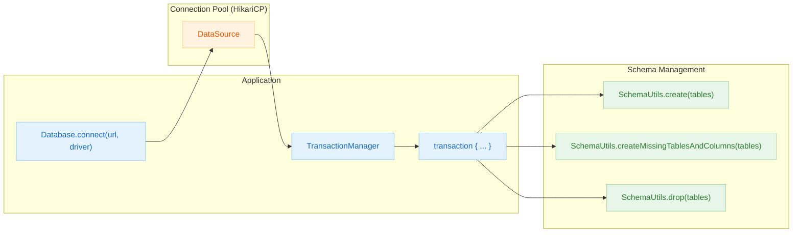

# 04 Exposed DDL

English | [한국어](./README.ko.md)

A chapter covering database connection and schema definition (DDL) in Exposed, from connection setup to table and constraint authoring.

## Overview

This chapter covers two foundational topics for Exposed applications. **Connection management** (`01-connection`) covers `Database.connect`, HikariCP pool configuration, and exception/timeout/multi-DB handling. **Schema definition** (`02-ddl`) covers `Table` declarations, indexes, sequences, custom enums, and DDL execution via `SchemaUtils`.

## Learning Objectives

- Understand `Database.connect` configuration and DataSource integration patterns.
- Learn to write tables, indexes, and constraints declaratively.
- Establish a verification flow for DB Dialect differences and portability when executing DDL.

## Included Modules

| Module          | Description                                                          |
|-----------------|----------------------------------------------------------------------|
| `01-connection` | DataSource configuration for each DB Dialect and `Database.connect` |
| `02-ddl`        | Table/index/constraint declarations and DDL execution via `SchemaUtils` |

## Architecture Flow



## Prerequisites

- Familiarity with DSL/DAO flow from `03-exposed-basic`
- Basic knowledge of JDBC DataSource and transactions

## Recommended Study Order

1. `01-connection` — connection initialization, exception handling, connection pool
2. `02-ddl` — table/index/sequence/enum declarations

## Running Tests

```bash
# Connection management module tests
./gradlew :04-exposed-ddl:01-connection:test

# DDL module tests
./gradlew :04-exposed-ddl:02-ddl:test

# Fast tests targeting H2 only
./gradlew :04-exposed-ddl:01-connection:test -PuseFastDB=true
./gradlew :04-exposed-ddl:02-ddl:test -PuseFastDB=true
```

## Test Points

- Verify that schema creation and deletion per Dialect are independent across tests.
- Validate that constraint violations or duplicate index errors are raised as expected.
- Identify full-scan risks caused by missing indexes.
- Document portability issues from DDL differences per DB using test code.

## Next Chapter

- [05-exposed-dml](../05-exposed-dml/README.md): Moves on to DML/transactions/Entity API.
