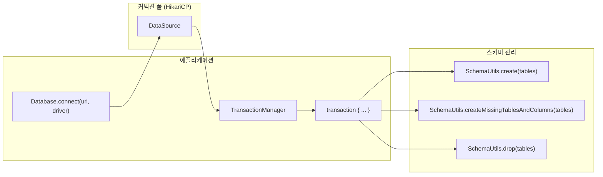

# 04 Exposed DDL

Exposed에서 데이터베이스 연결과 스키마 정의(DDL)를 다루는 챕터로, 커넥션 구성부터 테이블/제약조건 작성까지 실습합니다.

## 개요

이 챕터는 Exposed 애플리케이션의 기반이 되는 두 가지 주제를 다룹니다. **연결 관리**(`01-connection`)에서는
`Database.connect`와 HikariCP 풀 설정, 예외/타임아웃/다중 DB 처리를 실습합니다. **스키마 정의**(`02-ddl`)에서는 `Table` 선언, 인덱스, 시퀀스, 커스텀 enum,
`SchemaUtils`를 활용한 DDL 실행을 다룹니다.

## 학습 목표

- Exposed `Database.connect` 연결 설정과 DataSource 통합 방식을 정리한다.
- 테이블, 인덱스, 제약조건을 선언적으로 작성하는 패턴을 익힌다.
- DDL을 실행할 때 DB Dialect별 특성 및 이식성 검증 흐름을 수립한다.

## 포함 모듈

| 모듈              | 설명                                                         |
|-----------------|------------------------------------------------------------|
| `01-connection` | 각 DB Dialect용 DataSource 설정과 Exposed `Database.connect` 구성 |
| `02-ddl`        | 테이블/인덱스/제약조건 선언과 `SchemaUtils`를 활용한 DDL 실행                 |

## 아키텍처 흐름



## 선수 지식

- `03-exposed-basic`에서 DSL/DAO 흐름을 이해한 상태
- JDBC DataSource 및 트랜잭션 기본 개념

## 권장 학습 순서

1. `01-connection` — 연결 초기화, 예외 처리, 커넥션 풀
2. `02-ddl` — 테이블/인덱스/시퀀스/enum 선언

## 테스트 실행 방법

```bash
# 연결 관리 모듈 테스트
./gradlew :04-exposed-ddl:01-connection:test

# DDL 모듈 테스트
./gradlew :04-exposed-ddl:02-ddl:test

# H2만 대상으로 빠른 테스트
./gradlew :04-exposed-ddl:01-connection:test -PuseFastDB=true
./gradlew :04-exposed-ddl:02-ddl:test -PuseFastDB=true
```

## 테스트 포인트

- 각 Dialect에서 스키마 생성·삭제가 테스트 간 독립적으로 동작하는지 확인한다.
- 제약조건 위반이나 인덱스 중복 시 예외가 의도대로 발생하는지 검증한다.
- 누락된 인덱스로 인한 풀스캔 가능성을 찾아낸다.
- DB별 DDL 차이로 인한 이식성 이슈를 테스트 코드로 문서화한다.

## 다음 챕터

- [05-exposed-dml](../05-exposed-dml/README.md): DML/트랜잭션/Entity API 중심 학습으로 넘어갑니다.
