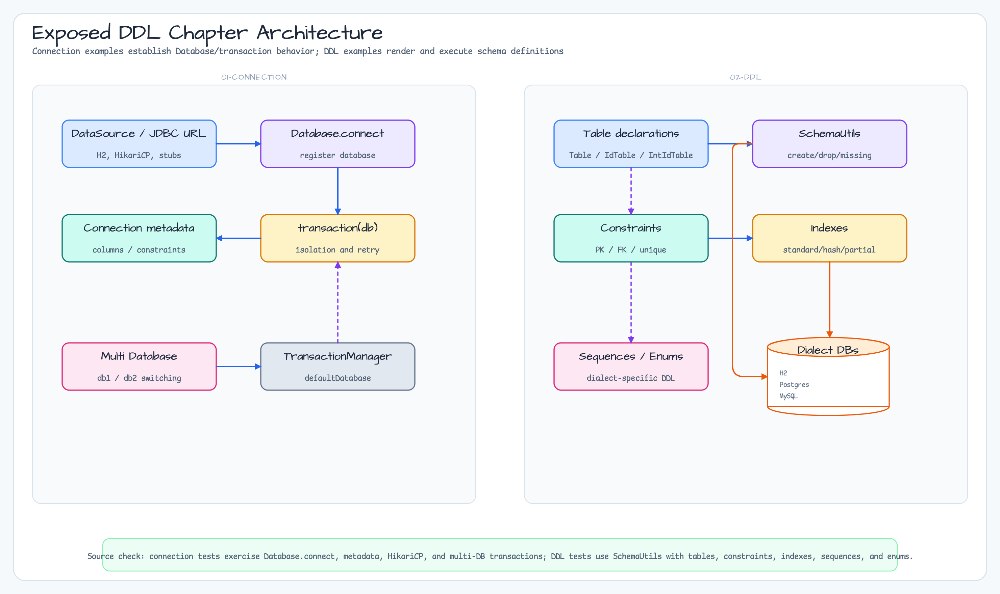

# 04 Exposed DDL

English | [한국어](./README.ko.md)

A chapter covering database connection and schema definition (DDL) in Exposed, from connection metadata and retry behavior to table, constraint, index, sequence, and enum authoring.

## Overview

This chapter covers two foundational topics for Exposed applications. **Connection management** (`01-connection`) covers `Database.connect`, connection metadata, transaction retry attempts, HikariCP pool reuse, and H2 multi-database transactions. **Schema definition** (`02-ddl`) covers `Table` declarations, indexes, sequences, custom enums, and DDL execution through `SchemaUtils` and `MigrationUtils`.

## Learning Objectives

- Understand `Database.connect` with URL/DataSource inputs and metadata inspection.
- Learn to declare tables, primary keys, foreign keys, indexes, sequences, and enum columns.
- Verify DB dialect differences and migration statements through parameterized tests.

## Included Modules

| Module          | Description                                                          |
|-----------------|----------------------------------------------------------------------|
| `01-connection` | `Database.connect`, metadata lookup, retry attempts, HikariCP reuse, and H2 multi-DB transaction examples |
| `02-ddl`        | Table/index/constraint/sequence/enum declarations and DDL execution via `SchemaUtils`/`MigrationUtils` |

## Architecture Flow



## Prerequisites

- Familiarity with DSL/DAO flow from `03-exposed-basic`
- Basic knowledge of JDBC DataSource and transactions

## Recommended Study Order

1. `01-connection` — connection initialization, exception handling, connection pool
2. `02-ddl` — table/index/sequence/enum declarations

## Running Tests

```bash
# Connection management module tests
./gradlew :01-connection:test

# DDL module tests
./gradlew :02-ddl:test

# Fast tests targeting H2 only
./gradlew :01-connection:test -PuseFastDB=true
./gradlew :02-ddl:test -PuseFastDB=true
```

## Test Points

- Verify connection metadata, transaction retry counts, and H2 multi-DB isolation.
- Verify schema creation/drop, missing-table/column migration, and duplicate-column failures per dialect.
- Validate index variants, sequence support, enum mappings, and dialect-specific guards.
- Document portability issues from DDL differences using executable tests.

## Next Chapter

- [05-exposed-dml](../05-exposed-dml/README.md): Moves on to DML/transactions/Entity API.
