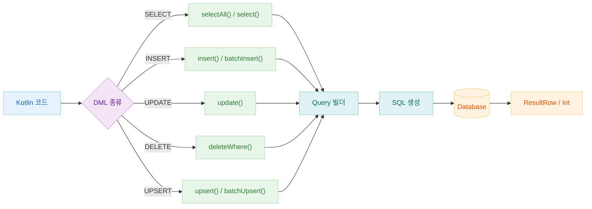
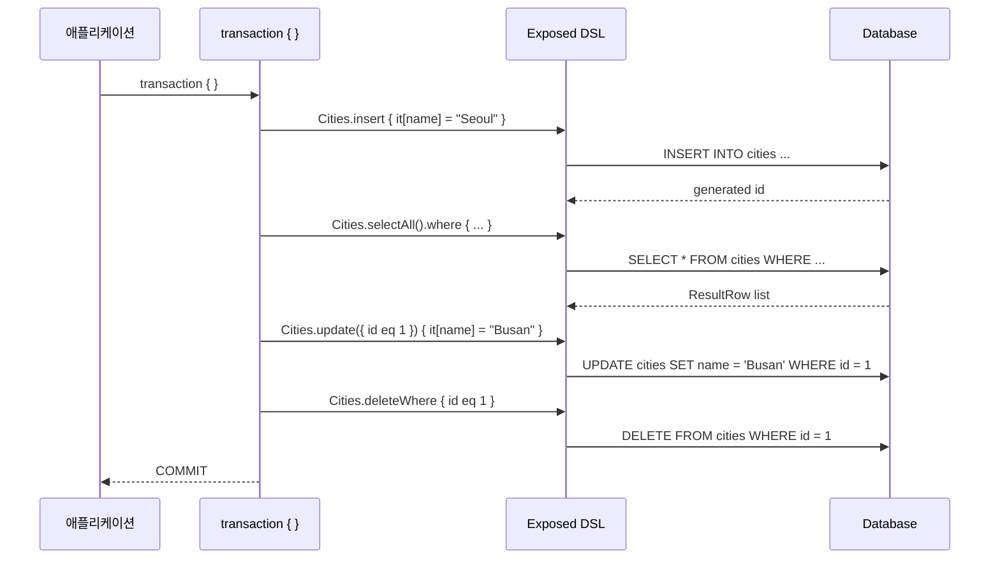
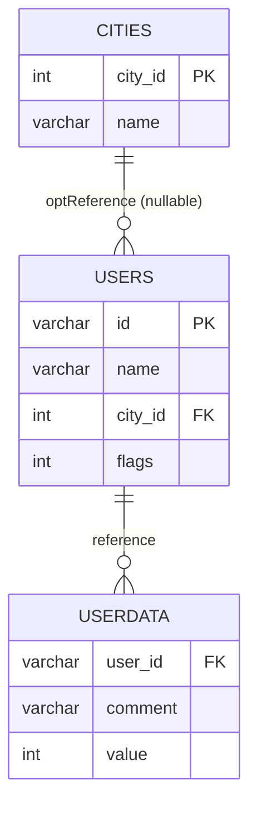

# 05 Exposed DML: 기본 연산 (01-dml)

[English](./README.md) | 한국어

Exposed 1.1.1 DSL로 DML 핵심 문법(조회/삽입/수정/삭제/집계/조인)을 학습하는 모듈입니다. 모든 예제는 테스트 코드로 제공되어 DB Dialect 차이를 함께 검증할 수 있습니다.

## 학습 목표

- SELECT/INSERT/UPDATE/DELETE/UPSERT 패턴을 익힌다.
- 조건식, 조인, 집계, 서브쿼리, 페이징 조합을 실습한다.
- DB별 지원 여부가 다른 기능(예: DISTINCT ON, RETURNING, MERGE)을 구분해 사용한다.

## 선수 지식

- [`../04-exposed-ddl/README.ko.md`](../../04-exposed-ddl/README.ko.md)
- Exposed DSL 기본 문법

## 핵심 개념

### SELECT

```kotlin
// 기본 조회
Cities.selectAll()
    .where { Cities.name eq "Seoul" }
    .orderBy(Cities.name)
    .limit(10)

// 다중 조건 조합
Users.selectAll()
    .where { (Users.age greaterEq 20) and (Users.city.isNotNull()) }
    .andWhere { Users.name like "K%" }

// 서브쿼리
Orders.selectAll()
    .where { Orders.userId inSubQuery Users.select(Users.id).where { Users.active eq true } }
```

### INSERT / BATCH INSERT

```kotlin
// 단건 삽입
Cities.insert {
    it[name] = "Busan"
    it[country] = "KR"
}

// 배치 삽입 (성능 최적화)
Cities.batchInsert(cityList) { city ->
    this[Cities.name] = city.name
    this[Cities.country] = city.country
}

// 삽입 후 ID 반환
val newId = Cities.insertAndGetId {
    it[name] = "Incheon"
}
```

### UPDATE

```kotlin
Cities.update({ Cities.id eq targetId }) {
    it[name] = "Updated Name"
}
```

### UPSERT (INSERT OR UPDATE)

```kotlin
// 충돌 시 업데이트
WordTable.upsert {
    it[word] = "hello"
    it[count] = 1
}

// 충돌 시 특정 컬럼만 업데이트
WordTable.upsert(onUpdate = listOf(WordTable.count to (WordTable.count + intLiteral(1)))) {
    it[word] = "hello"
    it[count] = 1
}

// 배치 upsert
WordTable.batchUpsert(words) { w ->
    this[WordTable.word] = w
    this[WordTable.count] = 1
}
```

### DELETE

```kotlin
Cities.deleteWhere { Cities.id eq targetId }
```

## DML 흐름 다이어그램



## CRUD 시퀀스 다이어그램



## City-User 도메인 ERD



## 예제 지도

소스 위치: `src/test/kotlin/exposed/examples/dml`

| 범주     | 파일                                                                                                                                                                                                                                 |
|--------|------------------------------------------------------------------------------------------------------------------------------------------------------------------------------------------------------------------------------------|
| 기본 DML | `Ex01_Select.kt`, `Ex02_Insert.kt`, `Ex03_Update.kt`, `Ex04_Upsert.kt`, `Ex05_Delete.kt`                                                                                                                                           |
| 조회 고급  | `Ex06_Exists.kt`, `Ex07_DistinctOn.kt`, `Ex08_Count.kt`, `Ex09_GroupBy.kt`, `Ex10_OrderBy.kt`, `Ex11_Join.kt`                                                                                                                      |
| 변경 고급  | `Ex12_InsertInto_Select.kt`, `Ex13_Replace.kt`, `Ex14_MergeBase.kt`, `Ex14_MergeTable.kt`, `Ex14_MergeSelect.kt`, `Ex15_Returning.kt`                                                                                              |
| 성능/확장  | `Ex16_FetchBatchedResults.kt`, `Ex17_Union.kt`, `Ex20_AdjustQuery.kt`, `Ex21_Arithmetic.kt`, `Ex22_ColumnWithTransform.kt`, `Ex23_Conditions.kt`, `Ex30_Explain.kt`, `Ex40_LateralJoin.kt`, `Ex50_RecursiveCTE.kt`, `Ex99_Dual.kt` |

## DB별 기능 지원 현황

| 기능             | H2 | PostgreSQL | MySQL V8 | MariaDB |
|----------------|----|------------|----------|---------|
| `DISTINCT ON`  | O  | O          | X        | X       |
| `RETURNING`    | O  | O          | X        | X       |
| `MERGE`        | O  | O          | X        | X       |
| `REPLACE`      | X  | X          | O        | O       |
| `LATERAL JOIN` | X  | O          | O        | X       |
| `CTE (WITH)`   | X  | O          | O        | O       |
| `UPSERT`       | O  | O          | O        | O       |

## 실행 방법

```bash
./gradlew :05-exposed-dml:01-dml:test
```

환경 변수로 빠른 테스트 실행(H2만):

```bash
USE_FAST_DB=true ./gradlew :05-exposed-dml:01-dml:test
```

## 실습 체크리스트

- 동일 쿼리를 H2/PostgreSQL/MySQL에서 실행해 결과 차이를 기록한다.
- `JOIN + GROUP BY + HAVING` 조합 쿼리를 직접 변형해본다.
- `RETURNING`, `MERGE`, `DISTINCT ON` 같은 DB 의존 기능은 대체 전략을 함께 정리한다.

## DB별 주의사항

- `withDistinctOn`: PostgreSQL/H2 중심으로 사용
- `replace`: MySQL/MariaDB 전용
- `returning`: DB 지원 여부 확인 필요
- `merge`: DB별 문법/지원 범위 차이 존재

## 성능·안정성 체크포인트

- 대량 조회는 `fetchBatchedResults`와 페이징으로 메모리 사용량을 제한
- 조인/집계 쿼리는 실행계획(`EXPLAIN`)으로 인덱스 사용 여부 확인
- 동적 조건 조합 시 `adjustWhere`로 쿼리 의도를 명확히 유지

## 복잡한 시나리오

### CTE (Common Table Expression)

재귀 CTE를 Raw SQL로 실행하는 방법을 학습합니다. `WITH RECURSIVE` 구문을 통해 계층형 데이터(트리 구조)를 조회합니다.

- 예제: [`Ex50_RecursiveCTE.kt`](src/test/kotlin/exposed/examples/dml/Ex50_RecursiveCTE.kt)
- 지원 DB: PostgreSQL, MySQL V8, MariaDB (H2 미지원)

### Window Function

집계 없이 행별로 순위/누적합 등을 계산하는 Window Function은 `03-functions` 모듈에서 다룹니다.

- 예제: [`../03-functions/src/test/kotlin/exposed/examples/functions/Ex05_WindowFunction.kt`](../03-functions/src/test/kotlin/exposed/examples/functions/Ex05_WindowFunction.kt)

### Upsert 패턴

충돌 시 업데이트 또는 무시(DO NOTHING) 전략을 선택할 수 있습니다.

- 단건 upsert: `Table.upsert { ... }`
- 배치 upsert: `Table.batchUpsert(...)`
- 예제: [`Ex04_Upsert.kt`](src/test/kotlin/exposed/examples/dml/Ex04_Upsert.kt)

### MERGE 문

소스 테이블/쿼리 기준으로 대상 테이블에 INSERT/UPDATE/DELETE를 한 번에 처리합니다.

- 예제: [`Ex14_MergeBase.kt`](src/test/kotlin/exposed/examples/dml/Ex14_MergeBase.kt), [`Ex14_MergeSelect.kt`](src/test/kotlin/exposed/examples/dml/Ex14_MergeSelect.kt), [`Ex14_MergeTable.kt`](src/test/kotlin/exposed/examples/dml/Ex14_MergeTable.kt)
- 지원 DB: PostgreSQL, Oracle, SQL Server (MySQL 미지원)

### Lateral JOIN

서브쿼리가 외부 쿼리의 컬럼을 참조할 수 있는 LATERAL JOIN 패턴입니다.

- 예제: [`Ex40_LateralJoin.kt`](src/test/kotlin/exposed/examples/dml/Ex40_LateralJoin.kt)
- 지원 DB: PostgreSQL, MySQL V8

## 다음 모듈

- [`../02-types/README.ko.md`](../02-types/README.ko.md)
