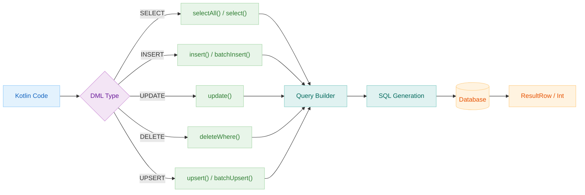
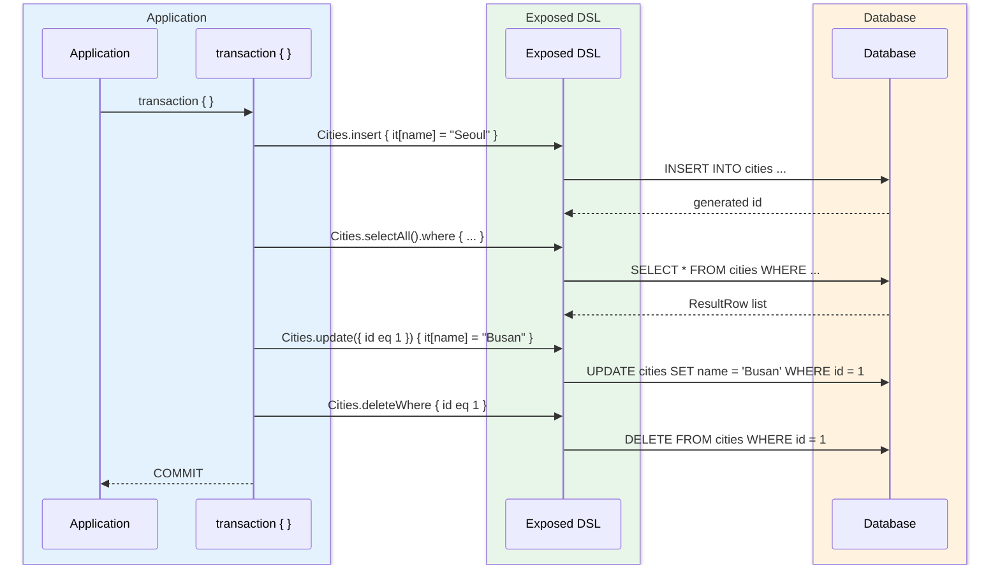
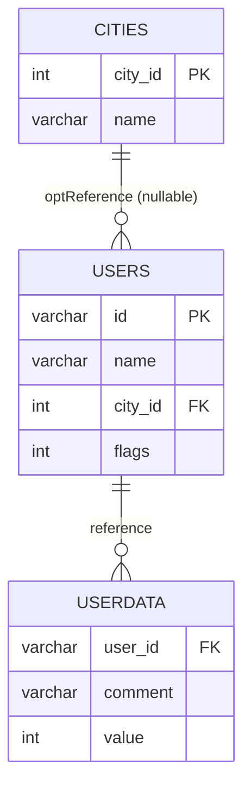

# 05 Exposed DML: Basic Operations (01-dml)

English | [한국어](./README.ko.md)

A module for learning the core DML syntax of the Exposed 1.1.1 DSL (SELECT/INSERT/UPDATE/DELETE/aggregation/JOIN). All examples are provided as test code so you can also verify DB Dialect differences.

## Learning Objectives

- Learn SELECT/INSERT/UPDATE/DELETE/UPSERT patterns.
- Practice combinations of conditions, joins, aggregations, subqueries, and pagination.
- Distinguish per-DB feature support for functions such as DISTINCT ON, RETURNING, and MERGE.

## Prerequisites

- [`../04-exposed-ddl/README.md`](../../04-exposed-ddl/README.md)
- Basic Exposed DSL syntax

## Key Concepts

### SELECT

```kotlin
// Basic query
Cities.selectAll()
    .where { Cities.name eq "Seoul" }
    .orderBy(Cities.name)
    .limit(10)

// Multiple conditions
Users.selectAll()
    .where { (Users.age greaterEq 20) and (Users.city.isNotNull()) }
    .andWhere { Users.name like "K%" }

// Subquery
Orders.selectAll()
    .where { Orders.userId inSubQuery Users.select(Users.id).where { Users.active eq true } }
```

### INSERT / BATCH INSERT

```kotlin
// Single insert
Cities.insert {
    it[name] = "Busan"
    it[country] = "KR"
}

// Batch insert (performance optimization)
Cities.batchInsert(cityList) { city ->
    this[Cities.name] = city.name
    this[Cities.country] = city.country
}

// Insert and return ID
val newId = Cities.insertAndGetId {
    it[name] = "Incheon"
}
```

### UPDATE

```kotlin
Cities.update({ Cities.id eq targetId }) {
    it[name] = "Updated Name"
}
```

### UPSERT (INSERT OR UPDATE)

```kotlin
// Update on conflict
WordTable.upsert {
    it[word] = "hello"
    it[count] = 1
}

// Update only specific columns on conflict
WordTable.upsert(onUpdate = listOf(WordTable.count to (WordTable.count + intLiteral(1)))) {
    it[word] = "hello"
    it[count] = 1
}

// Batch upsert
WordTable.batchUpsert(words) { w ->
    this[WordTable.word] = w
    this[WordTable.count] = 1
}
```

### DELETE

```kotlin
Cities.deleteWhere { Cities.id eq targetId }
```

## DML Flow Diagram



## CRUD Sequence Diagram



## City-User Domain ERD



## Example Map

Source location: `src/test/kotlin/exposed/examples/dml`

| Category        | Files                                                                                                                                                                                                                                |
|-----------------|--------------------------------------------------------------------------------------------------------------------------------------------------------------------------------------------------------------------------------------|
| Basic DML       | `Ex01_Select.kt`, `Ex02_Insert.kt`, `Ex03_Update.kt`, `Ex04_Upsert.kt`, `Ex05_Delete.kt`                                                                                                                                            |
| Advanced SELECT | `Ex06_Exists.kt`, `Ex07_DistinctOn.kt`, `Ex08_Count.kt`, `Ex09_GroupBy.kt`, `Ex10_OrderBy.kt`, `Ex11_Join.kt`                                                                                                                       |
| Advanced DML    | `Ex12_InsertInto_Select.kt`, `Ex13_Replace.kt`, `Ex14_MergeBase.kt`, `Ex14_MergeTable.kt`, `Ex14_MergeSelect.kt`, `Ex15_Returning.kt`                                                                                               |
| Performance/Extension | `Ex16_FetchBatchedResults.kt`, `Ex17_Union.kt`, `Ex20_AdjustQuery.kt`, `Ex21_Arithmetic.kt`, `Ex22_ColumnWithTransform.kt`, `Ex23_Conditions.kt`, `Ex30_Explain.kt`, `Ex40_LateralJoin.kt`, `Ex50_RecursiveCTE.kt`, `Ex99_Dual.kt` |

## Feature Support by DB

| Feature        | H2 | PostgreSQL | MySQL V8 | MariaDB |
|----------------|----|------------|----------|---------|
| `DISTINCT ON`  | O  | O          | X        | X       |
| `RETURNING`    | O  | O          | X        | X       |
| `MERGE`        | O  | O          | X        | X       |
| `REPLACE`      | X  | X          | O        | O       |
| `LATERAL JOIN` | X  | O          | O        | X       |
| `CTE (WITH)`   | X  | O          | O        | O       |
| `UPSERT`       | O  | O          | O        | O       |

## Running Tests

```bash
./gradlew :05-exposed-dml:01-dml:test
```

Fast test run targeting H2 only:

```bash
USE_FAST_DB=true ./gradlew :05-exposed-dml:01-dml:test
```

## Practice Checklist

- Run the same query on H2/PostgreSQL/MySQL and record the differences.
- Modify a `JOIN + GROUP BY + HAVING` combination query yourself.
- Document fallback strategies for DB-dependent features like `RETURNING`, `MERGE`, and `DISTINCT ON`.

## Per-DB Notes

- `withDistinctOn`: Primarily for PostgreSQL/H2
- `replace`: MySQL/MariaDB only
- `returning`: Check DB support before use
- `merge`: Differences in syntax and support range per DB

## Performance and Stability Checkpoints

- Limit memory usage with `fetchBatchedResults` and pagination for large queries
- Verify index usage for join/aggregation queries with `EXPLAIN`
- Use `adjustWhere` to maintain clear query intent when combining dynamic conditions

## Complex Scenarios

### CTE (Common Table Expression)

Learn how to run recursive CTEs as raw SQL. Use `WITH RECURSIVE` syntax to query hierarchical data (tree structures).

- Example: [`Ex50_RecursiveCTE.kt`](src/test/kotlin/exposed/examples/dml/Ex50_RecursiveCTE.kt)
- Supported DBs: PostgreSQL, MySQL V8, MariaDB (not H2)

### Window Function

Window functions that compute rank/cumulative sums per row without aggregation are covered in the `03-functions` module.

- Example: [`../03-functions/src/test/kotlin/exposed/examples/functions/Ex05_WindowFunction.kt`](../03-functions/src/test/kotlin/exposed/examples/functions/Ex05_WindowFunction.kt)

### Upsert Patterns

Choose between updating on conflict or ignoring (DO NOTHING).

- Single upsert: `Table.upsert { ... }`
- Batch upsert: `Table.batchUpsert(...)`
- Example: [`Ex04_Upsert.kt`](src/test/kotlin/exposed/examples/dml/Ex04_Upsert.kt)

### MERGE Statement

Process INSERT/UPDATE/DELETE against a target table in one statement based on a source table/query.

- Examples: [`Ex14_MergeBase.kt`](src/test/kotlin/exposed/examples/dml/Ex14_MergeBase.kt), [`Ex14_MergeSelect.kt`](src/test/kotlin/exposed/examples/dml/Ex14_MergeSelect.kt), [`Ex14_MergeTable.kt`](src/test/kotlin/exposed/examples/dml/Ex14_MergeTable.kt)
- Supported DBs: PostgreSQL, Oracle, SQL Server (not MySQL)

### Lateral JOIN

LATERAL JOIN pattern where subqueries can reference columns from the outer query.

- Example: [`Ex40_LateralJoin.kt`](src/test/kotlin/exposed/examples/dml/Ex40_LateralJoin.kt)
- Supported DBs: PostgreSQL, MySQL V8

## Next Module

- [`../02-types/README.md`](../02-types/README.md)
