# 05 Exposed DML: Column Types (02-types)

[English](./README.md) | 한국어

Exposed 컬럼 타입을 DB Dialect별로 검증하는 모듈입니다. 기본 타입뿐 아니라 배열, 다차원 배열, BLOB, UUID, unsigned 타입까지 실습합니다.

## 학습 목표

- Exposed 컬럼 타입 정의와 바인딩 방식을 익힌다.
- DB마다 다른 타입 지원 범위를 테스트로 확인한다.
- 커스텀/특수 타입 사용 시 제약 조건과 이식성 포인트를 이해한다.

## 선수 지식

- [`../01-dml/README.ko.md`](../01-dml/README.ko.md)

## Exposed 컬럼 타입 계층

```mermaid
%%{init: {'theme': 'base', 'themeVariables': {'background': '#FAFAFA', 'fontFamily': '"Comic Mono", "goorm sans code", "JetBrains Mono", "goorm sans"'}}}%%
classDiagram
    class ColumnType {
        +nullable Boolean
        +valueFromDB(value)
        +valueToDB(value)
        +sqlType() String
    }
    class BooleanColumnType
    class IntegerColumnType
    class LongColumnType
    class DoubleColumnType
    class DecimalColumnType {
        +precision Int
        +scale Int
    }
    class CharacterColumnType
    class VarCharColumnType {
        +colLength Int
    }
    class TextColumnType
    class BasicBinaryColumnType
    class BlobColumnType
    class UUIDColumnType
    class ArrayColumnType~T~ {
        +dimensions Int
    }

    ColumnType <|-- BooleanColumnType
    ColumnType <|-- IntegerColumnType
    ColumnType <|-- LongColumnType
    ColumnType <|-- DoubleColumnType
    ColumnType <|-- DecimalColumnType
    ColumnType <|-- CharacterColumnType
    ColumnType <|-- VarCharColumnType
    ColumnType <|-- TextColumnType
    ColumnType <|-- BasicBinaryColumnType
    ColumnType <|-- BlobColumnType
    ColumnType <|-- UUIDColumnType
    ColumnType <|-- ArrayColumnType

    style ColumnType fill:#F3E5F5,stroke:#CE93D8,color:#6A1B9A
    style BooleanColumnType fill:#E3F2FD,stroke:#90CAF9,color:#1565C0
    style IntegerColumnType fill:#E3F2FD,stroke:#90CAF9,color:#1565C0
    style LongColumnType fill:#E3F2FD,stroke:#90CAF9,color:#1565C0
    style DoubleColumnType fill:#E3F2FD,stroke:#90CAF9,color:#1565C0
    style DecimalColumnType fill:#E3F2FD,stroke:#90CAF9,color:#1565C0
    style CharacterColumnType fill:#E8F5E9,stroke:#A5D6A7,color:#2E7D32
    style VarCharColumnType fill:#E8F5E9,stroke:#A5D6A7,color:#2E7D32
    style TextColumnType fill:#E8F5E9,stroke:#A5D6A7,color:#2E7D32
    style BasicBinaryColumnType fill:#FFF3E0,stroke:#FFCC80,color:#E65100
    style BlobColumnType fill:#FFF3E0,stroke:#FFCC80,color:#E65100
    style UUIDColumnType fill:#FFF3E0,stroke:#FFCC80,color:#E65100
    style ArrayColumnType fill:#FCE4EC,stroke:#F48FB1,color:#AD1457
```



## 핵심 개념

### 기본 타입 정의

```kotlin
object TypesTable: Table("types_demo") {
    val flag = bool("flag")
    val initial = char("initial")
    val age = integer("age")
    val score = double("score")
    val label = varchar("label", 128)
}
```

### 파라미터 바인딩

```kotlin
// 안전한 파라미터 바인딩 — SQL 인젝션 방지
TypesTable.selectAll()
    .where { TypesTable.label eq stringParam("hello") }
```

### 배열 타입 (PostgreSQL/H2)

```kotlin
object ArrayTable: Table("array_demo") {
    val tags = array<String>("tags")
    val scores = array<Int>("scores")
}

// 배열 조건 — anyFrom / allFrom
ArrayTable.selectAll()
    .where { stringParam("kotlin") eq anyFrom(ArrayTable.tags) }
```

### UUID 컬럼

```kotlin
// Java UUID
object JavaUUIDTable: UUIDTable("java_uuid_demo")

// Kotlin UUID (kotlin.uuid.Uuid)
object KotlinUUIDTable: Table("kotlin_uuid_demo") {
    val id = kotlinUuid("id")
    override val primaryKey = PrimaryKey(id)
}
```

## 타입별 DB 지원 현황

| 타입                    | H2 | PostgreSQL | MySQL V8 | MariaDB | 비고                 |
|-----------------------|----|------------|----------|---------|--------------------|
| `bool`                | O  | O          | O        | O       |                    |
| `char`                | O  | O          | O        | O       |                    |
| `integer`             | O  | O          | O        | O       |                    |
| `double`              | O  | O          | O        | O       |                    |
| `array<T>`            | O  | O          | X        | X       | 1차원 배열             |
| `multiArray<T>`       | X  | O          | X        | X       | 다차원 배열             |
| `ubyte/ushort`        | O  | O          | O        | O       | unsigned 정수        |
| `blob`                | O  | O          | O        | O       | MySQL은 기본값 미지원     |
| `java UUID`           | O  | O          | O        | O       | 바이너리 vs 문자열 저장 차이  |
| `kotlin UUID`         | O  | O          | O        | O       | `kotlin.uuid.Uuid` |
| `useObjectIdentifier` | X  | O          | X        | X       | PostgreSQL OID 전용  |

## 예제 지도

소스 위치: `src/test/kotlin/exposed/examples/types`

| 범주    | 파일                                                                                                                   |
|-------|----------------------------------------------------------------------------------------------------------------------|
| 기본 타입 | `Ex01_BooleanColumnType.kt`, `Ex02_CharColumnType.kt`, `Ex03_NumericColumnType.kt`, `Ex04_DoubleColumnType.kt`       |
| 배열 타입 | `Ex05_ArrayColumnType.kt`, `Ex06_MultiArrayColumnType.kt`                                                            |
| 확장 타입 | `Ex07_UnsignedColumnType.kt`, `Ex08_BlobColumnType.kt`, `Ex09_JavaUUIDColumnType.kt`, `Ex10_KotlinUUIDColumnType.kt` |

## 실행 방법

```bash
./gradlew :05-exposed-dml:02-types:test
```

## 실습 체크리스트

- 배열/다차원 배열 지원 여부를 DB별로 표로 정리한다.
- UUID(Java/Kotlin) 타입 간 변환 경계에서 직렬화 이슈가 없는지 확인한다.
- unsigned 타입 범위 초과 입력 시 실패 동작을 검증한다.

## DB별 주의사항

- 배열 타입: PostgreSQL/H2 중심
- 다차원 배열: PostgreSQL 전용
- `blob` 기본값: MySQL 미지원
- `useObjectIdentifier`: PostgreSQL 전용

## 성능·안정성 체크포인트

- 대형 BLOB 조회 시 전체 적재보다 스트림 접근을 우선 고려
- 배열 컬럼은 인덱싱/검색 전략을 별도로 설계
- 타입 변환 실패를 테스트로 고정해 런타임 오류를 사전 차단

## 복잡한 시나리오

### 배열 컬럼 슬라이싱과 조건 조회

PostgreSQL/H2에서 배열 컬럼을 인덱스로 슬라이싱하거나 `anyFrom` / `allFrom`으로 조건을 표현하는 방법을 보여줍니다.

- 소스: [`Ex05_ArrayColumnType.kt`](src/test/kotlin/exposed/examples/types/Ex05_ArrayColumnType.kt)

### 다차원 배열 (PostgreSQL 전용)

2차원 이상의 배열 컬럼 정의, 삽입, 조회를 PostgreSQL 방언으로 실습합니다.

- 소스: [`Ex06_MultiArrayColumnType.kt`](src/test/kotlin/exposed/examples/types/Ex06_MultiArrayColumnType.kt)

### Kotlin UUID 컬럼 타입

`kotlin.uuid.Uuid`를 Exposed 컬럼에 매핑하는 방법과 DB별 UUID 저장/조회 동작(바이너리 vs 문자열)을 비교합니다.

- 소스: [`Ex10_KotlinUUIDColumnType.kt`](src/test/kotlin/exposed/examples/types/Ex10_KotlinUUIDColumnType.kt)

## 다음 모듈

- [`../03-functions/README.ko.md`](../03-functions/README.ko.md)
