# 05 Exposed DML: Column Types (02-types)

English | [한국어](./README.ko.md)

A module for validating Exposed column types per DB Dialect. Covers not only basic types but also arrays, multi-dimensional arrays, BLOB, UUID, and unsigned types.

## Learning Objectives

- Learn Exposed column type definitions and binding approaches.
- Verify the range of type support per DB through tests.
- Understand constraints and portability considerations when using custom/special types.

## Prerequisites

- [`../01-dml/README.md`](../01-dml/README.md)

## Exposed Column Type Hierarchy

```mermaid
classDiagram
    class ColumnType {
        +nullable Boolean
        +valueFromDB(value)
        +valueToDB(value)
        +sqlType() String
    }
    class BooleanColumnType
    class IntegerColumnType
    class LongColumnType
    class DoubleColumnType
    class DecimalColumnType {
        +precision Int
        +scale Int
    }
    class CharacterColumnType
    class VarCharColumnType {
        +colLength Int
    }
    class TextColumnType
    class BasicBinaryColumnType
    class BlobColumnType
    class UUIDColumnType
    class ArrayColumnType~T~ {
        +dimensions Int
    }

    ColumnType <|-- BooleanColumnType
    ColumnType <|-- IntegerColumnType
    ColumnType <|-- LongColumnType
    ColumnType <|-- DoubleColumnType
    ColumnType <|-- DecimalColumnType
    ColumnType <|-- CharacterColumnType
    ColumnType <|-- VarCharColumnType
    ColumnType <|-- TextColumnType
    ColumnType <|-- BasicBinaryColumnType
    ColumnType <|-- BlobColumnType
    ColumnType <|-- UUIDColumnType
    ColumnType <|-- ArrayColumnType

    style ColumnType fill:#F3E5F5,stroke:#CE93D8,color:#6A1B9A
    style BooleanColumnType fill:#E3F2FD,stroke:#90CAF9,color:#1565C0
    style IntegerColumnType fill:#E3F2FD,stroke:#90CAF9,color:#1565C0
    style LongColumnType fill:#E3F2FD,stroke:#90CAF9,color:#1565C0
    style DoubleColumnType fill:#E3F2FD,stroke:#90CAF9,color:#1565C0
    style DecimalColumnType fill:#E3F2FD,stroke:#90CAF9,color:#1565C0
    style CharacterColumnType fill:#E8F5E9,stroke:#A5D6A7,color:#2E7D32
    style VarCharColumnType fill:#E8F5E9,stroke:#A5D6A7,color:#2E7D32
    style TextColumnType fill:#E8F5E9,stroke:#A5D6A7,color:#2E7D32
    style BasicBinaryColumnType fill:#FFF3E0,stroke:#FFCC80,color:#E65100
    style BlobColumnType fill:#FFF3E0,stroke:#FFCC80,color:#E65100
    style UUIDColumnType fill:#FFF3E0,stroke:#FFCC80,color:#E65100
    style ArrayColumnType fill:#FCE4EC,stroke:#F48FB1,color:#AD1457
```



## Key Concepts

### Basic Type Definition

```kotlin
object TypesTable: Table("types_demo") {
    val flag = bool("flag")
    val initial = char("initial")
    val age = integer("age")
    val score = double("score")
    val label = varchar("label", 128)
}
```

### Parameter Binding

```kotlin
// Safe parameter binding — prevents SQL injection
TypesTable.selectAll()
    .where { TypesTable.label eq stringParam("hello") }
```

### Array Types (PostgreSQL/H2)

```kotlin
object ArrayTable: Table("array_demo") {
    val tags = array<String>("tags")
    val scores = array<Int>("scores")
}

// Array conditions — anyFrom / allFrom
ArrayTable.selectAll()
    .where { stringParam("kotlin") eq anyFrom(ArrayTable.tags) }
```

### UUID Columns

```kotlin
// Java UUID
object JavaUUIDTable: UUIDTable("java_uuid_demo")

// Kotlin UUID (kotlin.uuid.Uuid)
object KotlinUUIDTable: Table("kotlin_uuid_demo") {
    val id = kotlinUuid("id")
    override val primaryKey = PrimaryKey(id)
}
```

## Type Support by DB

| Type                  | H2 | PostgreSQL | MySQL V8 | MariaDB | Notes                        |
|-----------------------|----|------------|----------|---------|------------------------------|
| `bool`                | O  | O          | O        | O       |                              |
| `char`                | O  | O          | O        | O       |                              |
| `integer`             | O  | O          | O        | O       |                              |
| `double`              | O  | O          | O        | O       |                              |
| `array<T>`            | O  | O          | X        | X       | 1-dimensional array          |
| `multiArray<T>`       | X  | O          | X        | X       | Multi-dimensional array      |
| `ubyte/ushort`        | O  | O          | O        | O       | Unsigned integers            |
| `blob`                | O  | O          | O        | O       | MySQL: default value not supported |
| `java UUID`           | O  | O          | O        | O       | Binary vs string storage difference |
| `kotlin UUID`         | O  | O          | O        | O       | `kotlin.uuid.Uuid`           |
| `useObjectIdentifier` | X  | O          | X        | X       | PostgreSQL OID only          |

## Example Map

Source location: `src/test/kotlin/exposed/examples/types`

| Category      | Files                                                                                                                  |
|---------------|----------------------------------------------------------------------------------------------------------------------|
| Basic types   | `Ex01_BooleanColumnType.kt`, `Ex02_CharColumnType.kt`, `Ex03_NumericColumnType.kt`, `Ex04_DoubleColumnType.kt`       |
| Array types   | `Ex05_ArrayColumnType.kt`, `Ex06_MultiArrayColumnType.kt`                                                            |
| Extended types | `Ex07_UnsignedColumnType.kt`, `Ex08_BlobColumnType.kt`, `Ex09_JavaUUIDColumnType.kt`, `Ex10_KotlinUUIDColumnType.kt` |

## Running Tests

```bash
./gradlew :05-exposed-dml:02-types:test
```

## Practice Checklist

- Summarize array/multi-dimensional array support in a per-DB table.
- Verify there are no serialization issues at the boundary between Java/Kotlin UUID type conversions.
- Validate failure behavior when an unsigned type range is exceeded.

## Per-DB Notes

- Array types: Primarily PostgreSQL/H2
- Multi-dimensional arrays: PostgreSQL only
- `blob` default value: Not supported in MySQL
- `useObjectIdentifier`: PostgreSQL only

## Performance and Stability Checkpoints

- For large BLOB queries, prefer streaming access over full loading
- Design indexing/search strategies for array columns separately
- Fix type conversion failures in tests to prevent runtime errors

## Complex Scenarios

### Array Column Slicing and Conditional Queries

Shows how to slice array columns by index or express conditions with `anyFrom` / `allFrom` in PostgreSQL/H2.

- Source: [`Ex05_ArrayColumnType.kt`](src/test/kotlin/exposed/examples/types/Ex05_ArrayColumnType.kt)

### Multi-Dimensional Arrays (PostgreSQL only)

Practices defining, inserting, and querying 2D or higher array columns using the PostgreSQL dialect.

- Source: [`Ex06_MultiArrayColumnType.kt`](src/test/kotlin/exposed/examples/types/Ex06_MultiArrayColumnType.kt)

### Kotlin UUID Column Type

Covers mapping `kotlin.uuid.Uuid` to an Exposed column and comparing per-DB UUID storage/retrieval behavior (binary vs string).

- Source: [`Ex10_KotlinUUIDColumnType.kt`](src/test/kotlin/exposed/examples/types/Ex10_KotlinUUIDColumnType.kt)

## Next Module

- [`../03-functions/README.md`](../03-functions/README.md)
