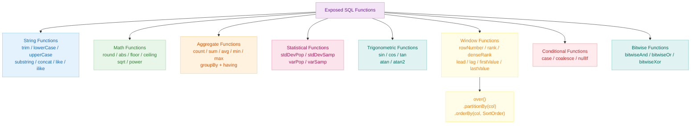
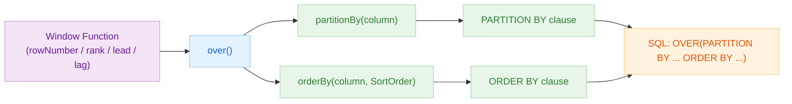

# 05 Exposed DML: SQL Functions (03-functions)

English | [한국어](./README.ko.md)

A module for writing analytical queries by combining SQL functions in the Exposed DSL. Focuses on string, math, statistical, and window functions with practical patterns.

## Learning Objectives

- Write expression-based queries using the Exposed function API.
- Implement analytical queries with aggregation and window functions.
- Manage per-DB function support differences with tests.

## Prerequisites

- [`../01-dml/README.md`](../01-dml/README.md)
- [`../02-types/README.md`](../02-types/README.md)

## SQL Function Classification Diagram



## Key Concepts

### String Functions

```kotlin
// trim, lowerCase, upperCase, substring, concat
Users.select(
    Users.name.trim(),
    Users.name.lowerCase(),
    concat(Users.firstName, stringLiteral(" "), Users.lastName)
)

// coalesce — null fallback value
Users.select(coalesce(Users.nickname, Users.name))
```

### Math Functions

```kotlin
// round, abs, floor, ceiling
Products.select(
    Products.price.round(2),
    Products.price.abs()
)
```

### Aggregate Functions

```kotlin
// count, sum, avg, min, max + groupBy + having
Orders
    .select(Orders.customerId, Orders.amount.sum())
    .groupBy(Orders.customerId)
    .having { Orders.amount.sum() greater 1000.toBigDecimal() }
```

### Window Functions

```kotlin
// rowNumber, rank, denseRank, lead, lag
val rowNum = rowNumber().over().partitionBy(Sales.region).orderBy(Sales.amount, SortOrder.DESC)
val rankVal = rank().over().orderBy(Sales.amount, SortOrder.DESC)

Sales.select(Sales.region, Sales.amount, rowNum, rankVal)
```

## Function Reference Table

| Category    | Functions                                                                    | Notes                        |
|-------------|------------------------------------------------------------------------------|------------------------------|
| String      | `trim`, `lowerCase`, `upperCase`, `substring`, `concat`, `like`, `ilike`    | `ilike`: PostgreSQL only     |
| Math        | `round`, `abs`, `floor`, `ceiling`, `sqrt`, `power`                         |                              |
| Aggregate   | `count`, `sum`, `avg`, `min`, `max`                                         | Combined with `groupBy` / `having` |
| Statistical | `stdDevPop`, `stdDevSamp`, `varPop`, `varSamp`                              | Per-DB support differences   |
| Trig        | `sin`, `cos`, `tan`, `atan`, `atan2`                                        | Per-DB support differences   |
| Window      | `rowNumber`, `rank`, `denseRank`, `lead`, `lag`, `firstValue`, `lastValue`  | Combined with `OVER()` clause |
| Conditional | `case`, `coalesce`, `nullIf`                                                |                              |
| Bitwise     | `bitwiseAnd`, `bitwiseOr`, `bitwiseXor`                                     |                              |

## Window Function Structure



## Example Map

Source location: `src/test/kotlin/exposed/examples/functions`

| File                                | Description                        |
|-------------------------------------|------------------------------------|
| `Ex00_FunctionBase.kt`              | Common table/data setup            |
| `Ex01_Functions.kt`                 | String and basic functions         |
| `Ex02_MathFunction.kt`              | Math functions                     |
| `Ex03_StatisticsFunction.kt`        | Aggregate and statistical functions |
| `Ex04_TrigonometricalFunction.kt`   | Trigonometric functions            |
| `Ex05_WindowFunction.kt`            | Window functions                   |

## Running Tests

```bash
./gradlew :05-exposed-dml:03-functions:test
```

## Practice Checklist

- Rewrite the same aggregation using `groupBy + having` combinations.
- Compare window function results (rank, lead/lag values) across different sort orders.
- Verify the result type when chaining functions (e.g., string normalization → aggregation).

## Per-DB Notes

- Function names/signatures may have subtle differences per DB; Dialect-specific tests are necessary
- Check DB support for case-insensitive search functions like `ilike`

## Performance and Stability Checkpoints

- Index presence on sort/partition columns has a significant performance impact on aggregate/window functions
- Separate expressions into smaller pieces as query complexity grows to maintain readability

## Complex Scenarios

### Window Function OVER Clause Combinations

Combine `rowNumber`, `rank`, `denseRank`, `lead`, `lag`, `sum`, `avg`, etc. with `PARTITION BY` / `ORDER BY` to write rank and cumulative sum queries.

- Source: [`Ex05_WindowFunction.kt`](src/test/kotlin/exposed/examples/functions/Ex05_WindowFunction.kt)

### String, Bitwise, and Conditional Function Chains

Shows patterns for building expression-based queries by chaining `concat`, `substring`, `lowerCase`, `coalesce`, `case`, `bitwiseAnd`, etc. in DSL.

- Source: [`Ex01_Functions.kt`](src/test/kotlin/exposed/examples/functions/Ex01_Functions.kt)

### Aggregate and Statistical Functions with groupBy/having

Write analytical queries by combining `count`, `sum`, `avg`, `min`, `max` with `groupBy` + `having`.

- Source: [`Ex03_StatisticsFunction.kt`](src/test/kotlin/exposed/examples/functions/Ex03_StatisticsFunction.kt)

## Next Module

- [`../04-transactions/README.md`](../04-transactions/README.md)
