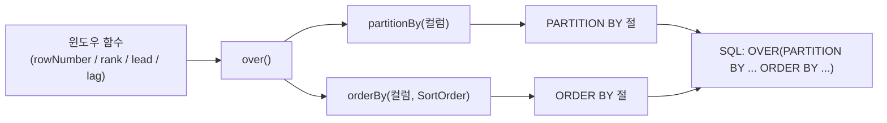

# 05 Exposed DML: SQL 함수 (03-functions)

Exposed DSL에서 SQL 함수를 조합해 분석 쿼리를 작성하는 모듈입니다. 문자열/수학/통계/윈도우 함수 중심으로 실무 패턴을 학습합니다.

## 학습 목표

- Exposed 함수 API를 이용해 표현식 기반 쿼리를 작성한다.
- 집계/윈도우 함수로 분석형 조회를 구현한다.
- DB별 함수 지원 차이를 테스트로 관리한다.

## 선수 지식

- [`../01-dml/README.md`](../01-dml/README.md)
- [`../02-types/README.md`](../02-types/README.md)

## 핵심 개념

### 문자열 함수

```kotlin
// trim, lowerCase, upperCase, substring, concat
Users.select(
    Users.name.trim(),
    Users.name.lowerCase(),
    concat(Users.firstName, stringLiteral(" "), Users.lastName)
)

// coalesce — null 대체값
Users.select(coalesce(Users.nickname, Users.name))
```

### 수학 함수

```kotlin
// round, abs, floor, ceiling
Products.select(
    Products.price.round(2),
    Products.price.abs()
)
```

### 집계 함수

```kotlin
// count, sum, avg, min, max + groupBy + having
Orders
    .select(Orders.customerId, Orders.amount.sum())
    .groupBy(Orders.customerId)
    .having { Orders.amount.sum() greater 1000.toBigDecimal() }
```

### 윈도우 함수

```kotlin
// rowNumber, rank, denseRank, lead, lag
val rowNum = rowNumber().over().partitionBy(Sales.region).orderBy(Sales.amount, SortOrder.DESC)
val rankVal = rank().over().orderBy(Sales.amount, SortOrder.DESC)

Sales.select(Sales.region, Sales.amount, rowNum, rankVal)
```

## 함수 분류표

| 분류  | 함수                                                                         | 비고                       |
|-----|----------------------------------------------------------------------------|--------------------------|
| 문자열 | `trim`, `lowerCase`, `upperCase`, `substring`, `concat`, `like`, `ilike`   | `ilike`: PostgreSQL 전용   |
| 수학  | `round`, `abs`, `floor`, `ceiling`, `sqrt`, `power`                        |                          |
| 집계  | `count`, `sum`, `avg`, `min`, `max`                                        | `groupBy` / `having`과 조합 |
| 통계  | `stdDevPop`, `stdDevSamp`, `varPop`, `varSamp`                             | DB별 지원 차이                |
| 삼각  | `sin`, `cos`, `tan`, `atan`, `atan2`                                       | DB별 지원 차이                |
| 윈도우 | `rowNumber`, `rank`, `denseRank`, `lead`, `lag`, `firstValue`, `lastValue` | `OVER()` 절과 조합           |
| 조건  | `case`, `coalesce`, `nullIf`                                               |                          |
| 비트  | `bitwiseAnd`, `bitwiseOr`, `bitwiseXor`                                    |                          |

## 윈도우 함수 구조



## 예제 지도

소스 위치: `src/test/kotlin/exposed/examples/functions`

| 파일                                | 설명            |
|-----------------------------------|---------------|
| `Ex00_FunctionBase.kt`            | 공통 테이블/데이터 구성 |
| `Ex01_Functions.kt`               | 문자열/기본 함수     |
| `Ex02_MathFunction.kt`            | 수학 함수         |
| `Ex03_StatisticsFunction.kt`      | 집계/통계 함수      |
| `Ex04_TrigonometricalFunction.kt` | 삼각 함수         |
| `Ex05_WindowFunction.kt`          | 윈도우 함수        |

## 실행 방법

```bash
./gradlew :05-exposed-dml:03-functions:test
```

## 실습 체크리스트

- 같은 집계를 `groupBy + having` 조합으로 직접 변형한다.
- 윈도우 함수 결과(순위, 이전/다음 값)를 정렬 기준별로 비교한다.
- 함수 체인(예: 문자열 정규화 → 집계) 시 결과 타입을 확인한다.

## DB별 주의사항

- 함수명/시그니처는 DB마다 미세 차이가 있으므로 Dialect별 테스트가 필요
- `ilike` 등 대소문자 무시 검색은 DB 지원 여부 확인

## 성능·안정성 체크포인트

- 집계/윈도우 함수는 정렬/파티션 컬럼 인덱스 유무가 성능에 크게 영향
- 계산식이 복잡해질수록 쿼리 가독성을 위해 표현식을 분리

## 복잡한 시나리오

### 윈도우 함수 OVER 절 조합

`rowNumber`, `rank`, `denseRank`, `lead`, `lag`, `sum`, `avg` 등을 `PARTITION BY` / `ORDER BY`와 함께 조합해 순위·누적 합계 쿼리를 작성합니다.

- 소스: [`Ex05_WindowFunction.kt`](src/test/kotlin/exposed/examples/functions/Ex05_WindowFunction.kt)

### 문자열·비트 연산·조건 함수 체인

`concat`, `substring`, `lowerCase`, `coalesce`, `case`, `bitwiseAnd` 등을 DSL로 연결해 표현식 기반 쿼리를 구성하는 패턴을 보여줍니다.

- 소스: [`Ex01_Functions.kt`](src/test/kotlin/exposed/examples/functions/Ex01_Functions.kt)

### 집계·통계 함수와 groupBy/having 조합

`count`, `sum`, `avg`, `min`, `max`를 `groupBy` + `having`과 결합해 분석형 조회를 작성합니다.

- 소스: [`Ex03_StatisticsFunction.kt`](src/test/kotlin/exposed/examples/functions/Ex03_StatisticsFunction.kt)

## 다음 모듈

- [`../04-transactions/README.md`](../04-transactions/README.md)
