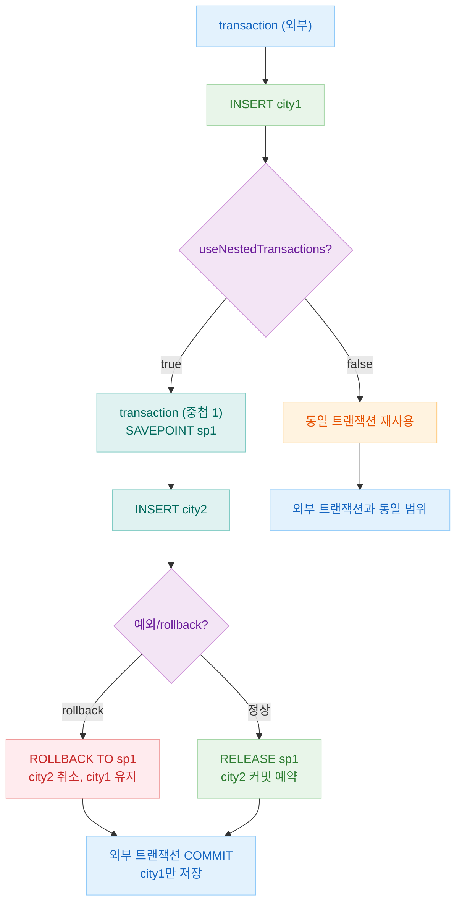
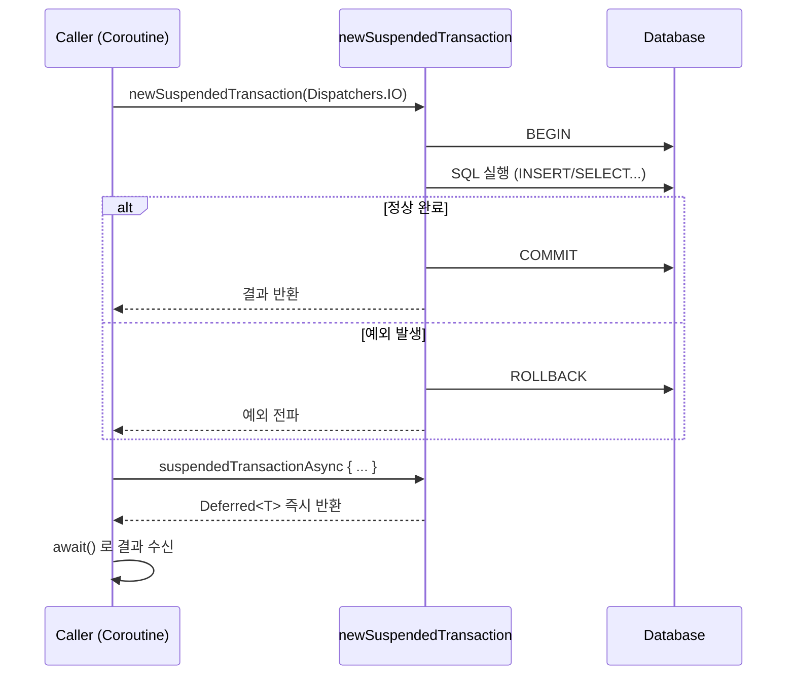

# 05 Exposed DML: 트랜잭션 (04-transactions)

[English](./README.md) | 한국어

Exposed 트랜잭션 모델의 핵심을 다루는 모듈입니다. 격리 수준, 중첩 트랜잭션, 롤백, 코루틴 트랜잭션을 실습합니다.

## 학습 목표

- 트랜잭션 경계와 격리 수준을 상황에 맞게 적용한다.
- 중첩 트랜잭션/세이브포인트 동작을 이해한다.
- 코루틴 환경에서 트랜잭션 컨텍스트를 안전하게 사용한다.

## 선수 지식

- [`../01-dml/README.ko.md`](../01-dml/README.ko.md)
- [`../03-functions/README.ko.md`](../03-functions/README.ko.md)
- Kotlin Coroutines 기본

## 핵심 개념

### 동기 트랜잭션

```kotlin
// 기본 트랜잭션
transaction {
    Cities.insert { it[name] = "Seoul" }
    // 예외 발생 시 자동 롤백
}

// 격리 수준 지정
inTopLevelTransaction(transactionIsolation = Connection.TRANSACTION_SERIALIZABLE) {
    maxAttempts = 3
    // ...
}
```

### 트랜잭션 옵션 설정

```kotlin
transaction {
    maxAttempts = 3               // 재시도 횟수
    minRetryDelay = 100           // 재시도 최소 대기(ms)
    maxRetryDelay = 1000          // 재시도 최대 대기(ms)
    queryTimeout = 30             // 쿼리 타임아웃(초)
}
```

### 코루틴 트랜잭션

```kotlin
// suspend 함수 내 트랜잭션
newSuspendedTransaction(Dispatchers.IO) {
    Cities.insert { it[name] = "Busan" }
}

// 비동기 병렬 트랜잭션
val deferred: Deferred<Int> = suspendedTransactionAsync(Dispatchers.IO) {
    Cities.selectAll().count().toInt()
}
val count = deferred.await()
```

### 중첩 트랜잭션 (Savepoint)

```kotlin
val db = Database.connect(
    url = "jdbc:h2:mem:...",
    databaseConfig = DatabaseConfig {
        useNestedTransactions = true  // 중첩 트랜잭션 활성화
    }
)

transaction(db) {
    Cities.insert { it[name] = "city1" }

    // 중첩 트랜잭션 (내부 SAVEPOINT 생성)
    transaction {
        Cities.insert { it[name] = "city2" }
        rollback()  // city2만 롤백, city1은 유지
    }
}
```

## 트랜잭션 격리 수준

| 격리 수준              | 상수값 | Dirty Read | Non-Repeatable Read | Phantom Read | 주 사용 사례          |
|--------------------|-----|------------|---------------------|--------------|------------------|
| `READ_UNCOMMITTED` | 1   | 가능         | 가능                  | 가능           | 거의 미사용           |
| `READ_COMMITTED`   | 2   | 방지         | 가능                  | 가능           | PostgreSQL 기본값   |
| `REPEATABLE_READ`  | 4   | 방지         | 방지                  | 가능           | MySQL/MariaDB 기본 |
| `SERIALIZABLE`     | 8   | 방지         | 방지                  | 방지           | 최고 수준 무결성 필요 시   |

> DB 엔진마다 실제 구현 차이가 있습니다. MySQL InnoDB는 `REPEATABLE_READ`에서도 갭 락으로 Phantom Read를 부분 방지합니다.

## 중첩 트랜잭션 흐름



## 코루틴 트랜잭션 흐름



## 예제 지도

소스 위치: `src/test/kotlin/exposed/examples/transactions`

| 파일                                      | 설명             |
|-----------------------------------------|----------------|
| `TransactionTables.kt`                  | 공통 스키마/테스트 데이터 |
| `Ex01_TransactionIsolation.kt`          | 격리 수준          |
| `Ex02_TransactionExec.kt`               | 기본 트랜잭션 실행     |
| `Ex03_Parameterization.kt`              | 트랜잭션 옵션 설정     |
| `Ex04_QueryTimeout.kt`                  | 쿼리 타임아웃        |
| `Ex05_NestedTransactions.kt`            | 중첩 트랜잭션 (동기)   |
| `Ex05_NestedTransactions_Coroutines.kt` | 중첩 트랜잭션 (코루틴)  |
| `Ex06_RollbackTransaction.kt`           | 명시적/암시적 롤백     |
| `Ex07_ThreadLocalManager.kt`            | 트랜잭션 컨텍스트 관리   |

## 실행 방법

```bash
./gradlew :05-exposed-dml:04-transactions:test
```

## 실습 체크리스트

- 동일 시나리오를 `transaction`과 `newSuspendedTransaction`으로 각각 실행한다.
- 중첩 트랜잭션에서 내부 실패 시 외부 트랜잭션 영향 범위를 확인한다.
- `timeout`/`maxAttempts` 설정 변경에 따른 실패/재시도 동작을 검증한다.

## DB별 주의사항

- 격리 수준의 실제 동작은 DB 엔진별 구현 차이가 있음
- 잠금/데드락 상황은 테스트 환경과 운영 환경이 다를 수 있으므로 부하 테스트 필요

## 성능·안정성 체크포인트

- 트랜잭션 범위를 최소화하여 락 보유 시간을 줄인다.
- 장시간 트랜잭션에서 외부 I/O 호출을 피한다.
- 코루틴 취소 시 트랜잭션 정리가 누락되지 않도록 확인한다.

## 복잡한 시나리오

### 중첩 트랜잭션과 Savepoint (동기)

`useNestedTransactions = true` 설정 하에 중첩 트랜잭션의 커밋/롤백 동작과 예외 발생 시 부분 롤백 처리 방식을 학습합니다.

- 소스: [`Ex05_NestedTransactions.kt`](src/test/kotlin/exposed/examples/transactions/Ex05_NestedTransactions.kt)

### 코루틴 환경에서 중첩 트랜잭션과 Savepoint

`newSuspendedTransaction`과 `runWithSavepoint`를 조합해 코루틴 컨텍스트에서 중첩 트랜잭션의 커밋/롤백 동작을 학습합니다.

- 소스: [`Ex05_NestedTransactions_Coroutines.kt`](src/test/kotlin/exposed/examples/transactions/Ex05_NestedTransactions_Coroutines.kt)

### 명시적/암시적 롤백

예외 발생 시 자동 롤백, `rollback()` 명시 호출, 최상위 트랜잭션에서의 롤백 범위를 비교합니다.

- 소스: [`Ex06_RollbackTransaction.kt`](src/test/kotlin/exposed/examples/transactions/Ex06_RollbackTransaction.kt)

### ThreadLocal 기반 트랜잭션 컨텍스트 관리

`JdbcTransactionManager`를 활용한 멀티스레드/코루틴 전환 시 트랜잭션 컨텍스트 격리 방식을 보여줍니다.

- 소스: [`Ex07_ThreadLocalManager.kt`](src/test/kotlin/exposed/examples/transactions/Ex07_ThreadLocalManager.kt)

## 다음 모듈

- [`../05-entities/README.ko.md`](../05-entities/README.ko.md)
