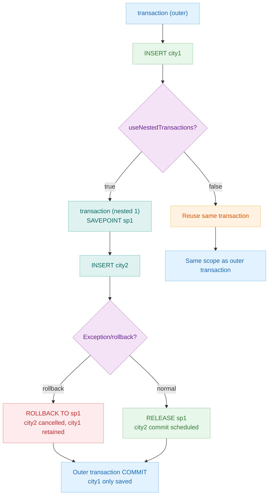
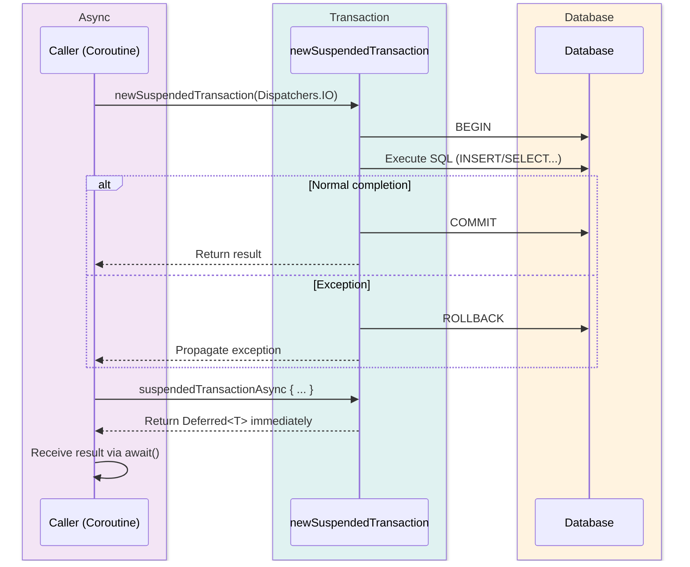

# 05 Exposed DML: Transactions (04-transactions)

English | [한국어](./README.ko.md)

A module covering the core of the Exposed transaction model. Covers isolation levels, nested transactions, rollback, and coroutine transactions.

## Learning Objectives

- Apply transaction boundaries and isolation levels appropriately for each situation.
- Understand nested transaction/savepoint behavior.
- Use transaction context safely in a coroutine environment.

## Prerequisites

- [`../01-dml/README.md`](../01-dml/README.md)
- [`../03-functions/README.md`](../03-functions/README.md)
- Basic Kotlin Coroutines knowledge

## Key Concepts

### Synchronous Transactions

```kotlin
// Basic transaction
transaction {
    Cities.insert { it[name] = "Seoul" }
    // Automatic rollback on exception
}

// Specify isolation level
inTopLevelTransaction(transactionIsolation = Connection.TRANSACTION_SERIALIZABLE) {
    maxAttempts = 3
    // ...
}
```

### Transaction Options

```kotlin
transaction {
    maxAttempts = 3               // Retry count
    minRetryDelay = 100           // Minimum retry delay (ms)
    maxRetryDelay = 1000          // Maximum retry delay (ms)
    queryTimeout = 30             // Query timeout (seconds)
}
```

### Coroutine Transactions

```kotlin
// Transaction in a suspend function
newSuspendedTransaction(Dispatchers.IO) {
    Cities.insert { it[name] = "Busan" }
}

// Async parallel transaction
val deferred: Deferred<Int> = suspendedTransactionAsync(Dispatchers.IO) {
    Cities.selectAll().count().toInt()
}
val count = deferred.await()
```

### Nested Transactions (Savepoint)

```kotlin
val db = Database.connect(
    url = "jdbc:h2:mem:...",
    databaseConfig = DatabaseConfig {
        useNestedTransactions = true  // Enable nested transactions
    }
)

transaction(db) {
    Cities.insert { it[name] = "city1" }

    // Nested transaction (creates internal SAVEPOINT)
    transaction {
        Cities.insert { it[name] = "city2" }
        rollback()  // Rolls back only city2, city1 is retained
    }
}
```

## Transaction Isolation Levels

| Isolation Level    | Value | Dirty Read | Non-Repeatable Read | Phantom Read | Primary Use Case          |
|--------------------|-------|------------|---------------------|--------------|---------------------------|
| `READ_UNCOMMITTED` | 1     | Possible   | Possible            | Possible     | Rarely used               |
| `READ_COMMITTED`   | 2     | Prevented  | Possible            | Possible     | PostgreSQL default        |
| `REPEATABLE_READ`  | 4     | Prevented  | Prevented           | Possible     | MySQL/MariaDB default     |
| `SERIALIZABLE`     | 8     | Prevented  | Prevented           | Prevented    | When highest integrity is needed |

> Actual behavior differs per DB engine. MySQL InnoDB partially prevents Phantom Reads even in `REPEATABLE_READ` using gap locks.

## Nested Transaction Flow



## Coroutine Transaction Flow



## Example Map

Source location: `src/test/kotlin/exposed/examples/transactions`

| File                                      | Description                          |
|-------------------------------------------|--------------------------------------|
| `TransactionTables.kt`                    | Common schema/test data              |
| `Ex01_TransactionIsolation.kt`            | Isolation levels                     |
| `Ex02_TransactionExec.kt`                 | Basic transaction execution          |
| `Ex03_Parameterization.kt`                | Transaction option configuration     |
| `Ex04_QueryTimeout.kt`                    | Query timeout                        |
| `Ex05_NestedTransactions.kt`              | Nested transactions (synchronous)    |
| `Ex05_NestedTransactions_Coroutines.kt`   | Nested transactions (coroutines)     |
| `Ex06_RollbackTransaction.kt`             | Explicit/implicit rollback           |
| `Ex07_ThreadLocalManager.kt`              | Transaction context management       |

## Running Tests

```bash
./gradlew :05-exposed-dml:04-transactions:test
```

## Practice Checklist

- Run the same scenario with both `transaction` and `newSuspendedTransaction`.
- Verify the impact range on the outer transaction when an inner nested transaction fails.
- Validate failure/retry behavior by changing `timeout`/`maxAttempts` settings.

## Per-DB Notes

- Actual isolation level behavior differs per DB engine
- Lock/deadlock situations may differ between test and production environments; load testing is required

## Performance and Stability Checkpoints

- Minimize transaction scope to reduce lock hold time.
- Avoid external I/O calls inside long-running transactions.
- Ensure transaction cleanup is not missed on coroutine cancellation.

## Complex Scenarios

### Nested Transactions and Savepoints (Synchronous)

Learn commit/rollback behavior of nested transactions under `useNestedTransactions = true` and how partial rollback is handled on exception.

- Source: [`Ex05_NestedTransactions.kt`](src/test/kotlin/exposed/examples/transactions/Ex05_NestedTransactions.kt)

### Nested Transactions and Savepoints in Coroutines

Learn commit/rollback behavior of nested transactions in a coroutine context by combining `newSuspendedTransaction` and `runWithSavepoint`.

- Source: [`Ex05_NestedTransactions_Coroutines.kt`](src/test/kotlin/exposed/examples/transactions/Ex05_NestedTransactions_Coroutines.kt)

### Explicit/Implicit Rollback

Compare automatic rollback on exception, explicit `rollback()` call, and rollback scope at the top-level transaction.

- Source: [`Ex06_RollbackTransaction.kt`](src/test/kotlin/exposed/examples/transactions/Ex06_RollbackTransaction.kt)

### ThreadLocal-Based Transaction Context Management

Shows how transaction context isolation works during multi-thread/coroutine transitions using `JdbcTransactionManager`.

- Source: [`Ex07_ThreadLocalManager.kt`](src/test/kotlin/exposed/examples/transactions/Ex07_ThreadLocalManager.kt)

## Next Module

- [`../05-entities/README.md`](../05-entities/README.md)
