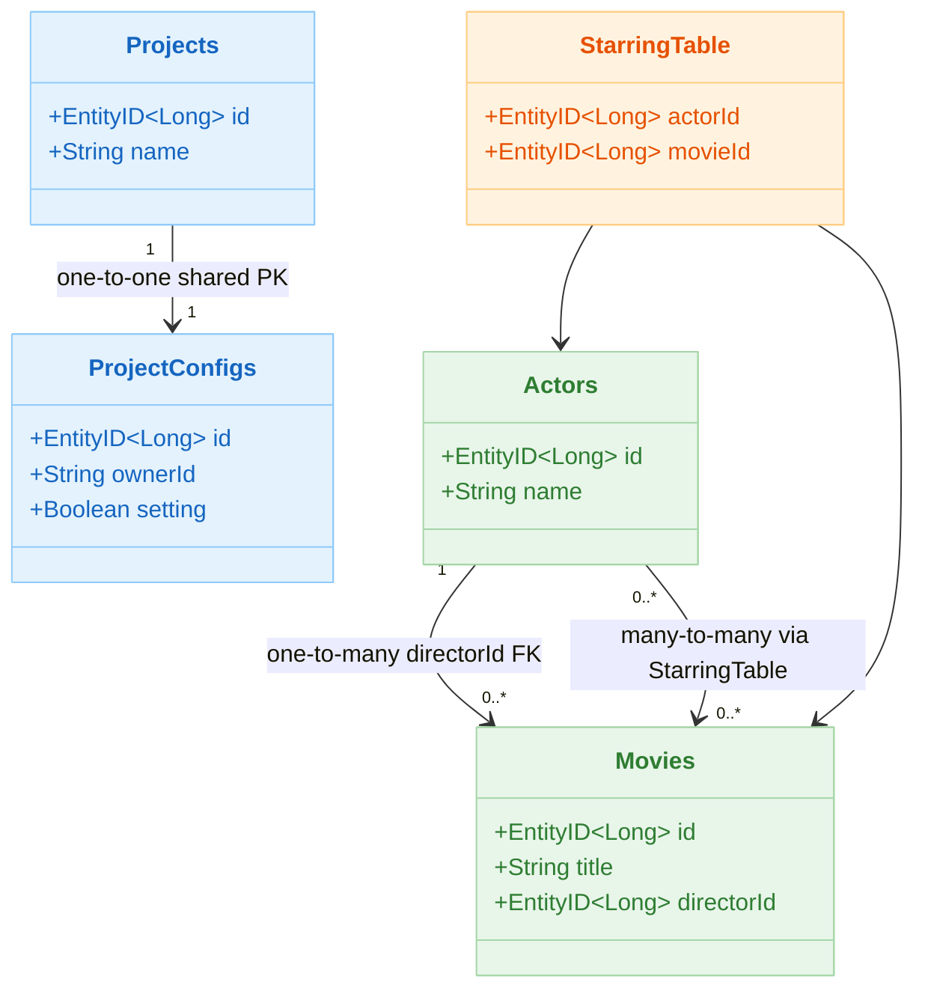
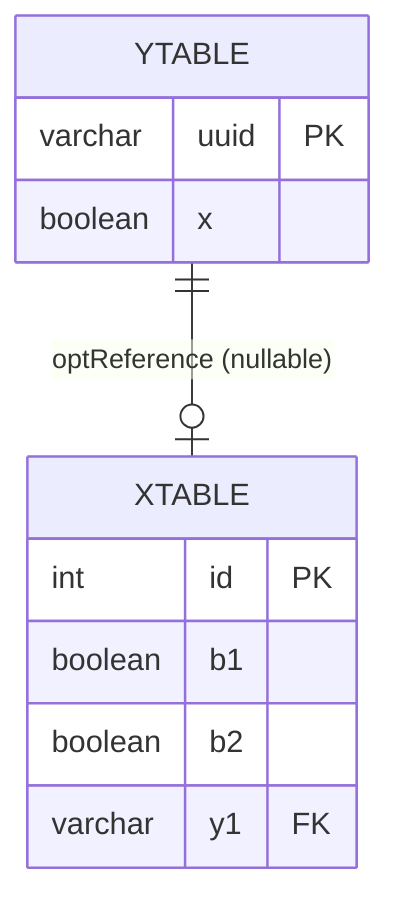
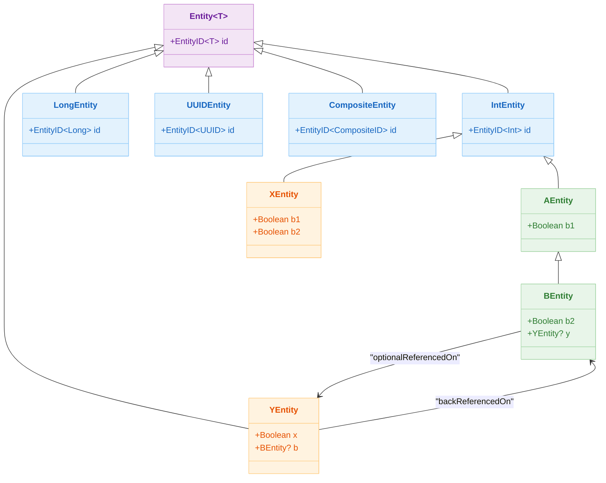

# 05 Exposed DML: Entity API (05-entities)

[English](./README.md) | 한국어

Exposed DAO(Entity) 모델을 학습하는 모듈입니다. 기본 CRUD부터 관계 매핑, 라이프사이클 훅, 캐시, 복합키까지 다룹니다.

## 학습 목표

- `Entity`/`EntityClass` 모델링 패턴을 익힌다.
- 다양한 PK 전략(Long/UUID/Composite)을 이해한다.
- 관계 매핑과 캐시/훅 사용 시 주의점을 학습한다.

## 선수 지식

- [`../01-dml/README.ko.md`](../01-dml/README.ko.md)
- [`../04-transactions/README.ko.md`](../04-transactions/README.ko.md)

## 핵심 개념

### Entity 기본 구조

```kotlin
// 테이블 정의
object Projects: LongIdTable("projects") {
    val name = varchar("name", 50)
}

// Entity 정의
class Project(id: EntityID<Long>): LongEntity(id) {
    companion object: LongEntityClass<Project>(Projects)

    var name by Projects.name
}

// CRUD
transaction {
    // Create
    val project = Project.new { name = "My Project" }

    // Read
    val found = Project.findById(project.id)

    // Update
    project.name = "Updated Name"

    // Delete
    project.delete()
}
```

### 관계 매핑

```kotlin
object Actors: LongIdTable("actors") {
    val name = varchar("name", 50)
}

object Movies: LongIdTable("movies") {
    val title = varchar("title", 100)
    val directorId = reference("director_id", Actors)  // FK
}

class Actor(id: EntityID<Long>): LongEntity(id) {
    companion object: LongEntityClass<Actor>(Actors)

    var name by Actors.name
    val movies by Movie referrersOn Movies.directorId  // 역참조 (one-to-many)
}

class Movie(id: EntityID<Long>): LongEntity(id) {
    companion object: LongEntityClass<Movie>(Movies)

    var title by Movies.title
    var director by Actor referencedOn Movies.directorId  // many-to-one
}
```

### 다대다 관계 (via)

```kotlin
object StarringTable: Table("starring") {
    val actor = reference("actor_id", Actors)
    val movie = reference("movie_id", Movies)
    override val primaryKey = PrimaryKey(actor, movie)
}

class Actor(...): LongEntity(id) {
    var starredMovies by Movie via StarringTable  // 다대다
}
```

### EntityHook (감사 패턴)

```kotlin
// Hook으로 createdAt/updatedAt 자동 관리
EntityHook.subscribe { change ->
    val entity = change.toEntity(AuditableEntity)
    when (change.changeType) {
        EntityChangeType.Created -> entity?.createdAt = now()
        EntityChangeType.Updated -> entity?.updatedAt = now()
        else                     -> {}
    }
}
```

## Entity 관계 매핑 다이어그램



## XEntity-YEntity 관계 ERD



## Entity 클래스 계층 다이어그램



## PK 전략 비교

| 전략          | 테이블 기반 클래스         | Entity 기반 클래스      | 설명                    |
|-------------|--------------------|--------------------|-----------------------|
| 자동 증가 Long  | `LongIdTable`      | `LongEntity`       | DB 자동 생성 Long PK      |
| 자동 증가 Int   | `IntIdTable`       | `IntEntity`        | DB 자동 생성 Int PK       |
| Java UUID   | `UUIDTable`        | `UUIDEntity`       | DB 생성 또는 앱 생성 UUID    |
| Kotlin UUID | `KotlinUUIDTable`  | `KotlinUUIDEntity` | `kotlin.uuid.Uuid` 기반 |
| 수동 ID       | `IdTable<T>`       | `Entity<T>`        | 앱에서 직접 ID 지정          |
| 복합키         | `CompositeIdTable` | `CompositeEntity`  | 여러 컬럼 조합 PK           |

## 예제 지도

소스 위치: `src/test/kotlin/exposed/examples/entities`

| 범주        | 파일                                                                                                                     |
|-----------|------------------------------------------------------------------------------------------------------------------------|
| 기본/라이프사이클 | `Ex01_Entity.kt`, `Ex02_EntityHook.kt`, `Ex02_EntityHook_Auditable.kt`, `Ex03_EntityCache.kt`                          |
| 키 전략      | `Ex04_LongIdTableEntity.kt`, `Ex05_UUIDTableEntity.kt`, `Ex06_NonAutoIncEntities.kt`, `Ex10_CompositeIdTableEntity.kt` |
| 확장        | `Ex07_EntityWithBlob.kt`, `Ex08_EntityFieldWithTransform.kt`, `Ex09_ImmutableEntity.kt`                                |
| 관계 매핑     | `Ex11_ForeignIdEntity.kt`, `Ex12_Via.kt`, `Ex13_OrderedReference.kt`, `Ex31_SelfReference.kt`                          |

## 실행 방법

```bash
./gradlew :05-exposed-dml:05-entities:test
```

## 실습 체크리스트

- 같은 도메인을 DSL 버전과 Entity 버전으로 각각 구현해 차이를 비교한다.
- 다대다(`via`)와 self-reference에서 조회 패턴/N+1 가능성을 점검한다.
- 훅(`beforeInsert`, `beforeUpdate`) 사용 시 부수효과를 최소화한다.

## DB별 주의사항

- ID 생성 전략은 DB/드라이버에 따라 성능과 동작 차이가 있음
- 복합키 모델은 쿼리 단순성보다 명시적 무결성에 초점을 두고 선택

## 성능·안정성 체크포인트

- 대량 조회/갱신에서는 DAO 남용보다 DSL 배치 접근을 고려
- Entity 캐시 사용 시 트랜잭션 경계 밖 참조를 피한다.
- 관계 로딩 전략을 명확히 하지 않으면 N+1 회귀 위험이 높다.

## 복잡한 시나리오

### 감사(Auditable) 패턴 — EntityHook과 Property Delegate

`EntityHook`을 통해 엔티티 생성/수정 시 `createdAt`, `updatedAt` 타임스탬프를 자동으로 관리하는 두 가지 방식(Hook 구독, Property Delegate)을 비교합니다.

- 소스: [`Ex02_EntityHook_Auditable.kt`](src/test/kotlin/exposed/examples/entities/Ex02_EntityHook_Auditable.kt)

### 복합 기본키(Composite ID) 테이블과 엔티티

`CompositeIdTable`을 이용한 복합 PK 정의, 복합 ID 엔티티 생성·조회, 연관 관계(참조) 처리 방식을 학습합니다.

- 소스: [`Ex10_CompositeIdTableEntity.kt`](src/test/kotlin/exposed/examples/entities/Ex10_CompositeIdTableEntity.kt)

### 다대다 관계 — `via` 중간 테이블

`via`를 이용한 다대다 관계 매핑과 중간 테이블을 통한 조회 패턴, N+1 문제 발생 가능 지점을 학습합니다.

- 소스: [`Ex12_Via.kt`](src/test/kotlin/exposed/examples/entities/Ex12_Via.kt)

### Self-Reference 관계

같은 테이블 내에서 부모-자식 관계를 `referencedOn` / `referrersOn`으로 표현하는 Self-Reference 패턴을 학습합니다.

- 소스: [`Ex31_SelfReference.kt`](src/test/kotlin/exposed/examples/entities/Ex31_SelfReference.kt)

## 다음 챕터

- [`../06-advanced/README.ko.md`](../../06-advanced/README.ko.md)
