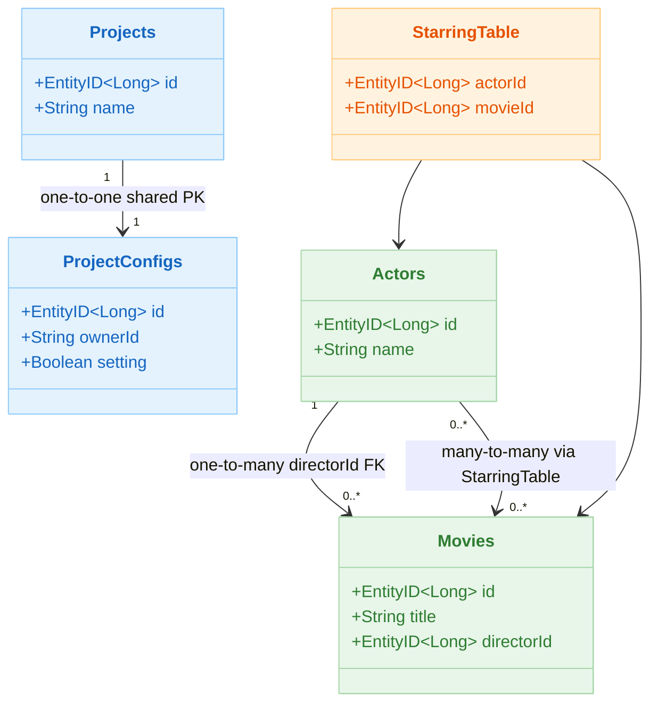
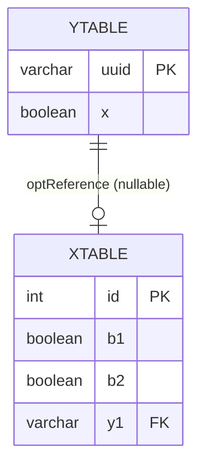
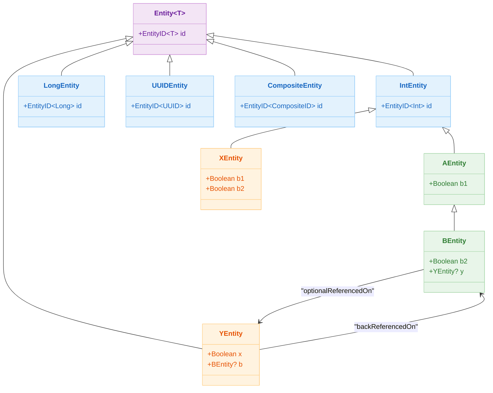

# 05 Exposed DML: Entity API (05-entities)

English | [한국어](./README.ko.md)

A module for learning the Exposed DAO (Entity) model. Covers basic CRUD, relationship mapping, lifecycle hooks, caching, and composite keys.

## Learning Objectives

- Learn `Entity`/`EntityClass` modeling patterns.
- Understand various PK strategies (Long/UUID/Composite).
- Learn the caveats of relationship mapping, caching, and hooks.

## Prerequisites

- [`../01-dml/README.md`](../01-dml/README.md)
- [`../04-transactions/README.md`](../04-transactions/README.md)

## Key Concepts

### Basic Entity Structure

```kotlin
// Table definition
object Projects: LongIdTable("projects") {
    val name = varchar("name", 50)
}

// Entity definition
class Project(id: EntityID<Long>): LongEntity(id) {
    companion object: LongEntityClass<Project>(Projects)

    var name by Projects.name
}

// CRUD
transaction {
    // Create
    val project = Project.new { name = "My Project" }

    // Read
    val found = Project.findById(project.id)

    // Update
    project.name = "Updated Name"

    // Delete
    project.delete()
}
```

### Relationship Mapping

```kotlin
object Actors: LongIdTable("actors") {
    val name = varchar("name", 50)
}

object Movies: LongIdTable("movies") {
    val title = varchar("title", 100)
    val directorId = reference("director_id", Actors)  // FK
}

class Actor(id: EntityID<Long>): LongEntity(id) {
    companion object: LongEntityClass<Actor>(Actors)

    var name by Actors.name
    val movies by Movie referrersOn Movies.directorId  // back-reference (one-to-many)
}

class Movie(id: EntityID<Long>): LongEntity(id) {
    companion object: LongEntityClass<Movie>(Movies)

    var title by Movies.title
    var director by Actor referencedOn Movies.directorId  // many-to-one
}
```

### Many-to-Many Relationship (via)

```kotlin
object StarringTable: Table("starring") {
    val actor = reference("actor_id", Actors)
    val movie = reference("movie_id", Movies)
    override val primaryKey = PrimaryKey(actor, movie)
}

class Actor(...): LongEntity(id) {
    var starredMovies by Movie via StarringTable  // many-to-many
}
```

### EntityHook (Audit Pattern)

```kotlin
// Automatically manage createdAt/updatedAt via Hook
EntityHook.subscribe { change ->
    val entity = change.toEntity(AuditableEntity)
    when (change.changeType) {
        EntityChangeType.Created -> entity?.createdAt = now()
        EntityChangeType.Updated -> entity?.updatedAt = now()
        else                     -> {}
    }
}
```

## Entity Relationship Mapping Diagram



## XEntity-YEntity Relationship ERD



## Entity Class Hierarchy Diagram



## PK Strategy Comparison

| Strategy        | Table Base Class      | Entity Base Class   | Description                          |
|-----------------|-----------------------|---------------------|--------------------------------------|
| Auto-increment Long | `LongIdTable`     | `LongEntity`        | DB auto-generated Long PK            |
| Auto-increment Int  | `IntIdTable`      | `IntEntity`         | DB auto-generated Int PK             |
| Java UUID       | `UUIDTable`           | `UUIDEntity`        | DB or app-generated UUID             |
| Kotlin UUID     | `KotlinUUIDTable`     | `KotlinUUIDEntity`  | Based on `kotlin.uuid.Uuid`          |
| Manual ID       | `IdTable<T>`          | `Entity<T>`         | ID assigned directly by the app      |
| Composite key   | `CompositeIdTable`    | `CompositeEntity`   | PK composed of multiple columns      |

## Example Map

Source location: `src/test/kotlin/exposed/examples/entities`

| Category             | Files                                                                                                                    |
|----------------------|--------------------------------------------------------------------------------------------------------------------------|
| Basic/Lifecycle      | `Ex01_Entity.kt`, `Ex02_EntityHook.kt`, `Ex02_EntityHook_Auditable.kt`, `Ex03_EntityCache.kt`                           |
| Key strategies       | `Ex04_LongIdTableEntity.kt`, `Ex05_UUIDTableEntity.kt`, `Ex06_NonAutoIncEntities.kt`, `Ex10_CompositeIdTableEntity.kt`  |
| Extensions           | `Ex07_EntityWithBlob.kt`, `Ex08_EntityFieldWithTransform.kt`, `Ex09_ImmutableEntity.kt`                                 |
| Relationship mapping | `Ex11_ForeignIdEntity.kt`, `Ex12_Via.kt`, `Ex13_OrderedReference.kt`, `Ex31_SelfReference.kt`                           |

## Running Tests

```bash
./gradlew :05-exposed-dml:05-entities:test
```

## Practice Checklist

- Implement the same domain in both DSL and Entity versions and compare the differences.
- Check query patterns and potential N+1 issues in many-to-many (`via`) and self-reference.
- Minimize side effects when using hooks (`beforeInsert`, `beforeUpdate`).

## Per-DB Notes

- ID generation strategy has performance and behavior differences per DB/driver
- Choose composite key models based on explicit integrity rather than query simplicity

## Performance and Stability Checkpoints

- For bulk reads/updates, consider DSL batch access rather than overusing DAO.
- Avoid referencing Entity cache outside transaction boundaries.
- Not specifying a relationship loading strategy clearly increases the risk of N+1 regression.

## Complex Scenarios

### Audit Pattern — EntityHook and Property Delegate

Compares two approaches (Hook subscription, Property Delegate) for automatically managing `createdAt` and `updatedAt` timestamps on entity creation/modification via `EntityHook`.

- Source: [`Ex02_EntityHook_Auditable.kt`](src/test/kotlin/exposed/examples/entities/Ex02_EntityHook_Auditable.kt)

### Composite PK Table and Entity

Learn composite PK definition with `CompositeIdTable`, creating/querying composite ID entities, and association (reference) handling.

- Source: [`Ex10_CompositeIdTableEntity.kt`](src/test/kotlin/exposed/examples/entities/Ex10_CompositeIdTableEntity.kt)

### Many-to-Many Relationship — `via` Junction Table

Learn many-to-many relationship mapping with `via`, query patterns through the junction table, and potential N+1 problem points.

- Source: [`Ex12_Via.kt`](src/test/kotlin/exposed/examples/entities/Ex12_Via.kt)

### Self-Reference Relationship

Learn the Self-Reference pattern for expressing parent-child relationships within the same table using `referencedOn` / `referrersOn`.

- Source: [`Ex31_SelfReference.kt`](src/test/kotlin/exposed/examples/entities/Ex31_SelfReference.kt)

## Next Chapter

- [`../06-advanced/README.md`](../../06-advanced/README.md)
