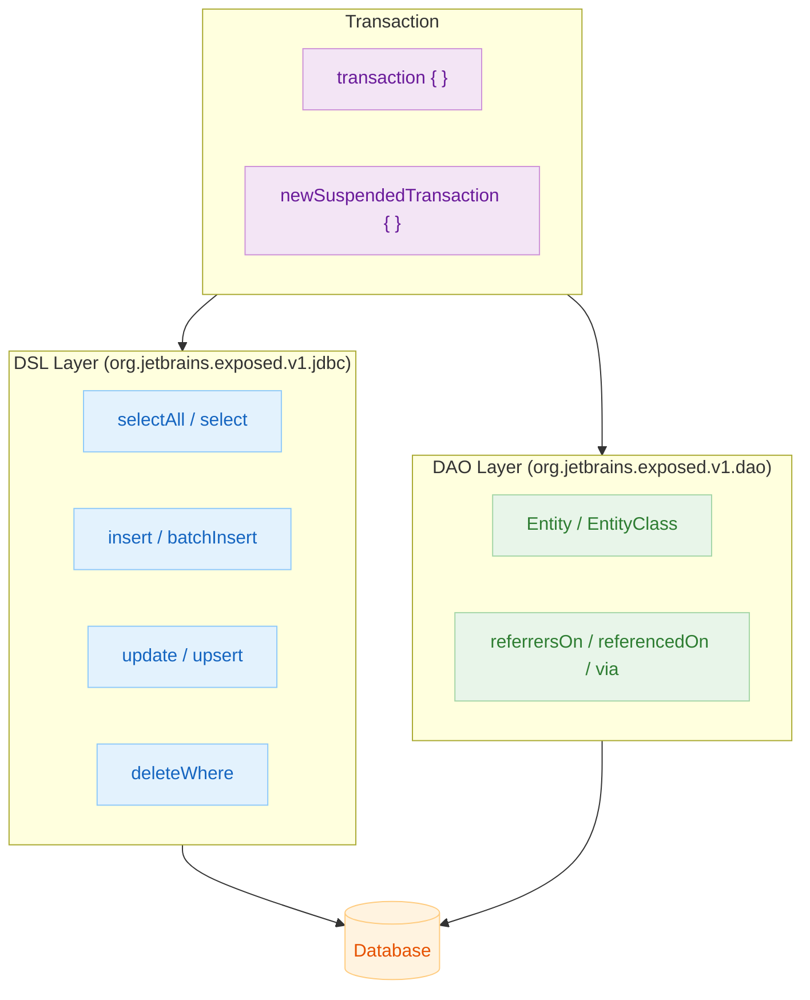

# 05 Exposed DML

[English](./README.md) | 한국어

Exposed 1.1.1 기준으로 SELECT/INSERT/UPDATE/DELETE/UPSERT, 타입, 함수, 트랜잭션, Entity API까지의 조회·변경 흐름을 테스트 중심으로 정리하는 챕터입니다.

## 챕터 목표

- DSL 기반 DML을 안전하게 작성하고, 테스트로 조건/집계/조인 결과를 검증한다.
- 타입/함수/정렬/윈도우 함수를 활용해 DB Dialect별 동작 차이를 문서화한다.
- 트랜잭션 경계, Entity DAO 패턴을 복합적으로 다뤄 성능과 무결성을 확보한다.

## 선수 지식

- `03-exposed-basic`, `04-exposed-ddl` 내용
- 관계형 데이터베이스의 트랜잭션/격리 수준 이해

## 포함 모듈

| 모듈                | 설명                                         |
|-------------------|--------------------------------------------|
| `01-dml`          | 기본 DML 쿼리와 JOIN, UPSERT 등 SELECT/UPDATE 흐름 |
| `02-types`        | 컬럼 타입 매칭과 DB별 타입 차이 사례                     |
| `03-functions`    | SQL 함수/집계/윈도우 함수 활용법                       |
| `04-transactions` | 트랜잭션 격리, 중첩, 롤백, 코루틴 트랜잭션                  |
| `05-entities`     | DAO(Entity) 모델링과 관계 매핑 검증                  |

## 아키텍처 개요



## 권장 학습 순서

1. `01-dml` — SELECT/INSERT/UPDATE/DELETE 기본
2. `02-types` — 컬럼 타입과 DB별 차이
3. `03-functions` — SQL 함수/집계/윈도우 함수
4. `04-transactions` — 트랜잭션 격리·중첩·롤백
5. `05-entities` — DAO Entity 모델링

## 실행 방법

```bash
# 모듈별 개별 실행
./gradlew :05-exposed-dml:01-dml:test
./gradlew :05-exposed-dml:02-types:test
./gradlew :05-exposed-dml:03-functions:test
./gradlew :05-exposed-dml:04-transactions:test
./gradlew :05-exposed-dml:05-entities:test

# 챕터 전체 실행
./gradlew :05-exposed-dml:test
```

## 테스트 포인트

- 파라미터 바인딩/조건식/집계 결과가 기대값과 일치하는지 확인한다.
- 트랜잭션 경계와 롤백 시나리오를 명시적으로 검증한다.
- Entity 관계 매핑을 통해 무결성이 유지되는지 검증한다.

## 성능·안정성 체크포인트

- 대량 조회 시 배치/페이징 전략을 점검한다.
- 트랜잭션 범위를 최소화해 락 경합 위험을 줄인다.
- DB별 지원 기능(예: ON CONFLICT, WINDOW FUNCTION 등)의 차이를 테스트로 관리한다.

## 다음 챕터

- [06-advanced](../06-advanced/README.ko.md): 커스텀 컬럼/직렬화/보안 등 실무 확장을 학습합니다.
