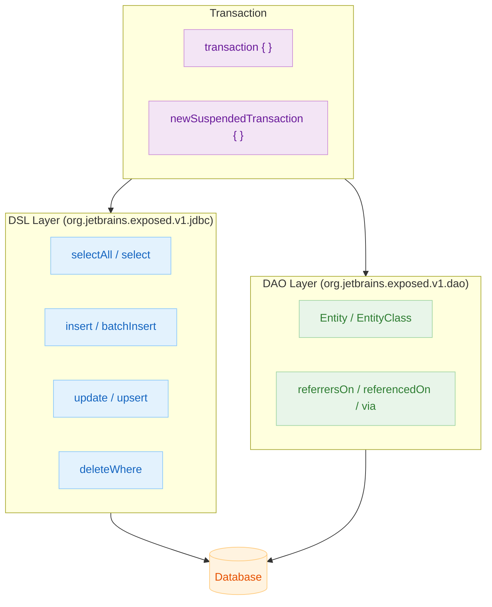

# 05 Exposed DML

English | [한국어](./README.ko.md)

A chapter covering the full read/write flow in Exposed 1.1.1, from SELECT/INSERT/UPDATE/DELETE/UPSERT, types, functions, and transactions to the Entity API, organized around tests.

## Chapter Goals

- Write safe DSL-based DML and verify conditions, aggregations, and join results with tests.
- Document per-DB Dialect behavior differences using types, functions, sorting, and window functions.
- Handle transaction boundaries and Entity DAO patterns together to ensure performance and integrity.

## Prerequisites

- Content from `03-exposed-basic` and `04-exposed-ddl`
- Understanding of relational database transactions and isolation levels

## Included Modules

| Module            | Description                                               |
|-------------------|-----------------------------------------------------------|
| `01-dml`          | Basic DML queries and SELECT/UPDATE flow with JOIN, UPSERT |
| `02-types`        | Column type mapping and per-DB type difference examples    |
| `03-functions`    | SQL functions, aggregations, and window functions          |
| `04-transactions` | Transaction isolation, nesting, rollback, coroutine transactions |
| `05-entities`     | DAO (Entity) modeling and relationship mapping verification |

## Architecture Overview



## Recommended Study Order

1. `01-dml` — SELECT/INSERT/UPDATE/DELETE basics
2. `02-types` — column types and per-DB differences
3. `03-functions` — SQL functions, aggregations, window functions
4. `04-transactions` — transaction isolation, nesting, rollback
5. `05-entities` — DAO Entity modeling

## Running Tests

```bash
# Run each module individually
./gradlew :05-exposed-dml:01-dml:test
./gradlew :05-exposed-dml:02-types:test
./gradlew :05-exposed-dml:03-functions:test
./gradlew :05-exposed-dml:04-transactions:test
./gradlew :05-exposed-dml:05-entities:test

# Run the entire chapter
./gradlew :05-exposed-dml:test
```

## Test Points

- Verify that parameter binding, conditions, and aggregation results match expected values.
- Explicitly validate transaction boundaries and rollback scenarios.
- Verify that integrity is maintained through Entity relationship mapping.

## Performance and Stability Checkpoints

- Review batch/paging strategies for large-volume queries.
- Minimize transaction scope to reduce lock contention risk.
- Manage per-DB feature support differences (e.g., ON CONFLICT, WINDOW FUNCTION) with tests.

## Next Chapter

- [06-advanced](../06-advanced/README.md): Covers practical extensions such as custom columns, serialization, and security.
